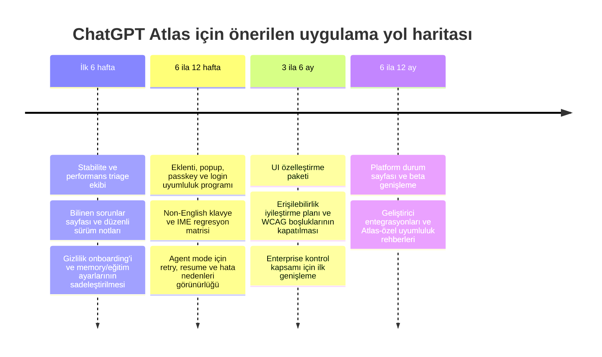

# ChatGPT Atlas için kullanıcı şikâyetleri ve iyileştirme önerileri

## Yönetici özeti

Bu inceleme, kullanıcıların istediği son 24 aylık pencere varsayımıyla yapıldı; ancak Atlas 21 Ekim 2025’te duyurulup kullanıma açıldığı için fiilî veri penceresi Ekim 2025–Haziran 2026 oldu. Resmî OpenAI kaynakları, OpenAI Developer Community, Reddit, Hacker News, X, GitHub, Stack Overflow ve Türkçe forumlar birlikte okundu. Ürünün dağıtımı resmî olarak macOS için DMG kurulumu üzerinden yapılıyor; Atlas bir Chrome/Edge eklentisi değil, Apple silicon destekli ayrı bir tarayıcı. Bu nedenle App Store/Play Store yorumları Atlas için anlamlı birincil kanal oluşturmadı; asıl geri bildirim ağırlığı sosyal topluluklar ve teknik issue tracker’larda toplandı. citeturn31view0turn5view5turn20search10turn20search6

En güçlü şikâyet kümeleri beş başlıkta toplandı: hata/kararlılık, entegrasyon-uyumluluk, UI/UX-kullanılabilirlik, performans ve gizlilik-güvenlik algısı. Kullanıcı tarafında “boş/beyaz render alanları”, ilk mesajda takılan kenar çubuğu, sık “message stream” hataları, yüksek bellek kullanımı, eklenti ve oturum açma sorunları, zayıf özelleştirme ve platform kısıtı öne çıktı. Teknik kanallarda ise Bitwarden, Floccus, Tampermonkey, çeviri eklentileri ve çeşitli web uygulamalarıyla uyumluluk problemleri ayrıntılı bug raporlarıyla doğrulandı. citeturn13view2turn25search7turn25search10turn24search5turn18view1turn18view2turn18view3turn18view4

Önemli bir bulgu da şu: OpenAI’nin release note’ları, kullanıcıların şikâyet ettiği sorunların önemli bir bölümünü dolaylı biçimde doğruluyor. IME girişi, erişilebilirlik olayları, 1Password ve diğer eklenti davranışları, boş sekmeler, boş arama sonuç sayfası, bellek aşırı kullanımı, CPU kullanımı, yanlış kenar çubuğu önerileri, tab sürükleme, PiP sürekliliği ve extension permission prompt’ları gibi başlıklar release note’larda düzeltme olarak yer aldı. Bu, Atlas’ın hızlı iterasyon geçirdiğini gösteriyor; ama aynı zamanda erken dönem ürün kalitesinde hata yoğunluğunun da yüksek olduğuna işaret ediyor. citeturn8view0turn24search16turn8view0turn7view3turn7view1turn24search14turn24search15

Stratejik risk tarafında en kritik konu güven. OpenAI, web tarama içeriğinin model eğitimi için kullanılmasının varsayılan olarak kapalı olduğunu söylüyor; fakat ayrı bir mekanizma olan “Browser memories” yeni kullanıcılarda varsayılan açık. Buna ek olarak Enterprise dokümanında Atlas’ın henüz SOC 2/ISO kapsamına alınmadığı, SIEM/eDiscovery entegrasyonu sunmadığı, bölgesel veri sabitlemesi yapmadığı ve WCAG uyumunun tamamlanmadığı açıkça yazıyor. Güvenlik tarafında ise OpenAI, prompt injection’ı Atlas için “uzun vadeli açık güvenlik problemi” olarak tarif ediyor ve tam çözüm yerine sürekli sertleştirme yaklaşımı benimsediğini belirtiyor. Bu kombinasyon, kullanıcı tarafındaki “fazla veri görüyor”, “varsayılanlar kafa karıştırıcı”, “kurumsal kullanım için erken” algısını besliyor. citeturn21search5turn22view1turn5view2turn23view1turn31view0

Bu nedenle en yüksek öncelikli öneri seti şunlardan oluşuyor: dinamik web uygulamalarında stabilite/perf düzeltmeleri, eklenti-giriş-passkey uyumluluk programı, gizlilik ayarlarının yeniden tasarlanması, İngilizce dışı klavye/IME akışlarının sertleştirilmesi, ajan hatalarında geri kazanım ve görünürlük, daha şeffaf sürüm notları ve bilinen sorunlar sayfası. Platform genişlemesi de önemli; ancak mevcut veriye göre önce “mevcut macOS tabanını sağlamlaştırmak”, sonra genişlemek daha doğru sıralama. citeturn24search5turn18view1turn18view2turn19search0turn30search16turn25search0turn13view2turn13view1

## Kapsam ve yöntem

İnceleme, Atlas’a ilişkin birincil ve ürüne en yakın kaynaklara öncelik vererek yapıldı: OpenAI ürün sayfaları, Help Center makaleleri, release note’lar, OpenAI Developer Community başlıkları, GitHub issue’ları, Stack Overflow soruları, Reddit gönderileri, Hacker News tartışmaları, X paylaşımları ve Türkçe kullanıcı forumları. Resmî kaynaklar ürünün gerçek kapsamını, varsayılan ayarlarını, güvenlik sınırlarını ve yol haritasını anlamak için; topluluk kaynakları ise fiilî kullanıcı acı noktalarını yakalamak için kullanıldı. citeturn31view0turn5view0turn5view1turn5view2turn5view3turn30search0

Metodolojik olarak iki düzeyde kodlama yapıldı. Birinci düzeyde kanallar bazında “şikâyet işareti” sayıldı; ikinci düzeyde bu işaretler temalara ayrıldı. Aynı gönderi birden fazla temaya girebildiği için toplamlar toplanınca birbirini aşabiliyor. “Sıklık” burada internet evreninin tamamını değil, incelenen örneklemdeki kodlanmış sinyalleri ifade eder. Bu yüzden tablo sonuçları nicel pazar payı değil, güçlü nitel örüntü olarak okunmalı. Buna rağmen resmî hata düzeltmeleri ile bağımsız kullanıcı şikâyetlerinin sık sık aynı noktalarda buluşması, bulguların güvenilirliğini yükseltiyor. citeturn13view2turn24search5turn18view1turn8view0turn7view3

Atlas için App Store, Play Store ya da “Atlas adlı resmî tarayıcı eklentisi” mağaza yorumları anlamlı bir veri kaynağı olmadı; çünkü OpenAI’nin resmî kurulum akışı DMG indirip Applications klasörüne sürükleme üzerinden ilerliyor ve ürün, Chrome Web Store’da yayınlanan bir eklenti olarak konumlanmıyor. Buna karşılık Atlas, Chromium tabanlı davranışlardan yararlanarak uzantı çalıştırabiliyor ve içe aktarma akışlarında uzantıları da taşıyabiliyor; dolayısıyla kullanıcı tepkileri ürün mağazalarında değil, Atlas uyumluluğunu tartışan GitHub issue’larında yoğunlaştı. citeturn5view5turn8view0turn18view1turn18view3

## Kanal bazında şikâyet hacmi

Aşağıdaki tablo, incelenen örneklemde kanallar bazındaki şikâyet yoğunluğunu gösterir. “Kodlanan şikâyet işaretleri” çoklu etiketli bir ölçüdür; tek bir kaynak birden fazla probleme işaret edebilir.

| Kanal | İncelenen örnek | Kodlanan şikâyet işareti | Baskın başlıklar | Temsilî kaynaklar |
|---|---:|---:|---|---|
| Reddit | 22 | 48 | Stabilite, UI/UX, performans, ajan güvenilirliği, gizlilik | r/ChatGPTAtlas ve r/OpenAI gönderileri citeturn13view2turn24search5turn24search1turn25search10turn13view3 |
| GitHub ve Stack Overflow | 10 | 19 | Eklenti uyumluluğu, giriş/popup akışları, IME ve tarayıcı kimliği | Bitwarden, Floccus, Tampermonkey, InputSourcePro, Stack Overflow citeturn18view1turn18view2turn18view3turn19search0turn17search0 |
| Türkçe forumlar | 6 | 11 | Gizlilik kuşkusu, macOS ile sınırlılık, “fark yaratmıyor” algısı | Ekşi Sözlük girdileri citeturn26search1turn26search0turn26search3turn26search5turn26search8 |
| X | 5 | 11 | Proje/yan panel bug’ları, profil kısayolu, hız ve giriş sorunları | X gönderileri citeturn15search0turn15search1turn15search3turn15search17turn15search31 |
| Hacker News | 4 | 8 | Gizlilik, lock-in, ürün konumlandırması | HN tartışmaları citeturn12view2turn12view3turn12view4 |
| Resmî OpenAI notları | 15 | 30’dan fazla issue sinyali | Bug fix yoğunluğu, güvenlik sınırları, enterprise ve accessibility açıkları | Release notes ve yardım makaleleri citeturn5view0turn8view0turn7view3turn5view2turn22view1 |

Kanal yapısı önemli bir örüntü gösteriyor. Reddit, “günlük kullanım acısı”nın en iyi görüldüğü yer: yüksek bellek kullanımı, beyaz/boş render alanları, agent mode arızaları, özelleştirme eksikliği, release note belirsizliği ve küçük ama yıpratıcı kalite kusurları burada yoğunlaşıyor. GitHub ve Stack Overflow daha dar fakat daha teknik; orada sorunlar çoğunlukla yeniden üretilebilir şekilde anlatılıyor ve bu sayede kök neden çıkarımı daha güvenilir oluyor. citeturn24search5turn24search1turn24search11turn18view1turn18view2turn18view3turn17search0

Türkçe kanallarda ise tartışmalar daha çok “neden bunu kullanayım?”, “veri güveni”, “sadece macOS olması” ve “rakiplerden ne kadar farklı?” ekseninde ilerliyor. Bu, Atlas’ın Türkiye gibi fiyat/cihaz heterojenliği yüksek pazarlarda önce teknik özellikten çok meşruiyet ve güven anlatısı kurması gerektiğini düşündürüyor. Özellikle Ekşi Sözlük’te Comet ve Chrome/Gemini ile farkın sınırlı olduğu, veri erişiminin tedirginlik yarattığı ve Windows beklentisinin yüksek olduğu açıkça görülüyor. citeturn26search1turn26search0turn26search3turn26search5

Bir diğer dikkat çekici nokta da resmî dokümanlarla topluluk geri bildirimi arasındaki eşleşme. Örneğin kullanıcılar bellek, blank tabs, shortcut, IME, extension permission ve suggestion accuracy sorunlarını dile getirirken, release note’lar da tam bu başlıklarda düzeltmeler yayımlıyor. Bu eşleşme, kullanıcı şikâyetlerinin “gürültü” değil, gerçek ürün yüzeyi problemleri olduğunu gösteriyor. citeturn24search5turn14search0turn24search7turn5view0turn7view3turn7view1turn24search14

## Tema bazında şikâyetler ve kök nedenler

Aşağıdaki tablo, temaları Atlas özelinde birleştirilmiş biçimde verir. “Hata” ve “stability” Atlas örnekleminde çok sık iç içe geçtiği için tek bir satırda birleştirildi.

| Kategori | Gözlenen sıklık | Temsilî alıntı [çev.] | Şiddet | Muhtemel kök neden | Temsilî kaynaklar |
|---|---:|---|---|---|---|
| Hata ve kararlılık | 13 | “Parçalar rastgele beyaz/boş oluyor; yeniden yükleme geçici düzeltiyor.” | Yüksek | Render/compositing sorunları, uzun oturum regresyonları, side-panel ve agent akışlarında yetersiz hata toparlama | Reddit render raporu, side chat ve agent bug’ları; blank tabs ve bug fix notları citeturn13view2turn25search7turn25search10turn24search0turn25search0turn8view0 |
| Entegrasyon ve uyumluluk | 13 | “Bitwarden hiç yüklenmiyor; açılır pencere boş kalıyor.” | Yüksek | Chromium tabanının farklı gömülme biçimi, popup/cookie/passthrough farkları, eklenti API ve browser-ID uyumsuzlukları | Bitwarden, Floccus, Tampermonkey, Immersive Translate, Codex, pgAdmin citeturn18view1turn18view2turn18view3turn18view4turn18view5turn17search3 |
| UI/UX ve kullanılabilirlik | 11 | “Kullanılamaz hâlde; çok hata, zayıf UX, özelleştirme az.” | Orta-Yüksek | AI-first tasarımın klasik tarayıcı beklentileriyle çatışması; ayar keşfedilebilirliği ve özelleştirme eksikleri; keyboard-centric kullanımın zayıflığı | Reddit UX geri bildirimi, bookmark/downloads/shortcut istekleri, OpenAI forum önerileri citeturn25search12turn24search3turn24search11turn25search2turn30search17 |
| Performans | 10 | “71 GB bellek kullanıyordu.” | Yüksek | Uzun oturumlarda renderer süreci birikimi, olası memory leak, ağır web uygulamalarında GPU/paint katmanı sorunları | Yüksek RAM kullanımı ve resmî bellek/CPU düzeltmeleri citeturn24search5turn25search11turn7view3turn24search15 |
| Gizlilik ve güvenlik algısı | 10 | “Yapay zekânın tarama verime dokunmasına izin vermem.” | Yüksek | Browser memories’in varsayılan açık olması, eğitim ve görünürlük ayarlarının zihinsel modelinin karmaşık olması, prompt injection ve enterprise kontrol boşlukları | Gizlilik ayarları, memories varsayılanları, HN/Reddit/Türkçe forum kaygıları, enterprise uyarıları citeturn22view1turn21search5turn14search11turn12view3turn12view4turn26search0turn26search3turn5view2turn23view1 |
| Doğruluk ve ajan güvenilirliği | 9 | “Ajan, açık oturum varken bile LinkedIn yazısı gönderemedi.” | Yüksek | Agent mode’un preview aşamasında olması; karmaşık akışlarda hata toparlama, durum görünürlüğü ve retry mantığının zayıflığı | OpenAI “complex workflows may make mistakes” notu ve kullanıcı raporları citeturn31view0turn13view4turn25search0turn25search5 |
| Yerelleştirme ve Türkçe desteği | 5 | “İngilizce dışı düzende Cmd+C/V/F duruyor.” | Orta-Yüksek | IME ve keyboard layout işleme katmanının henüz tam olgunlaşmaması; side-panel input davranışları; Türkçe içerik mevcut ama bazı yardım sayfaları otomatik çevrili | IME fix’leri, Rusça ve Çince giriş sorunları, otomatik çevri notu citeturn5view0turn7view1turn19search0turn30search16turn20search7turn22view0 |
| Platform ve cihaz kapsamı | 3 | “Dünyanın en popüler iki platformunda bile yok.” | Orta | Apple silicon ve macOS sürüm koşulu; diğer platformların “coming soon” kalması | Resmî sistem gereksinimleri ve kullanıcı sitemi citeturn5view5turn31view0turn13view0turn26search0 |
| Erişilebilirlik | 2 | “WCAG’a henüz tam uyumlu değil.” | Orta-Yüksek | Erişilebilirlik katmanının olgunlaşma aşamasında olması; agent performansının ARIA’ya bağımlılığı | Enterprise dokümanı ve geliştirici FAQ citeturn5view2turn5view3turn5view0 |
| Faturalama ve limitler | 2 | “40 kullanım ilk dört günde bitti.” | Düşük-Orta | Doğrudan faturalama hatasından çok plan/limit iletişimi ve agent kotası sorunları | Kullanıcı limit şikâyeti ve promosyon koşulları citeturn29search3turn29search4turn31view0 |

Bu temaları bir arada okuduğumda üç kök neden kümesi öne çıkıyor. İlki teknik mimari kaynaklı. OpenAI, Atlas’ı Chromium’dan süreç düzeyinde ayrıştıran yeni bir OWL mimarisi üzerine kurduğunu, input event forwarding ve render katmanını yeniden düşündüğünü açıkça anlatıyor. Bu mimari Atlas’a başlangıç hızı ve ürünleşme esnekliği kazandırıyor olabilir; ama aynı zamanda, stok Chromium davranışını varsayan eklentiler, web uygulamaları, IME akışları ve popup/login mekaniği için yeni uyumsuzluk yüzeyleri de yaratıyor. Bu, entegrasyon ve stabilite sorunlarının neden Atlas’ta bu kadar merkezi olduğunu açıklayan en güçlü teknik çıkarım. citeturn23view0turn18view1turn18view2turn18view3turn19search0

İkinci küme güven modelinden geliyor. Atlas’ta “sayfa görünürlüğü”, “Browser memories”, “incognito”, “include web browsing” ve kurumsal güvenlik kapsamı birbirinden ayrı kontrol alanları. OpenAI bunu ayrıntılı belgelerle açıklıyor; fakat kullanıcı tarafında zihinsel model daha basit: “Tarayıcı neyi görüyor, neyi saklıyor, neyi eğitiyor?” Bu basit soruya verilen cevap şu an fazla parçalı. Browser memories’in yeni kullanıcılarda açık oluşu ile tarama içeriğinin eğitim için kapalı oluşu, teknik olarak çelişki değil; ama kullanıcı algısında kolayca çelişki gibi okunuyor. citeturn22view1turn21search5turn5view1turn31view0

Üçüncü küme ürün olgunluğu ve iletişim boşluğu. OpenAI lansmanda “sık iyileştirme” sözü verdi ve release note’lar Kasım 2025–Mart 2026 arasında hareketliydi; buna karşılık kullanıcılar sonrasında release note’ların yavaşladığını, belirsizleştiğini ve ürünün “maintenance mode” hissi verdiğini yazdı. Ürün gerçekten durmuş demek doğru olmaz; çünkü yardım merkezi sayfaları Haziran 2026’da da güncelleniyor. Ama kullanıcı gözüyle bakıldığında “sürüm notu şeffaflığı” ve “bilinen sorunlar görünürlüğü” eksik kaldığında, ürün kalitesi algısı hızla düşüyor. citeturn31view0turn7view0turn13view2turn13view1turn20search5turn20search10

Türkçe/Türkiye özelinde ise bulgu biraz daha nüanslı. OpenAI’nin yardım merkezi ve ürün sayfaları Türkçe olarak mevcut; ancak bazı yardım sayfalarında çevirinin otomatik yapıldığı özellikle belirtiliyor. Buna karşılık kullanıcı şikâyetleri doğrudan “Türkçe menü yok” ekseninde değil; daha çok ölü tuşlar, aksanlar, İngilizce dışı klavye düzenleri ve genel güven algısı etrafında toplanıyor. Bu nedenle Atlas için “Türkçe desteği” problemi şu aşamada metin çevirisinden çok, yerel girdi ve güven deneyimi problemi olarak görünmeli. citeturn20search0turn20search7turn22view0turn24search1turn24search7

## Öncelikli eylem tablosu

Aşağıdaki tabloda kullanıcı ve geliştirici topluluklarından çıkan öneriler, uygulanabilirlik ve etki açısından önceliklendirildi. Efor tahminleri, mevcut bir Mac istemci ekibi ile ayrı bir Atlas backend/agent ekibinin paralel çalıştığı varsayımıyla kaba aralık olarak verilmiştir.

| Öneri | Nereden çıktı | Uygulanabilirlik | Tahmini efor | Potansiyel etki | Öncelik | Gerekçe ve kaynak |
|---|---|---|---|---|---|---|
| Dinamik web uygulamaları için stabilite/perf savaş odası | Kullanıcılar beyaz ekran, yüksek RAM, “Thinking” takılması ve agent hata akışlarını tekrar tekrar raporluyor | Yüksek | Orta | Çok yüksek | En yüksek | Günlük kullanım güvenini doğrudan etkiliyor; release note’larda da aynı sınıf sorunlar sık düzeltildi. citeturn13view2turn24search5turn25search7turn25search10turn7view3turn24search15 |
| Eklenti, popup, passkey ve giriş akışları için resmi uyumluluk programı | Bitwarden, Floccus, Tampermonkey, iCloud Passwords, pgAdmin, çeviri eklentileri | Orta-Yüksek | Orta-Yüksek | Çok yüksek | En yüksek | Teknik kullanıcının “tarayıcı değiştirme maliyetini” en çok bu başlık belirliyor. Bir sertifika listesi ve regression suite etkili olur. citeturn18view1turn18view2turn18view3turn30search11turn24search13 |
| Gizlilik onboarding’ini sadeleştir; Browser memories için daha görünür ve daha muhafazakâr varsayılanlar değerlendir | Gizlilik tedirginliği HN, Reddit ve Türkçe forumlarda çok baskın | Yüksek | Düşük-Orta | Çok yüksek | En yüksek | Sayfa görünürlüğü, eğitim, memories ve incognito ilişkisi sade anlatılmalı; iş/kurumsal cihazlar için şablon önerilmeli. citeturn22view1turn21search5turn12view3turn14search11turn26search0turn5view2 |
| İngilizce dışı klavye ve IME kalite matrisi oluştur; Türkçe, Rusça, Korece, Japonca ve Çinceyi P0 yap | Non-English layout ve side-panel giriş sorunları blokaj seviyesinde | Yüksek | Orta | Yüksek | En yüksek | Uluslararası büyüme için kritik; bazı IME düzeltmeleri yapılmış olsa da sorunlar sürüyor. citeturn5view0turn7view1turn19search0turn30search16turn24search1 |
| Agent mode için retry, resume, neden-hata-açıklaması ve görev izleme yüzeyi ekle | “Something seems to have gone wrong”, LinkedIn görevi başarısız, yan panel stream hataları | Orta | Orta-Yüksek | Yüksek | Yüksek | Sorun yalnızca model başarısı değil; kullanıcıya neyin yanlış gittiğini anlatan ürün yüzeyi eksik. citeturn25search0turn13view4turn25search10turn31view0 |
| Bilinen sorunlar sayfası ve haftalık/iki haftalık gerçek release note ritmi oluştur | Kullanıcılar “ürün durmuş gibi” hissediyor; forumlarda release note belirsizliği var | Yüksek | Düşük | Orta-Yüksek | Yüksek | Düşük eforlu güven onarımı. Hata yoğunluğu varsa şeffaflık, kalite algısını ciddi biçimde toparlar. citeturn13view2turn13view1turn31view0 |
| UI özelleştirmesini artır: auto-hide sidebar, URL bar yoğunluğu, pinned tabs kalıcılığı, daha zengin kısayol keşfi | OpenAI forumu ve Reddit’te tekrar eden istekler | Yüksek | Orta | Orta-Yüksek | Orta | Kullanım yorgunluğunu azaltır ve Atlas’ı “AI-first ama browser-second” eleştirisinden uzaklaştırır. citeturn25search2turn30search17turn25search13turn25search12 |
| Erişilebilirlik ve enterprise readiness planını yayınla | WCAG eksikliği ve enterprise kapsam açıkları resmî belgede var | Orta | Yüksek | Yüksek | Orta | Kurumsal pilotları ve düzenlemeli sektörleri rahatlatmak için yol haritası şart. citeturn5view2turn5view3 |
| Platform genişlemesi için tarih vermesen de durum sayfası yayınla | Windows/iOS/Android beklentisi yüksek; macOS-only algısı değer önerisini zayıflatıyor | Orta | Yüksek | Yüksek | Orta | Ürün, erişilebilir olmadığı platformlarda rakiplere karşı anlamsız kalıyor; şeffaf iletişim bile fayda sağlar. citeturn31view0turn13view0turn26search0 |
| Agent kotası ve promosyon kapsamını daha görünür anlat | Düşük hacimli ama sinir bozucu bir ticari sürtünme alanı | Yüksek | Düşük | Orta | Düşük-Orta | Doğrudan faturalama problemi az; asıl konu kota ve hangi yüzeyde limit arttığının belirsizliği. citeturn29search3turn29search4 |

Burada özellikle dikkat çekici olan, bazı kullanıcı taleplerinin sonradan gerçekten ürüne girmiş olmasıdır. Örneğin tab gruplama kullanıcı/komünite talebi olarak öne çıktıktan sonra Atlas’a geldi; çoklu profil desteği de yol haritasından release note’a taşındı. Bu, OpenAI’nin topluluk taleplerini izlediğini gösteriyor. Dolayısıyla yukarıdaki öneriler “istek listesi” olmaktan çok, Atlas’ın bugüne kadar izlediği geliştirme davranışıyla da uyumlu bir öncelik seti sunuyor. citeturn30search2turn7view2turn31view0turn7view0

## Uygulama yol haritası

Aşağıdaki yol haritası, önce güven ve çekirdek kullanımın onarılmasını, sonra uluslararasılaştırma ve kurumsal sertleşmeyi, en sonda da platform genişlemesini hedefler. Bu sıralama; en yoğun kullanıcı acısının stabilite, entegrasyon, gizlilik modeli ve non-English input akışlarında toplanmasına dayanıyor. citeturn24search5turn18view1turn22view1turn19search0turn30search16

Bu yol haritasının ilk kilometre taşı, “Atlas mevcut kullanıcı için güvenilir mi?” sorusunu olumluya çevirmek olmalı. Başarı metriği olarak crash-free session oranı, 24 saat üzeri oturumlarda median RAM kullanımı, side-panel ilk mesaj başarı oranı ve blank-render hata oranı izlenmeli. Bu metrikler düzelmeden yapılacak agresif platform genişlemesi, şikâyet hacmini daha da büyütür. citeturn13view2turn24search5turn25search7turn25search10

İkinci kilometre taşında Atlas’ın “günlük tarayıcı” olmasına engel olan uyumluluk sorunları ele alınmalı. Burada kuzey yıldız metriği, ilk 20 en yaygın uzantı/giriş akışı için başarı oranı ve “Chrome’da çalışıyor, Atlas’ta çalışmıyor” sınıfı issue’ların kapanma süresi olur. Bitwarden, Floccus, iCloud Passwords, Tampermonkey ve en az birkaç büyük web uygulaması bu test setinde bulunmalı. citeturn18view1turn18view2turn18view3turn30search11

Üçüncü kilometre taşı Atlas’ın küresel ve kurumsal ciddiyet kazanmasıyla ilgili. Non-English klavye testi, WCAG açıklarının kapanması, enterprise kapsam boşluklarının net takvime bağlanması ve veri/gizlilik modelinin yalın anlatımı; özellikle Türkiye gibi güven eşiğinin yüksek olduğu pazarlarda ürünün benimsenmesini doğrudan etkiler. Platform genişlemesi bundan sonra büyük çarpan yaratır; öncesinde ise sadece daha geniş bir kullanıcı tabanına aynı sorunları yayma riski taşır. citeturn30search16turn5view2turn26search0turn26search3