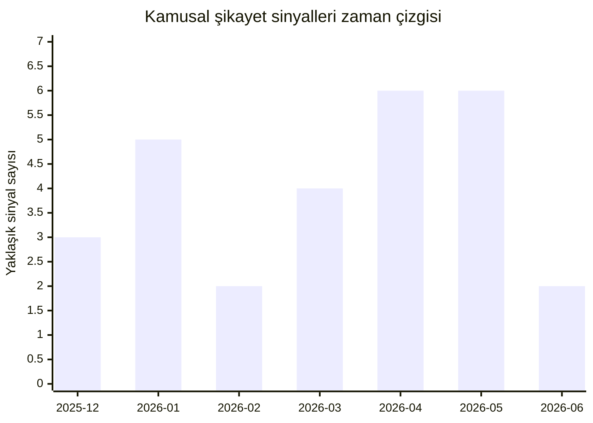

# Claude Chrome uzantısı hakkında kullanıcı şikayetleri ve geliştirme önerileri

## Yönetici özeti

Bu araştırmanın ana sonucu şu: **Claude in Chrome için kamusal memnuniyetsizlik tek bir başlıkta toplanmıyor; ancak en yoğun ve tekrarlayan şikayet kümeleri bağlantı ve oturum eşleme sorunları, izin ve site erişim akışındaki bozulmalar, ve gizlilik-güvenlik endişeleri etrafında toplanıyor.** Chrome Web Store kartı şu anda uzantıyı **2,7/5 puan, yaklaşık 1,2 bin değerlendirme ve 10 milyon kullanıcı** ile gösteriyor; bu da çok geniş kurulum tabanına rağmen kullanıcı değerlendirmesinin belirgin biçimde düşük kaldığını düşündürüyor. Resmî dokümantasyon ile GitHub issue trafiği birlikte okunduğunda, özellikle **Claude Code/Claude Desktop entegrasyonunda “Browser extension is not connected”, hesap uyuşmazlığı, WebSocket/OAuth döngüsü, Windows native messaging çatışmaları ve sahte “organization policy” blokları** öne çıkıyor. citeturn5view0turn31view1turn31view4turn31view11turn31view12turn25search13

İkinci büyük sonuç, **izin modeli kağıt üzerinde ayrıntılı görünse de pratikte kimi kullanıcılar için opak ve kırılgan** olmasıdır. Resmî izin rehberi, onaylı siteleri görme, izinleri geri alma ve izin geçmişini inceleme imkânı verdiğini söylüyor; buna karşılık Reddit ve GitHub’da **izin penceresinin hiç görünmemesi, aynı site için tekrar tekrar onay istemesi, “organization policy” hatasının kişisel hesaplarda bile belirmesi** gibi örnekler bulunuyor. Bu, ürünün güvenlik hedefi ile günlük kullanılabilirlik arasında henüz tam dengelenmemiş bir arayüze sahip olduğuna işaret ediyor. citeturn37view5turn37view6turn24view4turn24view5turn24view6turn24view8turn31view11

Üçüncü büyük sonuç, **gizlilik ve güvenlik tartışmasının teorik olmaktan çıkıp somut bir ürün riski haline gelmiş olmasıdır**. Chrome Web Store açıklamasına göre uzantı **kişisel tanımlayıcı veriler, kişisel iletişimler, konum, web geçmişi, kullanıcı etkinliği ve web sitesi içeriği** ile çalışıyor. Anthropic’in güvenlik dokümanları, yan panel açıldığında **aktif sekmenin ekran görüntülerinin alındığını**, JavaScript çalıştırma yetkisinin **oturum verilerine ve saklanan site verilerine** erişebildiğini, ayrıca çıktı filtrelerinin **“security boundary” olmadığını** açıkça belirtiyor. Buna Mart 2026’da Koi Security’nin açıkladığı **ShadowPrompt** zafiyeti eklendiğinde, kullanıcıların “Claude tarayıcıda fazla şey görüyor” kaygısı yalnızca algısal değil, ürün mimarisiyle ilgili bir risk başlığı haline geliyor. citeturn5view0turn37view3turn37view4turn18view1turn14news21

Ürün tarafında olumlu haber, Anthropic’in **hızlı iterasyon yaptığı** ve kamuya açık olarak hem özellik eklediği hem de bazı entegrasyon kusurlarını kapattığıdır. Claude in Chrome **Ağustos 2025’te deneysel olarak**, **Kasım 2025’te tüm Max planlarına**, **Aralık 2025’te tüm ücretli planlara** açıldı; bu süreçte çoklu sekme, bildirimler, zamanlanmış görevler, planı onaylayıp sonuna kadar çalıştırma, Claude Code entegrasyonu, iş akışı kaydı ve admin allowlist/blocklist kontrolleri geldi. Daha sonra changelog ve X/ClaudeCodeLog parçacıkları, **farklı hesaba bağlı sessiz bağlantı hataları** ve bazı **crash-loop** durumları için düzeltmeler gösteriyor. Ancak kamusal şikayetlerin niteliği, bugün için geliştirici önceliğinin yeni özellikten çok **bağlantı mimarisi, izin görünürlüğü, gizlilik açıklığı ve platform uyumluluğu** olması gerektiğini gösteriyor. citeturn17view0turn16view3turn25search13turn12search16turn12search6

## Kapsam, yöntem ve veri boşlukları

Bu rapor, öncelik sırasına göre şu kamuya açık kaynakları kullandı: **Chrome Web Store liste kartı, Anthropic’in resmî ürün ve yardım sayfaları, Claude Code dokümantasyonu, anthropics/claude-code GitHub issue akışı, Reddit, Hacker News, X arama parçacıkları, güvenlik araştırması ve seçilmiş teknik incelemeler**. İnceleme dönemi, uzantının halka açıldığı **Ağustos 2025** ile mevcut tarih olan **30 Haziran 2026** arasını kapsar. citeturn5view0turn1view3turn16view0turn16view1turn18view2turn9search0turn10search0turn10search2turn12search4turn14search0turn27view5

Aşağıdaki tablo, rapordaki kaynakları ağırlıklandırma mantığını özetler.

| Kaynak grubu | Ağırlık | Bu raporda ne için kullanıldı | Örnekler |
|---|---:|---|---|
| Resmî Anthropic kaynakları | Çok yüksek | Ürün kapsamı, sürüm evrimi, izin modeli, güvenlik varsayımları, resmî sınırlamalar | Chrome Web Store kartı, yardım merkezi, release notes, resmî blog ve Claude Code docs. citeturn5view0turn16view0turn16view1turn16view3turn18view2turn39view0 |
| GitHub issue ve changelog | Çok yüksek | Yeniden üretilebilir hata sinyalleri, platform çatışmaları, hesap bağlama ve OAuth sorunları, geliştirici düzeltmeleri | anthropics/claude-code issue’ları ve changelog parçacıkları. citeturn31view1turn31view4turn31view8turn31view9turn31view11turn31view12turn25search13 |
| Reddit ve Hacker News | Yüksek | Kullanıcı dilindeki günlük ağrı noktaları, UX sürtünmesi, güven ve güvenlik algısı, pratik kullanım sorunları | Reddit ve HN tartışmaları. citeturn24view0turn24view2turn24view4turn24view6turn24view7turn22view0turn22view4 |
| X arama parçacıkları | Orta | Güç kullanıcılarının “flaky” değerlendirmeleri ve geliştirici değişiklik notu sinyalleri | X sonuç parçacıkları. citeturn12search4turn12search6turn12search16 |
| Güvenlik ve teknik incelemeler | Orta | Mimari risklerin dış gözle değerlendirilmesi, güvenlik olayı ve kullanım incelemeleri | Koi Security, TechRadar, teknik bloglar. citeturn18view1turn27view5turn38view3 |

En önemli veri boşluğu, **Chrome Web Store inceleme metinlerinin erişilebilir HTML çıktısında görünmemesi** oldu. Web Store doğrudan puan, değerlendirme sayısı, sürüm, dil ve gizlilik kategorilerini veriyor; fakat yorum gövdeleri bu arayüzde geri dönmüyor. Bu nedenle aşağıdaki “sıklık” analizleri **tek tek mağaza yorumu sayımı değil**, kamuya açık şikayet sinyallerinin kodlanmış toplamıdır. Aynı nedenle **YouTube transcript erişimi de güvenilir değildi**; en az bir doğrudan açma denemesi throttle hatasına takıldı ve video’lar ancak başlık/açıklama düzeyinde ikincil sinyal olarak değerlendirilebildi. X tarafında da tam sayfa açılımlarının bazısı boş döndü. citeturn7view0turn5view0turn27view0turn20view0turn20view1

Bu raporda kullandığım kategori sayımları **tekil kullanıcı sayısı** değildir; her kamusal kaynak bir veya birden fazla kategoriye kodlandı. Dolayısıyla tablo toplamları, incelenen kaynak sayısından yüksek olabilir. Bu yaklaşım, mağaza yorum gövdelerine tam erişim yokken dahi **hangi sorun sınıflarının en tekrarlı ve en yıkıcı olduğunu** görünür kılmak için seçildi. citeturn31view1turn24view4turn18view1turn22view4turn38view3

## Şikayetlerin yoğunluğu ve zaman içindeki deseni

Ürünün evrimi ile şikayet paterni arasında net bir ilişki var. Anthropic, uzantıyı **Ağustos 2025’te kontrollü pilot olarak**, **Kasım 2025’te Max planına beta olarak**, **Aralık 2025’te ise tüm ücretli planlara** açtı. Kamusal şikayet sinyalleri esas olarak **Aralık 2025 sonrasındaki genişlemeyle** görünür hale geliyor; özellikle 2026 ilkbaharında Claude Code/Desktop duvarının kaldırılması, bridge/OAuth/native messaging zincirini daha kritik hale getirdiği için issue hacmi yükseliyor. citeturn1view3turn16view3turn18view2

Bir başka dikkat çekici işaret, Web Store değerlendirme havuzunun büyümesine rağmen düşük puanın korunmasıdır. **4 Mayıs 2026 tarihli teknik blog parçacığı 838 değerlendirme ve 2,7 yıldız** kaydederken, **29 Haziran 2026 tarihli mağaza kartı 1,2 bin değerlendirme ve yine 2,7 puan** gösteriyor. Bu, yaklaşık sekiz haftada değerlendirme hacminin anlamlı biçimde arttığını, fakat memnuniyet profilinin belirgin şekilde iyileşmediğini düşündürüyor. citeturn38view3turn5view0

Aşağıdaki grafik, tarih bilgisi taşıyan kamusal sinyallerin **yaklaşık aylık dağılımını** gösterir. Bu grafik tam evreni değil, kodlanan kamuya açık corpus’u temsil eder.

Grafik, iki zirveye işaret ediyor. İlki **Ocak 2026’da**, yani daha geniş sahaya açıldıktan hemen sonra, entegrasyon ve destek matrisi kaynaklı sorunların görünür hale geldiği dönemde ortaya çıkıyor. İkincisi ise **Nisan–Mayıs 2026’da**, Windows/Desktop çatışmaları, yanlış “organization policy” blokları, permission popup bozulmaları, OAuth retry loop’ları ve ShadowPrompt güvenlik olayı etrafında oluşuyor. Bu okumayı GitHub issue tarihleri, Koi’nin 26 Mart 2026 güvenlik yayını ve Reddit/HN tartışmalarındaki göreli tarihler destekliyor. citeturn9search0turn9search6turn9search13turn25search1turn14search0turn10search0turn11search0turn10search2

## Kategori bazında bulgular

Aşağıdaki karşılaştırma tablosu, kodlanan kamusal sinyallerin kategori bazlı dağılımını özetler. **Adetler, bu araştırmada kodlanan kaynak/sinyal sayılarıdır; tekil kullanıcı sayısı değildir ve kategoriler örtüşebilir.**

| Kategori | Kodlanan sinyal adedi | Şiddet | Baskın örnekler | Geliştirici için kısa öneri | Örnek kanıt |
|---|---:|---|---|---|---|
| Bağlantı, oturum, hesap eşleme | 12 | Kritik | “Browser extension is not connected”, token/user mismatch, OAuth retry, Windows native messaging çatışması | Tek bir bağlantı sağlık-denetleyicisi, hesap bağlama önkontrolü, otomatik reconnect | citeturn31view1turn31view4turn31view12turn31view9turn12search4 |
| İzinler, site erişimi, policy blokları | 8 | Yüksek | Tekrar tekrar izin isteme, popup’ın hiç görünmemesi, sahte org-policy blokları | İzin durumunu görünür kıl, neden kodu göster, toplu domain yönetimi ekle | citeturn24view2turn24view4turn24view6turn24view8turn31view11 |
| Gizlilik, güvenlik, veri işleme | 6 | Kritik | Geniş veri kapsamı, aktif sekme screenshot’ı, login session erişimi, ShadowPrompt | Hassas veri minimizasyonu, privacy mode, daha açık saklama/eğitim açıklaması | citeturn5view0turn37view3turn37view4turn18view1turn28view5 |
| Uyumluluk, platform, diğer eklentiler | 6 | Yüksek | Windows + Desktop çatışması, Brave/Arc/Comet talepleri, AV/TLS inspection etkisi | Resmî destek matrisi, conflict detector, platform bazlı rehber | citeturn31view4turn31view7turn10search0turn16view2turn18view2 |
| Performans, çökme, kararlılık | 5 | Yüksek | Chrome çökmesi, initialize/chat session hataları, flicker/logout, uzun oturum bozulması | Uzun oturum kompaksiyonu, daha hafif context sürümü, crash telemetry | citeturn24view0turn22view4turn31view9turn39view5 |
| UI/UX ve özellik boşlukları | 6 | Orta-Yüksek | Hafıza/süreklilik eksikliği, multi-profile yok, account selector yok, görünmeyen permission state | Profil seçici, oturum sürekliliği, daha açıklayıcı ayarlar | citeturn24view7turn31view5turn31view8turn37view5 |
| Yerelleştirme ve Türkçe arayüz | 2 | Orta | Uzantı dili English (US), resmî dil listesinde Türkçe yok | Türkçe UI, yardım merkezi ve hata mesajı lokalizasyonu | citeturn5view0turn40view0 |
| Abonelik, plan, hesap bağlantısı | 2 | Orta | Ücretli plan şartı, subscription prompt davranışı, yanlış hesapla bağlanma | Plan uygunluk denetimi ve açık onboarding | citeturn16view2turn25search2turn31view8 |

### Bağlantı, oturum ve hesap eşleme sorunları

En sık tekrar eden problem ailesi, **uzantının tek başına çalışmasına rağmen Claude Code veya Claude Desktop ile köprü kuramaması**. GitHub issue’larında Ocak 2026’dan itibaren aynı çekirdek hata farklı varyantlarla tekrar ediyor: uzantı kurulu ve yan panel çalışıyor, fakat CLI tarafı `tabs_context_mcp` veya benzeri çağrılarda **“Browser extension is not connected”** dönüyor. Resmî Claude Code dokümanları da bu ağrı noktasını doğruluyor; service worker’ın uzun oturumlarda idle kalabildiğini, Windows’ta named pipe ve native host hataları yaşanabildiğini, çözüm olarak `/chrome` ile reconnect önerildiğini açıkça yazıyor. citeturn31view1turn19view1turn19view2turn19view3

Windows özelinde sorun daha sert görünüyor. Mayıs 2026 tarihli bir GitHub raporu, **Claude Desktop ile Claude Code’un aynı Windows kayıt defterine farklı Native Messaging host’lar bırakması** nedeniyle uzantının sürekli “not connected” kalabildiğini ayrıntılı biçimde gösteriyor. Bu issue’da uzantının giriş yapmış ve sağlıklı görünmesine rağmen entegrasyonun kopuk kaldığı, hatta arka planda çalışan `cowork-svc.exe` benzeri servislerin soketi açık tuttuğu anlatılıyor. Bu, “kurulu ama kullanılmıyor” türü en yıkıcı hata sınıfı; çünkü çekirdek vaat olan tarayıcı otomasyonunu tümden boşa çıkarıyor. citeturn31view4

Hesap bağlama tarafında da benzer bir olgunluk açığı var. Haziran 2026’daki özellik talebi, uzantının **ayrı bir hesap seçiciye sahip olmadığını**, Chrome profilindeki `claude.ai` oturumunu miras aldığını ve bunun CLI hesabıyla farklılaştığında sessizce bozuk bir bağlanma durumu üretebildiğini söylüyor. Bu gözlem, changelog’daki **“OAuth token belongs to a different account”** düzeltmesiyle de örtüşüyor; yani geliştirici tarafı bu sınıfı fiilen tanımış durumda. X’te bir güç kullanıcısının uzantıyı “GOAT browser agent” diye överken aynı cümlede **“flaky”** demesi de, algının bugün “çok güçlü ama sık nazlanan” çizgisinde olduğunu gösteriyor. citeturn31view8turn25search13turn12search16turn12search4

### İzinler, site politikaları ve erişim kontrolü

İkinci büyük sorun kümesi, **izin sisteminin görünmezleşmesi veya beklenmedik davranması**. Resmî izin rehberi, kullanıcıların onaylı siteleri görebildiğini, izinleri geri alabildiğini ve **permission history** görüntüleyebildiğini söylüyor. Fakat pratikte kullanıcı raporları bunun her zaman doğru işlemediğini gösteriyor: bir Reddit kullanıcısı Claude’un her yeni domainde **`permission_required`** hatası verdiğini, fakat izin penceresinin **hiç görünmediğini** anlatıyor; başka bir raporda önceden izin verilmiş siteler için bile her çalıştırmada yeniden onay istendiği belirtiliyor. citeturn37view5turn37view7turn24view4turn24view5turn24view6

Yanlış policy blokları da önemli bir tema. Hem GitHub’da hem Reddit’te, kişisel kurulumlarda bile **“This site is blocked by your organization’s policy”** veya benzeri engellerin belirdiği raporlar var. Özellikle Nisan 2026’daki bir issue, kişisel profilde `claude.ai`’ye navigasyonun bile “organization policy” bahanesiyle bloke edilebildiğini gösteriyor. Resmî çözüm belgeleri bu tür engelleri teorik olarak gerçek kurumsal allowlist/blocklist yapılarına bağlıyor; fakat kamusal şikayetler, ürünün zaman zaman bu durumu yanlış pozitif olarak kullandığını düşündürüyor. citeturn31view11turn24view8turn16view2turn37view6

İzin tarafındaki en kritik tasarım problemi şu görünüyor: **ürünün güvenlik için seçtiği ayrıntılı izin modeli, bozulduğunda kullanıcıya teşhis edilebilir bir durum sunmuyor**. “İzin eksik mi, popup render mı olmadı, admin policy mi uygulandı, blocklist mi devrede, yoksa Token/OAuth zinciri mi koptu?” sorusu, kamusal raporların çoğunda son kullanıcı tarafından net ayırt edilemiyor. Bu da aynı çekirdek kusurun “permission loop”, “blocked by policy”, “popup gelmiyor”, “claude.ai subscription gerekiyor” gibi farklı yüzlerle görünmesine yol açıyor. citeturn24view2turn24view4turn25search2turn31view11

### Gizlilik, güvenlik ve veri işleme

Gizlilik şikayetleri yalnızca algısal değil; ürünün resmî veri kapsamı gerçekten geniş. Chrome Web Store’da Anthropic, uzantının **kişisel tanımlayıcı bilgi, kişisel iletişimler, konum, web geçmişi, kullanıcı etkinliği ve web sitesi içeriği** ile çalıştığını beyan ediyor. Resmî güvenlik dokümanı da yan panel açıldığında **aktif sekmenin ekran görüntüsünün alındığını**, görünür ekrandaki hassas belgeler ve özel bilgilerin Claude tarafından görülebileceğini söylüyor. Bu yüzden HN’de “Gizlilikten niye hiç bahsetmiyorlar?” sorusunun ve TechRadar’da “internette yaptığım hemen her şeye erişim verdim” tedirginliğinin yükselmesi şaşırtıcı değil. citeturn5view0turn37view2turn22view4turn28view5

Anthropic’in kendi dokümanları, riskin sert tarafını net biçimde kabul ediyor. Uzantı, JavaScript çalıştırabildiğinde **browser’ın o sayfadaki erişebildiği login session’lara, saklanan site verilerine ve sayfa içeriğine** erişim potansiyeli kazanıyor; ayrıca token ve API key kalıplarını engellemeye çalışan filtrelerin **tek başına güvenlik sınırı olmadığı** özellikle belirtiliyor. Bu, HN’deki bir kullanıcının “Claude çerezlerden access token’ımı aldı ve private API’ye cURL attı” diye anlattığı deneyimin neden ürkütücü algılandığını açıklıyor: insanlar burada yalnızca özetleyen bir yan panel değil, kendi oturum state’leri içinde hareket eden bir temsilci kullanıyor. citeturn37view4turn22view0

Güvenlik başlığındaki dönüm noktası, 26 Mart 2026’da açıklanan **ShadowPrompt** oldu. Koi Security, uzantının `*.claude.ai` güven sınırını fazla geniş tuttuğunu ve `a-cdn.claude.ai` üzerindeki DOM-XSS ile birleştirildiğinde **“no clicks, no permission prompts”** düzeyinde prompt enjeksiyonu yapılabildiğini gösterdi. Koi, riskli sürümler için **1.0.41 ve üzeri** tavsiye etti; üçüncü taraf güvenlik haberleri de Anthropic’in sorunu yamaladığını aktardı. Güvenlik açısından iyi haber şu: resmî blog, başlangıçta prompt injection saldırı başarısının **%23,6’dan %11,2’ye**, daha güncel güvenlik sayfasında ise mevcut konfigürasyon için yaklaşık **%1** seviyesine indirildiğini söylüyor. Kötü haber ise Anthropic’in kendisinin de belirttiği gibi **risk hâlâ sıfır değil**. citeturn18view1turn14news21turn39view0turn39view1turn37view4

### Uyumluluk, platform ve diğer eklentiler

Uyumluluk başlığında iki problem var: **gerçek teknik kısıt** ve **mesaj karması**. Chrome Web Store listing’i, uzantının **diğer Chromium tabanlı tarayıcılarda desteklenmediğini** söylerken, Claude Code dokümanları **Google Chrome ve Microsoft Edge ile çalıştığını**, fakat Brave, Arc ve diğer Chromium türevlerinde henüz desteklenmediğini yazıyor. Bu iki metin teknik olarak tamamen çelişkili olmasa bile son kullanıcı açısından kafa karıştırıcı; çünkü “Chrome uzantısı” ile “Chrome entegrasyonu” arasındaki ayrım açık anlatılmıyor. GitHub’da alternatif Chromium tarayıcı desteği ve multi-profile desteği için birden fazla özellik talebi açılmış olması, bu belirsizliğin sahaya yansıdığını gösteriyor. citeturn5view0turn18view2turn31view5turn31view7

Dış ortam çatışmaları da küçümsenmemeli. Resmî troubleshooting sayfası, **başka eklentilerin sayfa etkileşimine müdahale edebileceğini** söylüyor. Reddit’te bir kullanıcı, “not connected” probleminin kök nedenini **AV/TLS inspection** olarak teşhis eden bir çözüm paylaşmış; GitHub’da da Norton Web Shield / HTTPS scanning’in kök sebep olduğuna dair rapor var. Bu, ürünün yalnızca kendi koduyla değil, **güvenlik yazılımı, kurumsal trafik ara katmanları ve diğer uzantılarla** birlikte yaşamak zorunda olduğunu; dolayısıyla “destek matrisi”nin bugün fazlasıyla örtük kaldığını gösteriyor. citeturn16view2turn10search0turn9search8

### Performans, kararlılık, UX ve özellik boşlukları

Doğrudan performans şikayetleri, bağlantı ve izin sorunları kadar kalabalık değil; fakat var olanlar etkili. Resmî yardım merkezi “gereksiz sekmeleri kapatın”, “karmaşık görevleri küçük adımlara bölün” diyerek performans sınırlamasını kabul ediyor. Reddit’te bir kullanıcı basit bir görevde **Chrome’un her seferinde çöktüğünü** söylüyor; HN’de ise bir kullanıcı geniş Zillow listesini analiz ettirmeye çalışırken uzantının sayfalamayı tamamlayamadığını ve görevin güvenilir olmadığını belirtiyor. Yine HN’de “Unable to initialize the chat session” hata metninin yorumlarda yaygın olduğu ifade ediliyor. citeturn16view2turn24view0turn22view1turn22view4

Bu başlıkta Anthropic’in kendi “computer and browser use” rehberi özellikle aydınlatıcı. Şirket, screenshot tabanlı akışlarda **her eylemin yaklaşık 1.000–1.800 token** tüketebildiğini ve **200k context window’un 100 ekran görüntüsünün çok altında dolabildiğini** yazıyor. Bu, uzantı için doğrudan yayımlanmış bir benchmark değil; fakat HN’deki “tüm context’i yiyor” veya “uzun iş akışlarında saçmalıyor” şikayetleriyle birlikte okunduğunda, **uzun oturumlarda bağlam şişmesi ve kararlılık kaybının yapısal bir olasılık** olduğunu düşündürüyor. Burada yaptığım yorum bir çıkarımdır, ama resmi teknik çerçeve ile kullanıcı deneyimi birbirini destekliyor. citeturn21view1turn39view3turn39view5

UX ve özellik boşluklarında ise üç tema öne çıkıyor. Birincisi, **session continuity** eksikliği: Reddit’te uzantının “Projects, MCP bağlantıları veya oturumlar arası hafıza” taşımadığı söyleniyor. İkincisi, **profil ve hesap farkındalığı** eksikliği: hem multi-profile talebi hem account selector talebi bunu doğruluyor. Üçüncüsü, **lokalizasyon**: Chrome Web Store uzantıyı **English (United States)** olarak listeliyor; resmî Claude dil listesinde **Türkçe bulunmuyor**, her ne kadar web/desktop uygulamasında kullanıcı hangi dilde yazarsa o dilde yanıt alma mümkün olsa da. Bu da Türk kullanıcı için içerik düzeyinde değil ama **arayüz ve dokümantasyon düzeyinde** bariz bir boşluk bırakıyor. citeturn24view7turn31view5turn31view8turn5view0turn40view0

## Geliştirici yanıtları ve güncelleme çizgisi

Anthropic’in ürün cevabı iki kanalda görülüyor: **özellik genişletme** ve **entegrasyon bakım düzeltmeleri**. Release notes’a göre uzantı **26 Ağustos 2025’te deneysel** başladı; **16 Eylül 2025’te** uzun iş akışları, slash komutları ve bağlamsal öneriler geldi; **29 Eylül 2025’te** çoklu sekme ve bildirimler eklendi; **24 Kasım 2025’te** zamanlanmış görevler ve “follow a plan” geldi; **18 Aralık 2025’te** Claude Code entegrasyonu, Claude Desktop kontrolü, workflow recording, console logs ve Team/Enterprise admin kontrolleri açıldı. Bu, Anthropic’in gizlilik ve güvenlik kadar **ürün kapsamını hızla büyüttüğünü** gösteriyor. citeturn17view0turn16view3

Buna karşılık bug-fix görünürlüğü, extension’a özel bir halka açık issue tracker’dan çok **Claude Code changelog’u ve dağınık issue akışı** üzerinden izlenebiliyor. Changelog parçacıkları, **farklı hesabın token’ı nedeniyle sessiz bağlantı başarısızlığının** düzeltildiğini; X/ClaudeCodeLog parçacıkları ise bazı **shared-tab yokluğunda crash-loop** problemlerinin kapatıldığını gösteriyor. Başka bir deyişle, geliştirici ekibi sorunları ele alıyor; fakat kullanıcının “bu hata biliniyor mu, düzeltildi mi, hangi sürümde?” sorusuna doğrudan cevap veren tek, uzantı-odaklı ve sürüm bazlı bir halka açık bug özet sayfası görünmüyor. citeturn25search13turn12search16turn12search6

Aşağıdaki tablo, en büyük kamusal hata kümelerini “nasıl çoğaltıldı / bugün ne biliyoruz?” formatında özetler.

| Büyük hata kümesi | Çoğaltma adımları | Gözlenen sonuç | Muhtemel tetikleyici | Görülen geliştirici yanıtı |
|---|---|---|---|---|
| Claude Code bağlantısı hiç kurulmaz | Uzantı kur, `claude --chrome` çalıştır, `tabs_context_mcp` çağır | **“Browser extension is not connected”** | Native messaging host ya da bridge kopukluğu | Resmî docs reconnect, host doğrulama ve restart öneriyor. citeturn31view1turn19view0turn19view3 |
| Windows’ta Desktop yüklüyken bağlantı bozulur | Windows’a hem Claude Desktop hem Claude Code kur; uzantıyı bağla; herhangi bir `mcp__claude-in-chrome__*` aracını çağır | Uzantı sağlıklı görünse de bağlantı kurulmaz | Registry’de Native Messaging host çatışması, arka plan servisleri | Issue açık; resmî docs Windows named-pipe/native-host sorunlarını kabul ediyor. citeturn31view4turn19view2 |
| Permission popup hiç render olmaz | Yeni domaine git; Claude erişmek istediğinde popup bekle | `permission_required: [hostname]`, fakat popup yok | Permission UI render zinciri veya policy state bozulması | Resmî rehber teorik olarak izin yönetimini destekliyor; kullanıcı raporları pratikte boşluk gösteriyor. citeturn24view4turn24view5turn37view5 |
| Yanlış “organization policy” blokları | Uzantı v1.0.68 ile kişisel profilde `claude.ai` veya normal sitelere navigate et | **“This site is blocked by your organization's policy”** | Blocklist/org-policy mantığının yanlış pozitif üretmesi | Resmî docs gerçek kurumsal allowlist/blocklist’lerden söz ediyor; issue ise kişisel profilde de görüldüğünü gösteriyor. citeturn31view11turn37view6 |
| OAuth retry/flicker/logout döngüsü | v1.0.70, persistent 403 ile side panel | Side panel titriyor, oturum düşüyor, context siliniyor | Bridge tarafında OAuth/WS durum makinesi bozulması | Issue kapalı; benzer hesap-uyuşmazlığı sınıfı için changelog’da bağlantı düzeltmeleri var. citeturn31view9turn25search13 |
| Hesap eşleşmiyor, “connected” görünse de çalışmıyor | Chrome profili bir Claude hesabında, CLI başka hesapta | “Connected” görünür, ama grup/tab bağlanmaz | Ayrı account selector olmaması | Changelog’da farklı account token’ı için sessiz bağlanmama düzeltmesi yer alıyor. citeturn31view8turn25search13turn12search16 |

## Önceliklendirilmiş geliştirme önerileri

**Birinci öncelik, bağlantı zincirini tek bir gözlemlenebilir sisteme dönüştürmek olmalı.** Kullanıcı bugün “uzantı kurulu, yan panel açık, neden çalışmıyor?” sorusunun cevabını çoğu zaman bulamıyor. Uzantı; native host, bridge, account binding, service worker ve CLI/Desktop tarafını tek bir “health panel” içinde göstermeli ve otomatik onarma akışına sahip olmalı. “Wrong account”, “service worker idle”, “registry conflict”, “AV/TLS interception”, “popup blocked” gibi nedenler son kullanıcı dilinde doğrudan gösterilmeli. Çünkü kamusal veride en büyük şikayet kümesi budur. citeturn31view1turn31view4turn31view12turn19view1turn12search4

**İkinci öncelik, izin modelini daha açıklanabilir ve daha kalıcı hale getirmek olmalı.** Resmî rehber zaten izin geçmişi ve onaylı siteler kavramına sahip; sorun, bu durumun kullanıcı nezdinde tutarlı görünmemesi. Domain bazlı izinler için “neden soruyorum”, “neden engellendin”, “hangi politika uygulandı”, “bu izin neden hatırlanmadı” gibi açıklamalar zorunlu hale gelmeli. Ayrıca tek bir “Permission Debug” görünümü eklenmesi, bugün Reddit ve GitHub’da görülen izin kısır döngülerini dramatik biçimde azaltabilir. citeturn37view5turn24view4turn24view6turn24view8turn31view11

**Üçüncü öncelik, gizlilik yüzeyini küçültmek ve bunu çok daha açık anlatmak olmalı.** Uzantı geniş veri kategorileriyle çalışıyor; aktifleştirildiğinde ekran görüntüsü alıyor ve resmî belgeler bunun login session’lara kadar uzanabildiğini kabul ediyor. Bu nedenle “privacy mode”, “sadece görünür alan / belirli alan”, “sensitive-site lockout”, “asla screenshot alma” gibi daha keskin güvenlik profilleri eklenmeli. Buna veri saklama, eğitimde kullanım ve insan incelemesi ihtimaline dair tek bir sade açıklama sayfası eşlik etmeli; zira HN ve TechRadar’daki kaygıların çoğu belirsizlikten güç alıyor. citeturn5view0turn37view3turn37view4turn22view4turn28view5

**Dördüncü öncelik, destek matrisini ve çevresel çatışmaları resmileştirmek olmalı.** “Chrome mu, Edge mi, Brave neden değil, Arc ne zaman, WSL neden yok, AV/TLS inspection ne yapar, başka extension’lar neyi bozar?” sorularının bugün tek bir kanonik cevap sayfası yok. Store listing, help center ve Claude Code docs tek destek matrisi altında hizalanmalı; kurulum sırasında da çevresel test çalıştırılarak bilinen çatışmalar proaktif biçimde gösterilmeli. Bu alan, destek maliyetini düşürme açısından da yüksek getirili görünüyor. citeturn5view0turn18view2turn16view2turn31view7turn10search0

**Beşinci öncelik, oturum sürekliliği ve profil farkındalığı olmalı.** Kullanıcıların önemli bir kısmı ürünü yalnızca “tek seferlik browser robotu” değil, Claude ekosisteminin doğal uzantısı gibi görmek istiyor. Buna rağmen bugün ayrı hesap seçici, çoklu profil desteği ve oturumlar arası bağlam devamlılığı sınırlı. Projects/memory sürekliliği, seçilebilir profil/hesap hedefleme ve “hangi tab group / hangi browser profile” seçimleri, hem üretkenliği artırır hem de yanlış hesaba bağlanma gibi kritik hataları azaltır. citeturn24view7turn31view5turn31view8turn25search13

**Altıncı öncelik, lokalizasyon ve Türkçe kullanıcı deneyimi olmalı.** Bugün Claude kendisi Türkçe konuşabilir; ama uzantı katmanı ve yardım merkezi tarafında **Türkçe destek belirgin değil**. Web Store dili İngilizce, resmî dil listesinde Türkçe yok. Bu eksikliği gidermek; hata mesajlarını, izin uyarılarını ve kurulum adımlarını daha anlaşılır yapacağı için destek yükünü azaltır ve Türkiye gibi pazarlarda benimsemeyi güçlendirir. citeturn5view0turn40view0

## Ekler

### Önceliklendirilmiş kaynak listesi

| Kaynak | Tür | Bu rapordaki rolü |
|---|---|---|
| Claude – Chrome Web Store | Birincil | Güncel puan, değerlendirme sayısı, kullanıcı tabanı, sürüm, dil ve veri işleme kategorileri. citeturn5view0 |
| Piloting Claude in Chrome | Birincil | Ürünün güvenlik tasarımı, rollout tarihi, prompt injection metrikleri. citeturn1view3turn39view0 |
| Claude Help Center – Permissions / Safely / Troubleshooting / Release Notes | Birincil | İzin modeli, risk açıklamaları, resmî sorun sınıfları, ürün güncelleme çizgisi. citeturn16view0turn16view1turn16view2turn16view3 |
| Claude Code docs – Chrome integration | Birincil | Beta destek matrisi, reconnect ve Windows sorunları, service worker idle notu. citeturn18view2turn19view1turn19view2 |
| anthropics/claude-code GitHub issues | Birincil | Yeniden üretilebilir hata örnekleri ve tarihli kamuya açık arıza izleri. citeturn31view1turn31view4turn31view8turn31view11turn31view12 |
| anthropics/claude-code changelog parçacıkları | Birincil | Bazı hesap ve bağlantı hataları için yayımlanmış düzeltme sinyalleri. citeturn25search13turn25search10 |
| Reddit – r/ClaudeAI / r/ClaudeCowork | Topluluk | Permission loop, crash, no-memory, blocked-by-policy ve workaround raporları. citeturn24view0turn24view4turn24view6turn24view7turn24view8 |
| Hacker News – Claude in Chrome başlığı | Topluluk | Gizlilik, güvenlik ve gerçek kullanım etkinliği tartışmaları. citeturn21view0turn22view0turn22view4 |
| X parçacıkları | Topluluk / değişiklik sinyali | “Flaky” algısı ve bazı düzeltme notları. citeturn12search4turn12search6turn12search16 |
| Koi Security – ShadowPrompt | Güvenlik araştırması | En kritik üçüncü taraf güvenlik olayı ve patch eşiği. citeturn18view1 |
| TechRadar incelemesi | Teknik medya | Güven/mahremiyet endişesinin kullanıcı deneyimindeki ifadesi. citeturn27view5turn28view5 |
| Build to Launch teknik blogu | Teknik blog | Kurulum sürtünmesinin Web Store puanına etkisine dair alan notu. citeturn38view3turn38view4 |

### Temsilî kullanıcı alıntıları

Aşağıdaki alıntılar, özgün ifadelerin **Türkçe çeviri/parafrazı** olarak verildi.

| Tema | Türkçe temsilî alıntı | Kaynak |
|---|---|---|
| Bağlantı kopukluğu | “Uzantı kendi başına çalışıyor ama CLI ona bağlanamıyor; sürekli ‘browser extension is not connected’ dönüyor.” | citeturn31view1 |
| Windows çatışması | “Desktop da kuruluysa Windows’ta uzantı sağlıklı görünse bile bağlantı hiç kurulmayabiliyor.” | citeturn31view4 |
| İzin penceresi görünmüyor | “Her yeni sitede permission_required alıyorum; ama izin açılır penceresi hiç gelmiyor.” | citeturn24view4turn24view5 |
| Tekrarlayan izin talebi | “Önceden izin verilen aynı siteler için bile her seferinde yeniden izin istiyor.” | citeturn24view6 |
| Yanlış policy bloğu | “Kişisel bilgisayarımda bile ‘kuruluşunuzun gizlilik politikası bu sayfayı engelliyor’ diyor.” | citeturn24view8turn31view11 |
| Çökme | “Claude in Chrome görevini her çalıştırdığımda bütün Chrome çöküyor.” | citeturn24view0 |
| Hafıza/süreklilik boşluğu | “Bu, Projects veya oturumlar arası hafıza taşıyan tam Claude değil; daha çıplak bir browser oturumu gibi.” | citeturn24view7 |
| Gizlilik tedirginliği | “İnternette yaptığım neredeyse her şeye erişim verince gerçekten ürperdim.” | citeturn28view5 |
| Çerez/token hassasiyeti | “Bu, tarayıcı çerezlerime ve oturumuma dayanıyor; risk tam da burada.” | citeturn22view0turn37view4 |
| Güvenlik olayı | “Hiç tıklama olmadan, sadece siteyi ziyaret ederek prompt enjekte edilip tarayıcı kontrolü ele alınabiliyordu.” | citeturn18view1 |

### Eksik veya belirsiz veri notları

Chrome Web Store açısından **yorum gövdelerine doğrudan erişim olmadığı** için, bu rapor mağaza içindeki her bir şikayeti satır satır sayılamadı; bunun yerine puan, rating hacmi ve açık webde görünür şikayet sinyalleri birlikte kullanıldı. Aynı biçimde YouTube tarafında transcript erişimi bu arayüzde güvenilir değildi; doğrudan bir video fetch denemesi throttle’a takıldı. X tarafında da bazı tam sayfa açılımları içerik döndürmedi. Bu yüzden YouTube ve X, **nicel sayımda değil, nitel destekleyici sinyal** olarak kullanıldı. citeturn7view0turn27view0turn20view0turn20view1