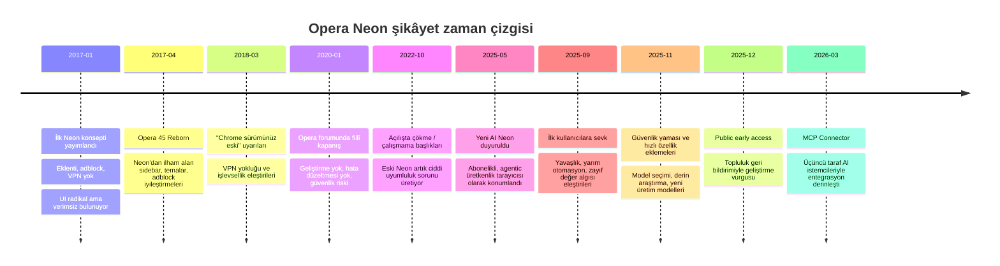

# Opera Neon kullanıcı şikâyetleri ve iyileştirme öncelikleri

## Yönetici özeti

Opera Neon hakkında kullanıcı şikâyetleri tek bir ürün döngüsüne ait değil, **iki ayrı döneme** ayrılıyor: ilki 12 Ocak 2017’de yayımlanan ve Opera’nın açıkça “güncel Opera masaüstü tarayıcısının yerine geçmek için tasarlanmadığını” söylediği konsept Neon; ikincisi ise Mayıs 2025’te duyurulan, 30 Eylül 2025’te kullanıma açılan, abonelik tabanlı “agentic AI browser” Neon’dur. Bu ayrım kritik; çünkü eski Neon’daki temel şikâyetler “tarayıcı temellerinin eksikliği” iken, yeni Neon’daki şikâyetler daha çok “yavaşlık, yarım kalan otomasyon, karmaşık deneyim ve fiyat/değer dengesi” etrafında toplanıyor. citeturn4view0turn4view1turn3search7

Manuel kodlamaya dayalı örneklemimde en sık görülen şikâyet kümeleri **özellik eksikleri**, **UI/UX sorunları**, **uyumluluk/kararlılık sorunları** ve **destek-güncelleme** başlıkları oldu. Eski Neon döneminde özellikle **eklenti yokluğu**, **yerleşik reklam engelleyici/VPN eksikliği**, **alışılmadık ve alan tüketen arayüz**, **güncelleme kesilmesi** ve buna bağlı **güvenlik riski** baskındı. Yeni Neon’da ise kullanıcılar ve incelemeciler daha çok **Comet gibi rakiplere göre daha yavaş görev tamamlama**, **otomasyonun son adımda yarım kalması**, **küçük/karışık kontrol yüzeyi**, **uyku modunda görev kopması** ve **$19.90/ay fiyatın yüksek bulunması** üzerinde duruyor. citeturn5view5turn6view0turn5view6turn4view6turn5view1turn12view2turn11view0

En önemli analitik bulgu şu: **Opera, eski Neon’daki “deneysel ama terk edilmiş” algısından yeni Neon’da “hızla gelişen ama olgunlaşmamış ücretli ürün” algısına geçmiş durumda.** Bu, olumsuz algıyı tamamen ortadan kaldırmıyor; sadece biçimini değiştiriyor. Resmî tarafta 2025 sonundan 2026’ya güvenlik yamaları, model seçici, yeni üretim modelleri, derin araştırma ve MCP Connector gibi eklemeler görüldü; yani artık “tamamen bırakılmış ürün” değil. Fakat kamuya açık hata/geri bildirim izinde, performans ve iş akışı güvenilirliği konusunda kullanıcıların beklediği olgunluk düzeyine henüz erişilmediği anlaşılıyor. citeturn4view4turn4view3turn4view5turn21search1

Ürün açısından en yüksek öncelikli iyileştirmeler şunlar olmalı: **görev güvenilirliği ve devamlılık**, **otomasyonun son adımı tamamlama oranı**, **hız/gecikme azaltımı**, **daha anlaşılır ve kısayol odaklı AI etkileşim modeli**, **şeffaf izin/eylem günlüğü**, ve **ücretli planı güçlendirecek daha net bir değer paketi ya da sınırlı ücretsiz katman**. Bu öneriler hem eski Neon’un “günlük kullanım için yetersiz” tarihsel yükünü azaltır, hem de yeni Neon’un erken benimseyenler dışına açılmasını kolaylaştırır. citeturn4view6turn5view1turn12view2turn19search0turn19search5turn19search9

## Kapsam ve yöntem

Bu rapor, **2017–2026** aralığındaki resmî Opera kaynaklarını, Opera forumlarını, Reddit gönderilerini, Türkçe kullanıcı içeriklerini ve seçilmiş teknoloji incelemelerini birlikte değerlendirir. Aynı marka adı altında iki farklı ürün nesli olduğu için, veriyi “tek ürün” gibi değil, **aynı marka altında evrilen iki kullanım vaadi** gibi okudum. Eski Neon’un resmî duyurusu, belirli eksikleri baştan kabul eder; yeni Neon’un resmî duyurusu ise AI-ajan odaklı, abonelikli, masaüstü üretkenlik tarayıcısı vaat eder. citeturn4view0turn4view1turn7view0

Aşağıdaki sayımlar, resmî ve kullanıcı kaynaklarından **manuel olarak kodlanan 55 ayrı şikâyet ifadesine** dayanır. Buradaki “adet”, pazar geneli nicel şikâyet hacmi değil; incelenen kaynaklar içinde geçen **ayırt edilebilir şikâyet örneklerinin** sayısıdır. Bu nedenle tabloyu istatistiksel prevalans değil, **yön ve yoğunluk göstergesi** olarak okumak gerekir. Kodlama seti; Opera blog ve forumları, Reddit, Ekşi Sözlük, Technopat, WM Aracı, Thurrott ve TechRadar gibi kaynakların birleşiminden oluşur. citeturn4view6turn5view1turn5view5turn6view0turn11view1turn12view2

Bir önemli boşluk da şudur: **Opera Neon için doğrulanabilir bir App Store / Google Play inceleme gövdesi görünmüyor.** Resmî Neon sitesi ürünü masaüstü/abonelik hizmeti olarak sunuyor; Google Play’de Opera’nın genel Android tarayıcıları listeleniyor, ancak Neon adına ayrı bir mobil liste görünmüyor. Üçüncü taraf incelemeler de “şu an için mobile yok” noktasını teyit ediyor. Dolayısıyla mağaza yorumu analizi yerine masaüstü kullanıcı toplulukları ve basın denemeleri ağır basıyor. citeturn7view0turn2search1turn2search12turn12view3

## Şikâyet desenleri

Aşağıdaki tablo, örneklemimde en sık görülen şikâyet kategorilerini ve ciddiyet düzeyini özetler. Ciddiyet, günlük kullanım engeli, güvenlik etkisi ve alternatif tarayıcılarla rekabet baskısı birlikte değerlendirilerek atanmıştır.

| Kategori | Kodlanan şikâyet adedi | Ciddiyet | Analitik yorum | Kanıt zemini |
|---|---:|---|---|---|
| Özellikler | 11 | Yüksek | Eski Neon’da adblock/VPN/dark mode/bookmark import gibi temel eksikler; yeni Neon’da ise AI özelleştirme, daha derin özetleme ve karmaşık “Make” çıktıları sınırı öne çıkıyor. | citeturn4view0turn5view5turn17view0turn5view1turn12view2 |
| UI/UX | 10 | Orta-Yüksek | 2017 dalgasında sağ-sol panellerin alan yemesi ve sekme ergonomisi; 2025 dalgasında AI yüzeylerinin küçük, dağınık veya pazarlamayla uyumsuz hissedilmesi belirgin. | citeturn6view0turn5view5turn5view6turn5view0turn12view4 |
| Uyumluluk ve kararlılık | 9 | Çok Yüksek | Eski Neon’da site uyumsuzluğu, Reddit çökmesi, açılışta donma/çökme; yeni Neon’da görev sırasında kopma ve mobil yokluğu daha görünür. | citeturn17view0turn5view3turn5view5turn12view2turn12view3 |
| Güncellemeler ve destek | 8 | Çok Yüksek | Eski Neon’un terk edilmesi en sert ve en kalıcı şikâyet. Yeni Neon’da bu kategori “ürün hâlâ prime time’a hazır değil” eleştirisine dönüşmüş durumda. | citeturn4view6turn5view3turn5view1 |
| Eklentiler | 5 | Yüksek | Bu kategori neredeyse tamamen eski Neon’a ait. Güncel Neon’da en azından bazı uzantılarla fiilî kullanım görülüyor; dolayısıyla bu artık tarihsel bir yük. | citeturn4view0turn5view5turn16search4turn11view1 |
| Performans | 5 | Yüksek | Modern Neon için “rakiplerden yavaş”, “ajan yavaş”, “uykudan sonra görev kopuyor” şikâyetleri kritik. | citeturn5view1turn12view2turn14search3 |
| Güvenlik ve gizlilik | 4 | Çok Yüksek | Eski Neon’da sorun, güncelleme eksikliği nedeniyle güvenlik açığı riskiydi; yeni Neon’da ise veri akışı ve saklama politikası nedeniyle güven/görünürlük sorusu öne çıkıyor. | citeturn4view6turn5view5turn9view3turn4view5 |
| Fiyat ve değer algısı | 3 | Orta-Yüksek | Yeni Neon’un ücretli olması, özellikle Chrome/Edge/Opera One tarafında AI özellikleri ücretsizleşirken, algıyı olumsuz etkiliyor. | citeturn11view0turn5view2turn19search0turn19search5turn19search9 |

Şikâyetlerin içeriği zamana göre net biçimde değişiyor. **Eski Neon** kullanıcıları daha çok “bu güzel ama eksik bir konsept” ile “bu artık günlük kullanım için fazla güvensiz/uyumsuz” arasında salınırken, **yeni Neon** kullanıcıları “fikri seviyorum ama ücretli ürün için fazla erken” demeye daha yatkın. Bu yüzden **en ağır tarihsel zarar destek/güncelleme ekseninde**, **en yüksek güncel ürün riski ise hız, görev güvenilirliği ve değer algısında** birikiyor. citeturn4view0turn4view6turn5view1turn12view2turn11view0

Kullanıcı alıntıları bu ayrımı iyi gösteriyor. Türkçe tarafta şikâyetler daha çok alan/verimlilik ve eksik temel işlevler üzerinde yoğunlaşıyor: “**user interface nedir… sınıfta kalan bir ekibin tarayıcısı**”, “**Tasarımını kullanışsız buluyorum**”, “**açılan web sayfası ekranı kaplamıyor**”. İngilizce tarafta yeni Neon için ton daha çok olgunluk ve akış verimliliği üzerine: “**design is shockingly poor**”, “**noticeably slower than its competitors**”, “**it disconnected from the server, and I’d have to start again**”. Bu alıntılar, estetik merakın zamanla yerini iş akışı güvenilirliği beklentisine bıraktığını gösteriyor. citeturn6view0turn5view5turn5view7turn5view0turn5view1turn12view2

Önemli bir nüans da şu: **Tüm şikâyetler bugün hâlâ geçerli değil.** Örneğin 2017’de Opera, Neon’da yerleşik ad blocker, VPN ve eklenti desteğinin olmadığını açıkça yazmıştı; 2025–2026 Neon sitesinde ise yerleşik ad blocker ve VPN tekrar öne çıkarılıyor, ayrıca bağımsız bir incelemede Proton Pass, Instapaper ve Dark Reader kurulabildiği görülüyor. Yani “eklenti/adblock/VPN yok” şikâyeti, güncel AI Neon için değil, büyük ölçüde eski Neon’un tarihsel bagajı için geçerli. citeturn4view0turn7view0turn11view1

## Zaman içindeki değişim

Aşağıdaki zaman çizgisi, şikâyetlerin evrildiği ana kırılma noktalarını ve Opera’nın verdiği en görünür resmî tepkileri özetler. Çizgi, hem konsept Neon hem de agentic AI Neon dönemlerini kapsar. citeturn4view0turn20view0turn4view6turn5view3turn4view2turn4view4turn4view3turn4view5

Bu zaman çizgisinin analitik anlamı şu: **2017 Neon’daki ana sorun “fikir iyi, ürün eksik”; 2020–2022’de “ürün terk edildi”; 2025–2026 Neon’da ise “ürün yaşıyor ama ücretli kullanım için henüz tam pişmedi.”** Başka bir deyişle, Opera eski Neon’da güveni güncelleme eksikliğiyle kaybetmişti; yeni Neon’da aynı güven eşiğini bu kez **performans, görev tamamlama ve fiyatlandırma** üzerinden test ediyor. citeturn4view6turn5view3turn5view1turn12view2turn11view0

## Öncelikli iyileştirmeler

Aşağıdaki öneriler, kullanıcılardan gelen şikâyetlerin yoğunluğu, ciddiyeti ve bugünkü ürün stratejisine etkisi üzerinden önceliklendirilmiştir. “Tahmini efor”, **benim analist tahminimdir**; Opera tarafından verilmiş resmî mühendislik tahmini değildir. Bu tahmin, gerekli mimari değişiklik, test kapsamı ve ürün/yasal iş yükü birlikte düşünülerek yapılmıştır. citeturn5view1turn12view2turn9view3turn4view5

| Öncelik | İyileştirme önerisi | Hedeflenen ana şikâyet | Gerekçe | Tahmini uygulanabilirlik ve efor | Uygulama notu |
|---|---|---|---|---|---|
| Kritik | Görev dayanıklılığı ve devamlılık mekanizması | Uyku sonrası kopma, yarım kalan işler, ajan takılması | Ücretli AI tarayıcı için en büyük güven kaynağı “başlattığım iş bitiyor mu?” sorusudur. | Orta uygulanabilirlik; **orta-yüksek efor** | Otomatik checkpoint, resume, son başarıyla tamamlanan adımı gösteren durum makinesi; özellikle “Do/Make” için. citeturn12view2turn5view1 |
| Kritik | Ajanların uçtan uca iş tamamlama oranını yükseltme | Son adımda manuel bitirme, rakiplere göre akış kopukluğu | Comet karşılaştırmalarında Neon’un asıl zayıflığı “işi başlatması ama tam bitirmemesi”. | Orta uygulanabilirlik; **yüksek efor** | Sık görülen iş akışları için yerel heuristic + site-spesifik connector katmanı; başarı/başarısızlık telemetry’si. citeturn5view1turn19search3 |
| Yüksek | Performans ve gecikme optimizasyonu | Rakiplere göre yavaşlık, ajan yavaşlığı | Hız şikâyeti yeni Neon’da en görünür rekabet açığı. | Yüksek uygulanabilirlik; **yüksek efor** | UI yanıt süresi, ajan planlama süresi ve web action latency ayrı ayrı ölçülmeli; “cold start” azaltılmalı. citeturn5view1turn12view2turn14search3 |
| Yüksek | Daha net AI etkileşim modeli ve kısayol sistemi | Küçük AI düğmesi, karışık yüzey, kısayol yokluğu | Güçlü özelliklerin bulunabilir olmaması benimsenmeyi düşürüyor. | Yüksek uygulanabilirlik; **orta efor** | Evrensel komut paleti, klavye kısayolları, “Chat / Do / Make / Tasks” için daha görünür durum geçişi. citeturn5view1turn12view4turn5view0 |
| Yüksek | Şeffaf izinler, eylem günlüğü ve hassas adım onayı | AI’ye kontrol verme tedirginliği, gizlilik/güven soruları | Yeni Neon’daki gizlilik sorunu “yama yok” değil, “hangi veri nereye gidiyor ve ajan ne yapıyor?” sorusu. | Orta uygulanabilirlik; **orta efor** | Kullanıcıya canlı eylem izi, veri akış özeti, login/ödeme onay kapıları, silme/retention kontrol ekrânı. citeturn9view3turn4view1turn4view5turn11view0 |
| Orta-Yüksek | Daha güçlü değer önerisi veya sınırlı ücretsiz katman | $19.90/ay pahalı algısı | Chrome, Edge ve Opera One tarafında AI’nin ücretsizleşmesi, Neon’un ücretini daha fazla sorgulatıyor. | İş modeli açısından uygulanabilir; **mühendislik eforu düşük-orta** | Kısıtlı ücretsiz katman, görev kredisi modeli ya da “power-user” özelliklerini daha net ayıran planlama. citeturn11view0turn19search0turn19search5turn19search9 |
| Orta | Uyumluluk matrisi ve hedefli site düzeltmeleri yayımlama | Belirli sitelerde hata, eski dönemde çökme ve uyumsuzluk | Uyumluluk sorunları, tarihsel olarak Neon markasının güvenini zedeledi. | Yüksek uygulanabilirlik; **orta-yüksek efor** | “Known issues / tested sites / degraded mode” sayfası yayımlanmalı; görev bazlı QA genişletilmeli. citeturn5view5turn17view0turn5view3 |
| Orta | Yol haritası: mobil, yerelleştirme, uzantı uyumluluğu | Mobil yokluğu, Türkçe desteği eksikliği, eski eklenti travması | Her biri tek başına ölümcül değil, birlikte ürünün “kapsam dışı” hissini güçlendiriyor. | Orta uygulanabilirlik; **orta-yüksek efor** | Her şeyi hemen göndermek yerine, resmî “ne var / ne yok / ne gelecek” sayfası güven artırır. citeturn12view3turn5view5turn11view1 |

En yüksek getirili kombinasyon bana göre **“görev dayanıklılığı + hız + açıklanabilir/izlenebilir ajans”** üçlüsü. Çünkü fiyatı userspace’de savunacak tek şey yenilik değil, **rakiplerden daha güvenilir sonuç** üretmektir. Mevcut kullanıcı söylemi Neon'sun “fikir olarak ileri, sonuç olarak dalgalı” algısına sıkıştırıyor; bu da özellikle ücretli ürünlerde çok kırılgan bir konum. citeturn5view1turn12view2turn11view0

## Resmî yanıtlar, karşılaştırmalar ve belirsizlikler

Opera’nın resmî yanıtlarını iki döneme ayırmak gerekiyor. **Eski Neon** için Opera, daha ilk gün “konsept tarayıcı” dedi; yani kullanıcıların eklenti, adblock, VPN ve günlük sürücü beklentisini baştan aşağı yönetmeye çalıştı. Sonrasında da Neon’daki bazı fikirleri Opera 45 “Reborn” içine taşıdı: Neon’dan ilham alan sidebar, yeni tema sistemi, ad blocker iyileştirmeleri ve bazı güvenlik uyarıları bunların başlıcalarıydı. Ne var ki 2020’de Opera forumunda gönüllü/moderatör tonunda verilen mesaj çok daha sertti: ürün artık geliştirilmiyor, hata düzeltmesi gelmeyecek ve ciddi güvenlik sorunları olabilir. Bu, eski Neon’un en ciddi itibar kırılmasıdır. citeturn4view0turn20view0turn4view6

**Yeni Neon** için resmî tablo çok farklı. Opera Eylül 2025’te ürünün çıktığını, Aralık 2025’te public early access’e geçtiğini, topluluk geri bildiriminden model seçici, video üretimi, image editing ve derin araştırma ajanı gibi eklemeler yaptığını söylüyor. Ayrıca Kasım 2025’te resmî güvenlik yaması notunda Neon’un da güncellenen ürünler arasında olduğu açıkça listeleniyor; Mart 2026’da da MCP Connector ile ChatGPT, Claude ve diğer istemcilerin Neon içinde çalışabilmesi duyuruluyor. Yani yeni Neon için “destek yok” demek yanlış olur; daha isabetli ifade, **“destek var ama ürün şimdilik kullanıcı beklentisinin gerisinde kalabiliyor”** olur. citeturn4view3turn4view4turn4view5turn21search1

Gizlilik ve güvenlik tarafında da dönüşüm var. Eski Neon’da ana problem güncelleme kesilmesi yüzünden oluşan riskti. Yeni Neon’da ise Opera bir yandan bazı görevlerin yerelde çalıştığını ve bunun gizlilik/güvenlik için iyi olduğunu söylüyor; öte yandan gizlilik beyanı, input’ların OpenAI veya Google ile paylaşılabildiğini, çıktıların Opera sunucularında şifreli biçimde 365 gün tutulduğunu, abonelik verisinin ise yasal nedenlerle beş yıla kadar saklanabildiğini yazıyor. Opera ayrıca verilerin reklam veya kişiselleştirme için kullanılmadığını da belirtiyor. Bu nedenle güncel şikâyet ekseni “güvenlik açığı”ndan çok **veri akışı görünürlüğü ve kontrol yüzeyi**ne kaymış durumda. citeturn4view1turn9view3turn7view0turn4view5

Ana akım tarayıcılarla karşılaştırıldığında Neon’un işini zorlaştıran unsur yalnızca Comet gibi AI-native rakipler değil. Google, Eylül 2025’te Chrome’a Gemini ile çok sekmeli bağlamsal yardım ve yaklaşan agentic browsing özelliklerini duyurdu; Microsoft da 2025 içinde Edge için Copilot Mode’u getirdi; Opera ise Aralık 2025 itibarıyla Opera One, GX ve Air’da yeniden inşa edilmiş **ücretsiz** tarayıcı AI’sını genele açtı. Kullanıcıların “neden Neon’a ayrıca para vereyim?” sorusu bu yüzden rasyonel. Neon hâlâ daha derin ajan mimarisi ve üretim senaryolarıyla ayrışabilir; ama bunun için ücretli katmanda **belirgin kalite farkı** göstermesi gerekiyor. citeturn19search0turn19search5turn19search9turn5view1turn12view2

Belirsizlikler de açıkça not edilmeli. Birincisi, yeni Neon’un kullanıcı tabanı hâlâ erken erişim ve abonelik filtresiyle sınırlı olduğu için, şikâyet örnekleri erken benimseyen ve teknik kullanıcıya doğru eğimli olabilir. İkincisi, resmî FAQ sayfasında bazı sorular görünse de tüm yanıtlar makine okumaya açık değil; bu yüzden dil/platform ayrıntılarının bir kısmı dolaylı kaynaklarla teyit edilmiştir. Üçüncüsü, mağaza yorumu korpusu bulunmadığı için mobil kullanıcı hissiyatı bu rapora yansımıyor. Bu üç boşluk, özellikle “genel kullanıcı kitlesi bunu nasıl algılıyor?” sorusunu kısmen açık bırakıyor. citeturn18search0turn12view3turn2search1turn2search12

## Kaynaklar

Bu raporun omurgasını oluşturan **resmî kaynaklar** şunlardır: 2017 konsept Neon duyurusu ve özellik sınırlamaları; 2025 agentic AI Neon duyurusu ve sevkiyatı; Aralık 2025 public early access yazısı; Kasım 2025 Neon güvenlik yaması; Mart 2026 MCP Connector duyurusu; 2017 “Reborn” güncellemesi. citeturn4view0turn4view1turn4view2turn4view3turn4view4turn4view5turn20view0

**Kullanıcı üretimli başlıca kaynaklar** ise Opera forumundaki “abandonware” uyarısı ve fiyat tartışması; Reddit’te eski Neon’un çökme/uyumsuzluk başlıkları ile yeni Neon’un hız, tamamlanmayan otomasyon ve fiyat eleştirileri; Türkçe tarafta Technopat, Ekşi Sözlük, WM Aracı ve benzeri topluluklarda paylaşılan deneyimlerdir. citeturn4view6turn11view0turn17view0turn5view3turn5view0turn5view1turn5view2turn5view5turn6view0turn5view6turn5view7

**Bağlam ve karşılaştırma** için ayrıca Thurrott, TechRadar, Google Chrome blogu, Microsoft Edge blogu ve Opera One AI ile ilgili resmî Opera yazıları kullanıldı. Bunlar, özellikle mobil yokluğu, fiyat/değer gerilimi ve rakiplerdeki ücretsiz AI kabiliyetleri açısından karşılaştırma zemini sağladı. citeturn11view1turn12view2turn19search0turn19search5turn19search9

Sonuç olarak, Opera Neon’un kullanıcı eleştirilerinde en sert iki tarihsel mesaj değişmiyor: **“temeller eksikse estetik yetmiyor”** ve **“ücretli ürünse güvenilirlik şart.”** Eski Neon bir konsept olarak ilham verdi ama bakım eksikliğiyle kendi güvenini tüketti; yeni Neon ise daha ciddi ve yaşayan bir ürün, ancak bu kez de **hız, tamamlama kalitesi ve fiyatlandırma** sınavından geçmek zorunda. citeturn4view0turn4view6turn5view1turn12view2turn11view0