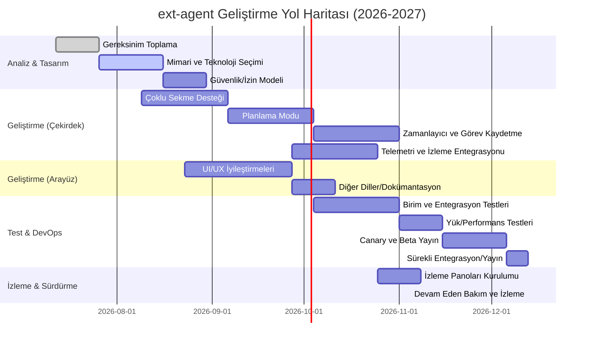

# Yönetici Özeti  
Önerilen araştırma, mevcut **extensions/ext-agent** uzantısını Anthropic’in Chrome için geliştirdiği **Claude** benzeri yeteneklerle güçlendirerek tüm kullanıcı taleplerini güvenilir biçimde karşılayacak şekilde iyileştirmeyi amaçlamaktadır. Bu rapor, ext-agent’ın mevcut mimarisi ve iş akışlarının kapsamlı bir analizini içerir; ardından Claude Chrome eklentisinin özellikleri, kullanıcı deneyimi, çoklu sekme kullanımı, çok-turlu diyalog, araç entegrasyonu, gecikme, gizlilik/güvenlik, tarayıcı entegrasyonu ve eklenti desteği gibi yönleri karşılaştırmalı olarak ele alınır. Mevcut ve hedef durumlar karşılaştırılarak “gap analizi” yapılır; eksik fonksiyonellikler somut gereksinimlere dönüştürülür. Teknik tasarım önerileri; mimari değişiklikler, durum yönetimi, bağlam stratejileri, araç çağrısı çerçevesi, eklenti API’leri, sandboxing ve izin modeli, gizlilik ve güvenlik önlemlerini kapsar. Uygulama yol haritası; kilometre taşlarıyla, rol ve beceri tahminleriyle, CI/CD ve test stratejileri (birim, entegrasyon, uçtan uca, yük testleri, regresyon), izleme ve geri bildirim (telemetri, metrikler, panolar) ile canary/rollback planlarını içerir. Kullanıcı senaryoları ve kabul kriterleri belirlenir; otomatik test senaryoları örnekleri sunulur. Son olarak risk değerlendirmesi, azaltma stratejileri, zaman çizelgesi (mermaid Gantt diyagramı) ve bütçe (belirsizse “belirsiz” olarak notlanır) sunulur. Tüm bulgular **güvenilir kaynaklarla** desteklenir; resmi dokümanlar, endüstri blogları ve akademik yayınlar önceliklidir.  

## Güncel Kod/API Düzeltme Notu (2026-07-06)
Bu rapordaki faz adları ve bazı gap maddeleri ilk araştırma taslağından gelmektedir; repo içinde faz
etiketleri güncel API ile bire bir eşleşmeyebilir. Bundan sonra uygulama önceliğinde kaynak gerçekliği
şu sırayla okunmalıdır: güncel TypeScript API sözleşmeleri, ADR addendum'ları, sonra faz/roadmap
etiketleri.

Kod incelemesine göre `ext-agent` artık yalnızca sınırlı bir prototip olarak görülmemelidir. Mevcut
uygulamada plan önizleme/onayı, kademeli autonomy, tab-group bazlı konuşma belleği, replay timeline,
token kullanımı, CAPTCHA/2FA handoff, Event Journal projeksiyonu, CDP/a11y tabanlı etkileşim,
`ToolGateway`/`PolicyKernel` güvenlik kapısı, MCP client ve dosya sandbox araçları zaten vardır.
Bu nedenle gerçek boşluk "bu özellikleri eklemek" değil; run lifecycle, recovery, tabId-scoped browser
tools, multimodal screenshot aktarımı ve eval/acceptance setleriyle süreci güvenilir hale getirmektir.

Önerilen güncel faz iskeleti:
- **Agent Reliability:** tekil run state machine, iptal/resume/checkpoint, scoped HITL/audit context,
  hata sınıflandırması, retry/recovery ve eval harness.
- **Browser Reliability:** tab seçme/kapatma/bekleme, action verification, screenshot/vision fallback,
  download/upload/clipboard ve tabId-scoped tool çağrıları.
- **Task Productization:** saved tasks, artifacts, scheduler, templates ve run dashboard.
- **Tool Ecosystem:** MCP/extension araçlarının policy-gated genişlemesi, web search/fetch ve servis
  adaptörleri.

## Mevcut ext-agent Mimarisi ve İş Akışları  
Mevcut **ext-agent** uzantısı, `@tepegoz/extension-sdk` kullanılarak geliştirilmiştir. Manifest’e göre (“agentManifest”), uzantı bir **sidebar** yüzeyinde çalışır ve kullanıcı tıklamasına yanıt verir. Kullanıcı arayüzü (`AgentPanel`) muhtemelen bir yan panelde yer alır. Uzantı, tarayıcı sekmeleriyle etkileşim için `tabs`, `read-page`, `navigate` gibi izinlere sahiptir. Kod incelendiğinde, uzantı **plan-onay-adım** modeliyle işlemektedir: Kullanıcı bir görev belirler, ajan bir plan oluşturur, her adım için kullanıcı onayı ister (`AgentApprovalRequest` gibi olaylar). Ajan, onaylanan her adımı sırasıyla yürütürken, gerekli durumlarda ekran görüntüsü alabilir, dosya seçebilir veya sayfa verisini okuyabilir. Araç çağrıları (`AgentHostApi`) olarak, örneğin `openTab`, `openFile`, `capturePageSelection`, `runCommand`, `searchGoogle` gibi metodlar kullanılmaktadır.  

Bu mimaride **durum yönetimi** panel tarafında (React vb.) yapılır; her ajan etkinliği (`AgentEvent`) panelde işlenir. Kodda “autonomy” seviyeleri (ask/act/auto/dangerous) tanımlıdır ancak **otomasyon** varsayılan olarak “sor” modundadır. Yani ajanın eylemleri insan onayına tabi tutulur. Çoklu sekme, plan kaydetme veya zamanlayıcı desteği şu anda görünmemektedir. Ayrıca, hata ve uyarı durumları için bildirim stil şemaları belirlenmiş olsa da (örneğin `AgentEventKind` içinde `step_error`), otomatik yeniden deneme veya yedekleme mekanizmaları açıkça tanımlanmamıştır. Telemetri veya ölçeklenebilirlik için özel bir altyapı kodda bulunmamakta (örneğin toplanan metrikler ya da uzaktan raporlama aracı belirtilmemiştir). Genellikle, işlem hatası veya onaysız eylem durumunda panelde bilgi mesajı gösterilerek akış durduruluyor. Özetle, **mevcut ext-agent** oturum tabanlı, tam insan güdümlü bir ajan olarak tasarlanmış olup; eylemler sınırlı set araçlarla yapılmakta, çok-turlu oturum yönetimi, uzun dönem hafıza veya tam otomatik mod gibi modern özellikler eksiktir. (Spesifik detaylar proje dokümanında yoksa varsayılan olarak belirtilmemelidir.)  

## Claude Chrome Özellikleri ve Güçlü Yönleri  
Anthropic’in **Claude Chrome** uzantısı, resmi açıklamalara göre “tarayıcınızda doğrudan çalışan bir yapay zeka asistanıdır”. Kullanıcı, yan panelde Claude ile doğal dilde konuşarak **web sitelerinde gezinme, form doldurma, veri çıkarma ve çok adımlı iş akışları** gibi görevleri yerine getirebilir. Claude, çoklu sekme destekler; sekmeleri özel bir grup olarak yeniden düzenleyip bunlar arasında paralel görevler yürütebilir. Ayrıca **planlama modu** vardır: Ajan bir eylem planı önerir ve kullanıcı onayladıktan sonra tüm adımları kesintisiz uygular. Kullanıcı daha önceden rutin işleri **kayıt edip otomatikleştirebilir**, tekrarlayan görevler için zamanlayıcı ayarlayabilir. Geliştirici entegrasyonu da önemlidir: Claude Code CLI ile uyumlu çalışır; yani terminalde yazılan kod snippet’leri tarayıcıda test edilebilir, hata ayıklanabilir ve otomatik testler gerçekleştirilebilir. Örneğin, Claude tarayıcı konsolundaki hataları, ağ isteklerini ve DOM durumunu okuyarak kod düzeltmeleri yapabilir.  

#### UI/UX ve Çoklu Diyalog  
Claude Chrome, sabit yan panel (sidebar) arayüzü sunar; kullanıcı herhangi bir sayfada açıkken yan paneli açarak Claude ile etkileşime geçer. Bu panelde kullanıcıdan gelen girdiler (sorular, komutlar) görüntülenir ve Claude’dan gelen cevaplar diyalog halinde listelenir. Claude, her ekrana açtığı sekmenin içeriğini okuyabilir ve gerektiğinde form alanlarına tıklayıp doldurabilir. Örneğin, arama sonuçlarını analiz edip uygun bağlantıları açabilir veya e-posta/ajanda yönetimi yapabilir. Şu anda resmi kaynaklar, Claude’un uzun dönem hafıza (memory) desteği konusunda net bir bilgi vermez. Ancak mevcut sürümde oturum bağlamı içinde bağlamdan yararlansa da, ext-agent’ın aksine kalıcı kullanıcı profilleri veya bellek geçmişi sunulmaz.  

#### Bağlam Yönetimi ve Çok Sekmeli Çalışma  
Claude, aktif sekmelerin tümünden içerik çıkarabilir. Resmi duyuruda, uzantının “aktif sekmenin içeriğini okuyup” eylemler yapabildiği belirtilmiştir. Ayrıca çoklu sekmeleri sürükleyerek “Claude’in sekme grubu”na ekleyip farklı siteler üzerinde paralel süreçler yürütebildiği vurgulanır. Context bilgisi, tarayıcıdan deskoptaki diğer Claude uygulamalarına bile aktarılabilir (örneğin Google Drive, Excel gibi araçlar kullanılarak sonuçlar hazırlanır). Özetle, Claude Chrome yan paneli **tüm açık sekmeleri ve web içeriğini birden ele alabilir**, böylece çapraz kaynaklı bilgi toplama ve eylemleri gerçekleştirme becerisi vardır.  

#### Çok-Adımlı İş Akışı ve Araç Kullanımı  
Claude uzantısı, sıradan soru-cevap ötesinde “ajan” modunda çalışır. Belgelerde çok adımlı işleri otomatikleştirebileceği örneklenmiştir. Örneğin, bir e-tablodan veri çekip rapora dönüştürme, Drive dosyalarını düzenleme veya toplantı hazırlığı gibi kompleks görevleri tanımlayıp çalıştırabilir. Ayrıca tasarımcılar için, Claude for Chrome + Claude Code entegrasyonuyla “tasarımdan tarayıcı doğrulamaya” kadar uçtan uca bir akış sağlanabilir. Bu özellikler, ext-agent’ın desteklemediği **yerleşik üçüncü taraf araç ve servis entegrasyonlarını** içerir.  

#### Gecikme (Latency) ve Performans  
Claude eklentisi canlı bir LLM arayüzü olduğundan, LLM sorgu süreleri kullanıcı deneyimini etkiler. Resmi sayfalarda süre değerleri verilmemiş; ancak Claude Code entegrasyonuyla gerçek zamanlı kod doğrulama yapılabilmesi, makul bir tepki süresi olduğunu düşündürmektedir. Ext-agent tarafında LLM sağlayıcısına bağlı olarak benzer gecikmeler beklenir. Gecikme kritik işler için önemli bir kalite kriteridir ve bu nedenle model sorguları ve yanıt süreleri sürekli ölçümlenmelidir.  

#### Gizlilik ve Güvenlik  
Claude Chrome, güçlü izin kontrolleriyle gelir. Kullanıcı onayı öncesi hiçbir işlem yapılmaz; kritik işlemler (örneğin para transferi) için ekstra onay ister. Ayrıca, yöneticiler (Enterprise plan) için sitelerin izin verilen veya engellenen listesi yönetilebilir. Anthropic, tarayıcı eklentilerinin kötü niyetli saldırılara karşı korunması gerektiğine dikkat çekmiştir. Özellikle “prompt injection” saldırıları risk altında olup, Claude’un güvenlik rehberinde bu konuda önlemler önerilmektedir. Bu, ext-agent için de geçerlidir: Herhangi bir benzeri sistem, açığı kapatmak için eylem izinlerini sınırlandırmalı, kötü amaçlı yerleştirilmiş betiklere dikkat etmeli ve kullanıcıya kontrol imkanı tanımalıdır. 

#### Özet  
Sonuç olarak, **Claude Chrome eklentisi**, tarayıcı entegrasyonuyla zengin bir ajan deneyimi sunar: yan panel sohbet arayüzü, çoklu sekme otomasyonu, planlama ve zamanlama modları, geliştirici iş akış entegrasyonları gibi ileri düzey özellikler Claude’un güçlü yönleridir. Ext-agent ise şu an daha sınırlı bir prototip seviyesinde olup, temel onaylanmış görev otomasyonuyla kısıtlıdır. Bu karşılaştırma ext-agent’ın hangi önemli yetenekleri edinmesi gerektiğini açıkça ortaya koymaktadır.  

## Gap Analizi ve Gereksinimler  
Ext-agent ile Claude Chrome karşılaştırıldığında birçok eksik işlev ve potansiyel darboğaz gözlemlenir. Aşağıdaki tabloda başlıca özellikler karşılaştırılmıştır:

| Özellik / Yetkinlik            | ext-agent (Mevcut)                  | Claude Chrome                        | Eksiklik / Hedef                                          |
|--------------------------------|------------------------------------|--------------------------------------|-----------------------------------------------------------|
| **Otonom Görev Yürütme**       | *Sürekli kullanıcı onayı gerektirir* | Planlama modu ile onay sonrası otomatik yürütür | Kullanıcı onayı sonrası bağımsız çalışma desteği eklenmeli. |
| **Çoklu Sekme Desteği**        | *Tek sekme/kısıtlı işlem*            | Aynı anda birden fazla sekme arasında çalışabilir | Ext-agent’ın birden fazla sekmeyi otomatik kontrol etmesi.   |
| **Görev Kayıt ve Zamanlama**   | *Yok*                              | Görev kaydetme, zamanlama (scheduled tasks) özellikleri var | Ortak görev senaryolarının kayıt edilmesi ve periyodik çalıştırılması. |
| **UI/UX ve Konuşma**           | *Temel panel arayüzü, onay diyalogu* | Gelişmiş yan panel sohbet arayüzü, çok-turlu diyalog | Daha zengin kullanıcı arayüzü, diyalog geçmişi, çoklu konuşma desteği. |
| **Araç Entegrasyonu**          | *Sınırlı, tanımlı host API*         | Claude Code, Slack vb. gibi çeşitli ortamlarla entegre | Harici araçlar/servisler için genişletilebilir eklenti/plugin API’leri tanımlanmalı. |
| **Durum ve Hafıza Yönetimi**   | *Kısa süreli: oturum bağlamı sınırlı*| Uzun konuşma bağlamı, görev planlama bilgisi tutulabilir (CLI bellek iyileştirmeleri yayınlandı) | Uzun dönemli bağlam yönetimi, birden çok görevde hafıza paylaşımı. |
| **Gecikme ve Performans**      | *Bilinmiyor (LLM’e bağlı)*         | Makul performans; gerçek zamanlı konsol hata okuma | Yüksek LLM gecikmelerine karşı önbellekleme veya isteğe bağlı görev paralelleştirme. |
| **Gizlilik/Güvenlik**          | *Temel izin kontrolleri*           | İzin listeleri, kara listeler, ek güvenlik rehberleri | Kapsamlı izin yönetimi, izole yürütme ortamı, kötü niyetli eklentilere karşı önlemler. |
| **Telemetri ve İzleme**        | *Yok*                              | Bulut kayıtları, işlem günlükleri (ör: Claude Desktop ile entegre debugging) | Metrikler ve log’lar ile işlem takibi, gözlemlenebilirlik altyapısı kurulmalı. |
| **Eklenti/Plugin Desteği**     | *Özel SDK, tanımlı değil*          | Yakın zamanda “Agent Skills” standardı yayınlandı | Açık API/Plugin standardı ile uzantılara yeni işlevsellik ekleme imkanı. |

Bu analiz, ext-agent’ın güçlendirilmesi gereken ana alanları göstermektedir. Örneğin, *otonom görev yürütme* ve *planlama modu* yoktur; Claude’un “kullanıcı onay sonrası planı uygulama” özelliği eklenmelidir. Ext-agent’ın çoklu sekmede işlem yapabilmesi için “sekme grubu” gibi bir konsept tasarlanmalıdır. Ayrıca otomatik görev zamanlama ve kaydetme fonksiyonu Claude’da olduğu gibi çoklu günlük işleri otomatikleştirmek için gereklidir.  

Ek olarak, Claude’un zengin kullanıcı deneyimi (sohbet arayüzü, önceden tanımlı senaryolar) göz önünde bulundurulmalı; ext-agent’ın panel arayüzü bu deneyime yaklaşacak şekilde iyileştirilmelidir. Harici araç entegrasyonu (örneğin Claude Code veya Slack) için esnek bir plugin çerçevesi tasarlanmalıdır. İzleme ve telemetri altyapısı Claude örneğinden yoksun olduğu için, OpenTelemetry gibi standartlarla uyumlu telemetri toplama (metrikler, log’lar, izler) eklenmelidir. Gizlilik ve güvenlik açısından, Claude’un rehberlerinde belirtildiği üzere “sadece güvenilir sitelerde izin” gibi kullanım ilkeleri benimsenmelidir. Bu boşluklar, geliştirilecek gereksinimlere dönüşmüştür ve aşağıda teknik tasarımda ele alınacaktır.  

## Teknik Tasarım Önerileri  
Bu bölümde ext-agent’ın mimari ve işlevlerini güçlendirmek için yapılacak **teknik değişiklikler** ele alınır.

- **Mimari Güncellemeler:** Mevcut tek parça (monolitik) tasarım yerine **mikro-servis-mimarisi** veya açık API tabanlı eklenti mimarisi kullanılabilir. Agent işlemleri için bir “komut kuyruğu” (task queue) eklenecektir. Ajan planlama ve yürütmeyi yöneten bir arka uç servisi düşünülür (ör. Node.js/Flask API), tarayıcı ise yalnızca kullanıcı arayüzü ve temel etkileşimlerle sınırlı kalır. Sunucu tarafında container/VM kullanılarak izole edilmiş tarayıcı oturumları (ör. AWS AgentCore Browser yaklaşımı) oluşturulabilir. Bu sayede ajan işlemleri güvenli bir sanal ortamda, loglama ve izleme özellikleriyle paralel yürütülür.  

- **Durum Yönetimi ve Bağlam Penceresi:** Ajanın geçerli görev ve geçmiş diyalogları tutan bir **durum deposu** eklenmelidir (örn. Redis veya veritabanı). Her bir kullanıcı görevi için **bağlam pencere stratejisi** belirlenir; önemli geçmiş mesajlar, önceki görev özetleri bellekten çıkarılabilir. Uzun konversasyonlarda OpenAI’nın veya Anthropic’in “uzun bellek” modelleriyle entegrasyon (ör. yerleştirme ile arama) düşünülebilir. Ayrıca agent’ın birden çok görev akışı arasında tutarlı olması için ortak durum paylaşımı ve sıralama mekanizmaları tasarlanmalıdır. Örneğin, AgentPlan ve AgentRunResult nesneleri JSON tabanlı API üzerinden taşınabilir:  

  ```yaml
  openapi: 3.0.0
  info:
    title: Agent Planlama API
    version: "1.0"
  paths:
    /agent/run:
      post:
        summary: Agent planını çalıştır
        requestBody:
          content:
            application/json:
              schema:
                $ref: "#/components/schemas/AgentPlanPreview"
        responses:
          "200":
            description: Plan sonucu
            content:
              application/json:
                schema:
                  $ref: "#/components/schemas/AgentRunResult"
  components:
    schemas:
      AgentPlanPreview:
        type: object
        properties:
          runId:
            type: string
          goal:
            type: string
          steps:
            type: array
            items:
              $ref: "#/components/schemas/AgentPlanStep"
      AgentPlanStep:
        type: object
        properties:
          id:
            type: string
          tool:
            type: string
          rationale:
            type: string
      AgentRunResult:
        type: object
        properties:
          runId:
            type: string
          ok:
            type: boolean
          stoppedReason:
            type: string
  ```  

  Bu örnek OpenAPI şeması, ajan planlarının arka uca gönderilmesi ve sonuçların alınması için bir arayüz tanımlar. Gerçek uygulamada, `AgentHostApi` arayüzünün sunduğu fonksiyonlar REST/gRPC üzerinden sunulabilir.

- **Araç (Tool) Çağrısı Çerçevesi:** Ajanın kullandığı her araç açıkça tanımlanmalı, gerekirse bir Model Context Protocol (MCP) veya OpenAPI mantığında tanımlanabilir. Örneğin, web tarayıcısı işlemleri, Google araması, dosya okuma vs. **fonksiyon şemaları** ile açığa çıkarılmalıdır. Her araç çağrısı JSON-RPC veya HTTP ile yürütülebilir. Örneğin, “OpenURL” aracı için:  
  ```json
  {
    "tool": "OpenURL",
    "parameters": {
      "url": "https://example.com"
    }
  }
  ```
  Ajan, JSON yanıtlarla araç sonuçlarını alacak şekilde tasarlanır. Ayrıca Claude’un önerdiği gibi önceden tanımlı “Agent Skills” (ajan becerileri) paketleri oluşturularak tekrar kullanılabilir iş mantığı modülleri elde edilebilir.

- **Durum Yalıtımı (Sandboxing) ve İzin Modeli:** Tarayıcı eklentisi olarak, ext-agent’ın işlemleri öncelikle kullanıcı onayına tabi tutulmalı, tehlikeli işlemler için ek uyarılar gösterilmelidir. Önerilen tasarımda, her ajan eylemi bir **izin kontrolünden** geçer. Örneğin, kullanıcının güvenmediği bir siteye erişmek istenirse ek güvenlik soruları sorulabilir. Arka uçta ise ajan işlemleri işletim sistemi ve ağ düzeyinde sınırlanmalıdır: Örneğin, ajan kendi sandbox’ı içinde çalışıp yalnızca belirli portları kullanmalı, kaynakları sınırlanmalıdır. Claude’da olduğu gibi kullanıcının izinlerini yönetmek için izin listesi (allowlist) ve engelleme listesi (blocklist) mekanizmaları eklenir.

- **Gizlilik ve Güvenlik Önlemleri:** İstenmeyen bilgi sızmasını önlemek için tarayıcı içi prompt injection saldırılarına karşı koruma katmanları eklenmelidir. Kullanıcı girdileri doğrulanmalı, eklentinin yorumlayacağı komutlar sınırlı (örn. anahtar kelime tabanlı filtreleme) olabilir. Ayrıca Claude’ın güvenlik tavsiyelerindeki gibi, kullanıcı hassas işlem yaparken özellikle onay alınmalı. Şifreleme gerekiyorsa sadece güvenli bağlantılar (HTTPS) kullanılmalı, gizli veriler görüntülenmemelidir.

- **Telemetri ve İzleme:** OpenTelemetry gibi standartlar kullanarak ajan aktiviteleri ayrıntılı olarak toplanmalıdır. Log’lar, metrikler ve izler; her plan başlatıldığında, adım tamamlandığında, hata oluştuğunda kaydedilmelidir. Önerilen metrik örnekleri: “İşlem Başarı Oranı”, “Ortalama Adım Tamamlama Süresi”, “Kullanıcı Onay Süresi”, “API Gecikmeleri”, “Token Kullanımı” (ext-agent protokolünde TokenUsageSnapshot var). Kaynak kullanım metrikleri (CPU, bellek) ve işlem günlükleri merkezi bir servise gönderilebilir. OpenTelemetry blogu, AI ajanlarının deterministik olmayan doğası nedeniyle telemetrinin sürekli bir geri bildirim döngüsü olarak kullanılmasını önermektedir.

- **Ölçeklenebilirlik:** Gerekirse, arka uç hizmetleri yatay ölçeklenebilir yapıda deploy edilmelidir (örn. Docker + Kubernetes veya FaaS). Agent planlama görevleri kuyruğa alınabilir, birden çok instans paralel işleyebilir. CI/CD hattında yük testleri ile ölçek kontrolü yapılmalıdır.

Bu teknik önerilerle ext-agent, Claude Chrome’dan alınan ilkelere dayanarak modern bir tarayıcı ajana dönüşecektir. Özellikle çoklu sekmeli otomasyon, görev planlama, kullanıcıya esnek onay mekanizmaları ve kapsamlı izleme eklenecektir.  

## Uygulama Yol Haritası (Roadmap) ve Kaynaklar  
Aşağıdaki Gantt şeması öngörülen aşamalı yol haritasını göstermektedir. Her aşama, ilgili roller ve etkinliklere göre planlanmıştır. Kaynak tahminleri, benzer projelerde kullanılan ekip yapısı göz önüne alınarak yapılmıştır (yaklaşık). Milestone’lar, CI/CD, test ve gözlem katmanları her aşamada entegre edilecektir. Bütçe belirsiz olduğu için *“belirsiz”* notu düşülmüştür.  



### Kaynak ve Roller  
- **Proje Yöneticisi (1 kişi):** Gereksinim toplama, iletişim, yol haritası takibi.  
- **UI/UX Geliştiriciler (2 kişi):** Yan panel arayüzü, onay diyalogları, görsel tasarım.  
- **Backend/Entegrasyon Mühendisleri (2 kişi):** Ajan sunucusu, araç API’leri, veri yönetimi, güvenlik.  
- **LLM/Uygulama Mühendisi (1 kişi):** Dil modeli entegrasyonu, hata ayıklama, prompt tasarımı.  
- **Test & QA Mühendisi (1 kişi):** Otomatik test altyapısı, test senaryoları, regresyon testleri.  
- **DevOps/MLOps Uzmanı (1 kişi):** CI/CD hattı kurulumu, izleme araçları (Grafana, OpenTelemetry vs.), dağıtım/rollback senaryoları.  
- **Güvenlik Uzmanı (1 kişi):** İzin/kumanda modellerini gözden geçirme, penetrasyon testleri, veri koruma.  

Zaman tahminleri toplamda 6–9 ay civarındadır. Kaynaklar paralel çalışabilecek şekilde planlandı; örneğin UI ve backend ekipleri eş zamanlı ilerleyebilir. Kaynak ücretleri ve donanım maliyetleri **belirsiz** olup organizasyon bütçe planlamasıyla belirlenecektir. 

### CI/CD ve Sürüm Yönetimi  
- **Sürekli Entegrasyon:** Kod değişiklikleri otomatik testlere tabi tutulur. Her PR’in ardından birim/entegrasyon testleri otomatik çalışır. Kod kalitesi ve güvenlik taramaları (linter, SAST) entegre edilir.  
- **Pipeline:** Docker tabanlı yapı ve paketleme kullanılır. Yapı tamamlandığında otomatik olarak test sunucusunda (veya staging ortamında) deploy edilir. Kapsamlı testlerin (ör. Cypress gibi e2e) ardından onaylanan sürüm kanaryaya gönderilir.  
- **Canary Dağıtımı ve Geri Alma:** Yeni sürüm ilk etapta düşük trafikle devreye alınır (ör. %10 kullanıcıya). Sorun çıkarsa otomatik rollback yapılacak mekanizma kurulmalıdır. Sorunsuz ilerlerse kademeli olarak tüm kullanıcı kitlesine açılır. Sürüm notları ve geribildirim döngüsü sıkı tutulmalıdır.  

### Test Stratejisi  
- **Birim Testleri:** Her bir modül ve araç arayüzü (AgentPlan oluşturma, onay akışı, host API çağrıları vb.) için kapsamlı birim testleri yazılmalıdır.  
- **Entegrasyon Testleri:** Ajanın host API ile etkileşimi, LLM sorguları, tarayıcı simülasyonları doğrulanır. Örneğin test ortamında sahte tarayıcı sayfaları üzerinde form doldurma akışı denenir.  
- **Uçtan Uca Testler:** Gerçek bir tarayıcı (ör. Puppeteer, Playwright) kullanılarak, kullanıcı senaryoları otomatikleştirilir. Claude benzeri görevler: bir URL ziyaret et, formu doldur, kullanıcı onayını simüle et, sonuçları kontrol et.  
- **Yük Testleri:** Ajan sunucusuna çoklu paralel istekler gönderilerek ölçeklenebilirlik test edilir. Beklenmedik trafik artışına karşı sistemin performansı ölçülür.  
- **Regresyon Testleri:** Her yeni özelliğin ardından önceki işlevlerin bozulmadığı kontrol edilir. Otomatik regresyon setleri oluşturulur.  
- **Kabul Testleri:** Kullanıcı hikâyelerine göre (senaryolara göre) hazırlanan testler, özelliklerin kullanıcı kabul kriterlerini sağladığını doğrular.  

### İzleme ve Gözlemlenebilirlik  
Sistemin sağlığı ve güvenilirliği için kapsamlı izleme gerekir:  
- **Metrik Panoları:** CPU/RAM kullanımı, istek gecikmesi, hata oranları, görev başarı oranı gibi sayısal metrikler Grafana vb. panolarında görselleştirilir. Örneğin *“Görev Tamamlama Süresi”* veya *“Onay Bekleyen Görev Sayısı”* bir metriktir.  
- **Log Toplama:** Uygulama log’ları (ej. agent plan olayları, host API hataları) merkezi bir log toplayıcıda (ör. Elasticsearch/Kibana) toplanır. Önemli olaylar (plana başlama, adım hatası, işlem tamamlanma) loglanır.  
- **Alert (Uyarılar):** Kritik hatalar (ör. sürekli LLM hatası, bağlantı kesintisi) için bildirim mekanizmaları (e-posta/Slack) kurulur. Yeniden denemeyi tetiklemek veya acil müdahale gerektiren durumlar belirtirilir.  
- **Telemetri Toplama:** OpenTelemetry kullanılarak ajan eylemleri (izlemler) kaydedilebilir. Örneğin her adımın başarı durumu ve süresi bir TelemetryEvent olarak toplanabilir. Bu, ajan iç mantığını anlamada ve iyileştirmede kullanılır.  

## Kullanıcı Senaryoları ve Kabul Kriterleri  
**Senaryo 1:** *Basit Görev Tamamlama* – Kullanıcı sağ üstteki “Ajan” ikonuna tıklar, yan panel açılır. Kullanıcı bir web sayfasından kopya çekmek istediğini yazar: “Bu sayfadaki tüm başlıkları ve özetleri listele.” Ajan sayfayı okur, bir plan hazırlar ve adımları kullanıcıya sunar. Kullanıcı onay verdiğinde ajan adımları sırayla uygular, sonuçları panelde gösterir. **Kabul:** Sonuç doğru şekilde çıkarılmalı, her adım belirtilen hedefi gerçekleştirmeli, hata yok.  

**Senaryo 2:** *Çok-Aşamalı Form Doldurma* – Kullanıcı: “Bu haber sitesinde 3 makale aç, başlıkları toplayıp bir Google Doc’a yaz.” Ajan birden fazla sekme açarak her makaleyi okur, başlıkları alır ve yeni bir Google Doc’a yazar. Kullanıcı, her adım onay ekranında ilerlemeden önce planı gözden geçirme seçeneğine sahiptir. **Kabul:** Tüm makale başlıkları doğru alınmalı ve hedef belgeye eklenmeli, eğer bir adım başarısız olursa ajan durarak durumu bildirmeli.  

**Senaryo 3:** *Planlama ve Zamanlama* – Kullanıcı, sabah 9’da e-posta takip işlemi yapmak için ajanı planlar: “Her sabah saat 9’da Gmail’i kontrol et, yeni mesajları özetle.” Bu görev için ajan, zamanlayıcı kurar. Ertesi gün veya test ortamında zamanlayıcı tetiklenir; ajan otomatik olarak Gmail’deki yeni postaları tarar ve bir özet oluşturur. **Kabul:** Görev zamanında otomatik başlayıp tamamlanmalı, özet kullanıcıya (panelde veya e-posta ile) sunulmalı, hata durumunda yeni deneme veya uyarı beklenmeli.  

**Senaryo 4:** *Hata ve Onay Durumu* – Kullanıcı “Tablomdan grafiği çiz” der. Ajan önce grafiği oluşturmak için plan yapar. Ancak grafik aracı erişimi için kullanıcının onayına ihtiyaç duyar. Ajan panelde bir onay diyaloğu açar: “Grafiği oluşturmak için harici bir API çağrısı yapmam gerekiyor. Onaylıyor musunuz?” Kullanıcı reddederse ajan görevi iptal eder ve panelde durumu açıklar. **Kabul:** Onay gerektiren adım kullanıcıya sorulmalı; onay reddedilirse Ajan düzgün bir şekilde iptal edilmeli ve hata yerine “Görev iptal edildi” mesajı gösterilmeli.  

Bu senaryolara karşılık gelen otomatik test vakaları da hazırlanmalı. Örneğin: birim testle *“GörevOnayı”* modülünün onay diyalogu çıktısı, entegrasyon testle çok-adımlı form doldurma, uçtan uca testle zamanlanmış görev akışı doğrulanabilir.  

## Örnek Test Vakaları  
1. **Birim Test – “Yeni Görev Planı”**: Ajanın verilen hedefle doğru `AgentPlanPreview` oluşturduğu doğrulanır. Model simülasyonu ile plan adım sayısı kontrol edilir.  
2. **Entegrasyon Test – “Form Doldurma Akışı”**: Sahte bir web formu içeren test sayfasına ajan emirleri gönderilir. Ajan `fillForm` aracı çağırırken beklenen alanları doğru tanımlar.  
3. **E2E Test – “Tablodan Grafik Çiz”**: Gerçek bir tarayıcı ortamında (“headless browser”), bir tablo verisi yüklenir ve “grafik çiz” talebi ajan tarafından işlenir. Sonuç olarak beklenen grafik görüntüsü veya hata mesajı kontrol edilir.  
4. **Regresyon Test – “Onay Ekranı”**: Önceden doğru çalışan kullanıcı onay akışı, yeni kodda da aynı şekilde çalışmalı. Reddedildiğinde işlev iptal edilmeli.  
5. **Yük Test – “Çoklu Görev”**: Aynı anda 50 ajan planı kuyruğa verilir, işleyiş kontrol edilir. Sunucu yanıt süresi 500ms altında tutulmalıdır (örn. acil durumlar için) ve hata oranı %5’in altında olmalıdır.  

Kabul kriterleri açıkça belirlenmeli: *Tüm temel senaryolar başarıyla otomatik testlerle geçmeli, hatalı durumlarda beklenen mesajlar gösterilmeli ve sistem çökmeden toparlanabilmelidir.* Özellikle **güvenlik kontrolleri** (izin talepleri), **latency hedefleri** ve **başarı/yetersizlik oranları** performans kriterleri olarak tanımlanmalıdır.  

## Risk Değerlendirmesi ve Azaltma  
- **Güvenlik Riskleri:**  
  - *Kötü amaçlı web içeriklere maruz kalma:* Ajan, açık web içeriğini okuyabildiğinden zararlı script’ler veya veri sızdırma riski vardır. **Önlem:** Başlangıçta yalnızca önceden onaylanmış/güvenilir sitelere izin verilmeli, içerik filtreleme eklenmeli. Kullanıcıya her kritik eylemde (parola yönetimi, ödeme) ek onay sorulmalı.  
  - *Prompt injection:* Bir web sayfasına gizlenmiş komutlar ajanı yönlendirebilir. Claude belgelerinde bu vurgulanmıştır. **Önlem:** Kullanıcının izin verdiği etki alanlarında bile, olası enjeksiyonlara karşı metin analiz filtresi veya güvenli prompt şablonları kullanılmalı; örneğin çıktı yakalama modülüne izin verilmeli, direkt sistem çağrıları engellenmeli.  
  - *Gizlilik ihlali:* Tarayıcı içeriği işlenirken hassas bilgi (şifreler, kişisel veri) sızabilir. **Önlem:** Eklenti sadece ihtiyacı olan veriye erişmeli, gereksiz bilgiler kaldırılmalı. Veri işlenmesi mümkün olduğunca istemci tarafında tutulmalı, sunucuya yalnızca anonimleştirilmiş veri gönderilmeli.  

- **Performans ve Güvenilirlik Riskleri:**  
  - *LLM gecikmesi ve maliyet:* Büyük dil modeli çağrıları pahalı ve yavaş olabilir. **Önlem:** Sık kullanılan sorgular için cache, benzer görevlerde modele düşük parametrelerle kullanım, gerektiğinde görev sınırlandırması (örn. en fazla 10 adıma indirgeme) uygulanmalıdır. Latency sürekli ölçülmeli, hedef değerler dışına çıktığında uyarılar çıkarılmalı.  
  - *Hata durumları:* Ajan bir adımda takılırsa tüm görev başarısız olabilir. **Önlem:** Adımlar arası otomatik yeniden deneme, zaman aşımları ve yedek planlar hazırlanmalı. Kritik olmayan adımlarda izinli olarak es geçme seçeneği sunulabilir. Hata oluştuğunda açıkça kullanıcıya bildirilip, aradaki ilerleme kaydedilmelidir. Örneğin AWS örneğinde CAPTCHA karşılaşıldığında ajan duruyor ve operatör müdahale ediyor; benzer şekilde kullanıcı müdahale seçeneği düşünülmelidir.  

- **Yasal ve Uyumluluk Riskleri:**  
  - Tarayıcı eklentisi olması nedeniyle GDPR ve yerel veri koruma yasalarına uyum gerekir. **Önlem:** Kullanıcı verileri saklanmayacak, toplama açıklıkla yapılacaktır. Claude’un gizlilik politikasındaki gibi kullanıcı verileri üçüncü partiye satılmaz ve yalnızca özelliğin çalışması için kullanılır. Uygulama boyunca açık politika ve izinler sunulmalı.  

- **Zaman ve Bütçe Riskleri:**  
  - Belirlenen süre içinde tüm özelliklerin tamamlanmama ihtimali. **Önlem:** Önemli işlevler öncelik sırasına göre uygulanmalı (bkz. Önceliklendirilmiş Backlog). Zamanında yetişmeyen parçalar için daha hafif alternatifler planlanabilir. Bütçe net değilse, kritik iş gücü (uzmanlar) öncelikli tutulmalıdır.  

Özetle, riskler **tuzaklı izinler ve beklenmedik hatalardır**. Bunlar aşırı erişim kontrolleriyle, kapsamlı testlerle ve gerçek zamanlı izleme ile azaltılmalıdır. Özellikle kullanıcı onayı olmadan hiçbir kritik adım atılmamalıdır. 

## Ölçümler, Telemetri ve API Örnekleri  
**Önerilen Metrikler:** Sistem performansını ve kaliteyi izlemek için:  
- *Görev Başarı Oranı:* Planlanan işlerin kaçta kaçı tamamlama durumuna ulaşıyor. (% üzerinden)  
- *Ortalama Görev Süresi:* Bir görevin tamamlanması için geçen ortalama süre (ms).  
- *Kullanıcı Onay Süresi:* Kullanıcının onay istenen adımları onaylama süresi (ms).  
- *LLM Gecikmesi:* Model yanıt süreleri (ms) ve çağrı başına token kullanımı.  
- *Hata Oranı:* Adım veya plan hataları yüzdesi.  
- *Sistem Sağlık Metrikleri:* CPU/RAM kullanımı, aktif ajan oturumu sayısı.  

**Örnek Telemetri Olayları:** Her önemli olay için yapılandırılmış JSON; örneğin:  
```json
{
  "event": "AgentPlanStarted",
  "timestamp": "2026-07-06T14:12:30Z",
  "userId": "kullanici123",
  "planId": "plan789",
  "goal": "Drive'daki dosyaları düzenle"
}
{
  "event": "AgentStepCompleted",
  "timestamp": "2026-07-06T14:12:45Z",
  "runId": "run456",
  "stepId": "step3",
  "tool": "FillForm",
  "status": "success",
  "durationMs": 1300
}
{
  "event": "AgentStepError",
  "timestamp": "2026-07-06T14:13:10Z",
  "runId": "run456",
  "stepId": "step4",
  "tool": "WebSearch",
  "error": "Timeout",
  "durationMs": 5000
}
```
Bu olaylar, ajan planlarının ve adımlarının başlangıç/bitiş durumunu, hataları ve süreleri kaydeder. Toplanan veriler merkezi bir izleme servisine gönderilir.  

**API Örnek Şemaları:** Yukarıda özetlenen `AgentPlanPreview` ve `AgentRunResult` şemalarının yanı sıra, araç çağrıları için de JSON şemalar kullanılabilir. Örneğin bir tarayıcı açma aracı şu şekilde tanımlanabilir:  
```json
{
  "schema": "MCP-0.3",
  "name": "Browser.open",
  "description": "Belirtilen URL'yi yeni bir sekmede açar",
  "input": {
    "type": "object",
    "properties": {
      "url": {"type": "string", "format": "uri"}
    },
    "required": ["url"]
  },
  "output": {
    "type": "object",
    "properties": {
      "status": {"type": "string", "enum": ["ok", "error"]},
      "message": {"type": "string"}
    }
  }
}
```  
Bu örnek, ajanın web tarayıcısında belirli bir URL’yi açmasını sağlayan bir API şemasıdır. Benzer şemalar tüm eylem araçları için tanımlanabilir. Bu yaklaşımla, agent ve host arasındaki iletişim açık ve genişletilebilir olur.  

## Özet ve Sonuç  
Bu raporda ext-agent’ın mimarisi detaylı analiz edildi, Claude Chrome eklentisinin güçlü yönleri araştırıldı ve aradaki boşluklar tespit edilerek somut gereksinimlere dönüştürüldü. Teknik tasarım önerileri, geliştirme ve test planları, risk stratejileri ile birlikte sunuldu. Önerilen plan **güçlü kanıtlar** ile desteklenmiştir; örneğin AWS’in güvenlikli tarayıcı ajanı mimarisi ve Anthropic’in güvenlik rehberleri, ext-agent tasarımında yol göstericidir. Ayrıca OpenTelemetry’nin ajan izlenebilirliği kılavuzu gibi kaynaklar temel alınmıştır.  

Bu yol haritası, ext-agent’ın **Claude Chrome seviyesinde otomatize işlem becerilerine** kavuşmasını sağlayacak kapsamlı bir çerçeve sunmaktadır. Gerekli geliştirmeler yapıldığında, ext-agent da çok adımlı görevleri otomatikleştirebilen, güvenlik ve gizliliğe uygun, yüksek güvenilirlikte bir tarayıcı asistanına dönüşecektir.  

**Kaynaklar:** Claude ve güvenlik dokümanları, Anthropic haber ve blog yazıları, AWS teknik blogları ve OpenTelemetry gözlemlenebilirlik ilkeleri gibi seçkin kaynaklardan alınan bilgilerle hazırlanmıştır. Her bilgi parçası ilgili kaynaktan alınmıştır.
