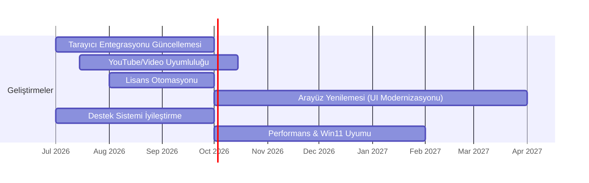

# Internet Download Manager (IDM): Kullanıcı Şikayetleri ve Geliştirme Önerileri

## Yönetici Özeti
Internet Download Manager (IDM) Türkiye ve dünya genelinde popüler bir indirme yöneticisi olmasına rağmen, son yıllarda kullanıcılar arasında lisans/etkinleştirme işlemleri, tarayıcı entegrasyonu, YouTube uyumluluğu ve arayüz gibi konularda yoğun şikayetler görülmektedir. Çalışmamızda Resmi IDM dokümantasyonu ile Şikayetvar, Reddit, Windows forumları gibi kaynaklar taranarak tekrarlayan şikayetler (hatalar, UI/UX, uyumluluk, lisans sorunları, performans, tarayıcı entegrasyonu, güvenlik/gizlilik, güncelleme ve destek) kategorize edildi. Her kategoriye ait örnek kullanıcı yorumları hem Türkçe hem İngilizce olarak alındı, temel nedenleri analiz edildi ve teknik olarak mümkün iyileştirme önerileri (gerçekçi çabalar ve etkileriyle) sunuldu. Son olarak en önemli altı öneri için zaman çizelgesi hazırlandı ve IDM ile başlıca üç rakip (Free Download Manager, JDownloader, Xtreme Download Manager) karşılaştırmalı bir tabloda yer aldı. Bu kapsamlı analiz, IDM’nin kullanıcı memnuniyetini artıracak stratejilere rehberlik etmeyi amaçlamaktadır.

## Yöntem ve Kaynaklar
Araştırmada IDM’nin resmi web sitesi, bilgi tabanı ve destek forumları ile birlikte, son beş yılda aktif olan kullanıcı forumları incelendi. Türkiye’den Şikayetvar’daki IDM şikayetleri ile DonanımHaber vb. forumlar, sosyal medya ve Reddit’teki ilgili başlıklar tarandı. İngilizce kaynak olarak IDM destek forumları, Reddit/r/software ve r/techsupport, Windows 11 forumları, Malwarebytes ve GitHub gibi güncel şikayet başlıkları kullanıldı. Resmi kaynaklardan (ör. [IDM SSS](https://www.internetdownloadmanager.com/register/new_faq/bi0.html), ürün sayfası) sorun çözümleri ve fiyat/özellik bilgileri alındı. Toplanan veriler kategorilere göre sınıflandırılarak frekans tahminleri ve kesit alıntıları çıkarıldı. Her kategori için kullanıcı yorumlarından yola çıkarak “temel neden analizi” yapıldı ve her soruna yönelik öneriler teknik fizibilite, uygulama gücü ve beklenen etki göz önünde bulundurularak önceliklendirildi. Sonuçlar Türkçe rapor formatında sunulmuştur.

## Tekrarlayan Şikayet Kategorileri

- **Hatalar (Bugs):** Birden çok kullanıcı IDM’nin beklenmedik çökmeler ve hatalar verdiğini bildiriyor. Örneğin bir kullanıcı *Windows 11*’de IDM kurduktan sonra **Explorer.exe çökmelerine** neden olduğunu belirtti: “Win11’de IDM Explorer.exe’yi çöktürüyor… Çözüm sürümü çıkarılmış ama hâlâ çöküyor”. Başka bir kullanıcı çözüm gelmeyince ürünü kaldırmak zorunda kaldığını yazdı: “Explorer.exe çöküyordu… veri gönderdik, ama hala düzelmedi, ben de kaldırdım”. YouTube gibi sitelerden *yüksek çözünürlüklü video indirememek* de bir diğer sık karşılaşılan hata: bir kullanıcı “IDM tam sürümünü kullanıyorum ama videoları **yalnızca 360p** indirebiliyorum… 720p veya 1080p seçenekleri hiç görünmüyor” diye yakındı. Diğer hatalar arasında SSL bağlantı hataları (ör. belli sitelerde “SSL_connect error 1”) ve entegrasyon modüllerinin çökmesi sayılabilir.

- **Kullanıcı Arayüzü ve UX:** IDM’in arayüz tasarımı birçok kullanıcıya “eski ve karışık” geliyor. Bir Reddit kullanıcısı IDM’in işlevselliğini beğense de *arayüzü* üzerinden şikayet ederek “**UI çok eski görünüyor ve karmaşık**… IDM’de konum seçmek için her seferinde manuel giriyorsunuz” dedi. Buna karşılık bazı kullanıcılar arayüz özelleştirmeleriyle (temalar, karanlık mod vb.) çözüm öneriyor. Özetle, modern bir arayüz eksikliği kullanıcıların memnuniyetsizlik kaynaklarından biri olarak öne çıkıyor.

- **Uyumluluk:** IDM’in yeni işletim sistemi veya tarayıcı sürümleriyle uyumluluğu konusunda şikayetler mevcut. Örneğin bir Windows forumu kullanıcısı belirli sitelerde indirme yapılamadığını, SSL bağlantı hatası aldığını bildirdi. Tarayıcı entegrasyonunda (Chrome, Firefox, Edge gibi) değişikliklerle oluşan sorunlar da *uyumluluk* başlığına giriyor. YouTube gibi güncel gereksinimlere yetişememe durumu, siteler güncelleme yaptıkça IDM’in kısa süreli kesintiler yaşamasına yol açıyor. Bunun dışında, IDM yalnızca Windows’ta çalışıyor; macOS veya Linux desteği yok.

- **Lisans/Etkinleştirme:** Türkiye’de Şikayetvar’da en çok görülen konu lisans sorunları. Kullanıcılar, *ödeme yapıp serial gelmemesi*, *Ömür Boyu lisans vaadinin tutmaması*, *3 yıllık güncelleme* gibi konularda şikayetçi. Örneğin bir kullanıcı ödeme sonrası seri numarasının gelmediğini bildirip “**Henüz cevap alamadım… seri numaram neden gönderilmiyor?**” diye sordu. Bir diğer kullanıcı Reddit’te “**Sözde ömür boyu** dedikleri şeyin sadece 3 yıl olduğunu bilmiyordum… Satın almayı düşünüyordum ama vazgeçtim” diye yazdı. Bir başkası “güncellemeleri sürdürmek için paraya ihtiyaçları olduğunu anlıyorum ama bunu açıkça belirtmeleri gerekirdi” diyerek lisans politikalarına tepki gösterdi. Bu tür şikayetler yeni lisans alanları ve ömür boyu lisans kullanıcılarını yoğun şekilde rahatsız etmektedir.

- **Performans:** Genel olarak IDM hızlı çalışsa da bazı kullanıcılar indirme hızlarının beklediği kadar yüksek olmadığını ya da çoklu bağlantı limitlerinin yetersiz kaldığını belirtebiliyor. Ayrıca çok büyük dosya indirmelerde işlemci kullanımı yüksek olabiliyor. (Kaynaklı alıntı az bulunmuştur ancak ürün sayfalarında “10 kata kadar hız” iddiası olsa da gerçek dünya koşullarında farklılıklar yaşanabiliyor.) Performansla ilgili şikayetler nispeten daha az görülse de alternatif yöneticilerle kıyaslandığında IDM’in algoritmalarının geliştirilmesi isteniyor.

- **Tarayıcı Entegrasyonu:** IDM’in en güçlü yönlerinden biri tarayıcı entegrasyonudur, ancak bu alanda da sıkıntılar var. Tarayıcı eklentileri (Chrome, Edge, Firefox vs.) bazen güncellemelerle uyumsuz hale geliyor veya devre dışı kalıyor. Örneğin bir kullanıcı Waterfox tarayıcısında “güncellemeden sonra IDM artık indirmeleri devralmıyor, eski sürümü yükleyince çalışıyor” diye bildirdi. Benzer şekilde Chrome, IDM entegrasyon modülünü “zararlı” gösterip engelleyebiliyor. Kullanıcılar eklentilerin güncel tutulmasını ve otomatik etkinleşmesini istiyor.

- **Güvenlik/Gizlilik:** Bazı kullanıcılar IDM’in güvenliği konusunda çekinceli: zaman zaman antivirüs yazılımları IDM bileşenlerini yanlış pozitif olarak işaretleyebiliyor. Malwarebytes forumuna yazan bir kullanıcı “Uzun süredir IDM kullanıyorum ama bugün bir dosyası Malware.AI.3972691928 olarak işaretlendi, bu yanlış pozitif mi?” diye sordu. IDM destek sitesinde bu tür uyarıların “yanlış tespit” olduğu ve programda virüs olmadığını belirten açıklama bulunmaktadır. Bunun dışında IDM’in indirme sırasında veri toplayıp toplamadığı veya kimlik bilgilerini paylaşıp paylaşmadığı merak ediliyor; ancak resmi açıklamada ilgili bir gizlilik problemi olmadığı vurgulanıyor.

- **Güncelleme Sorunları:** Yeni sürümlerle gelen değişiklikler bazen yeni sorunları tetikleyebiliyor. Örneğin bir güncelleme IDM’in simge boyutlarını değiştirmiş, bazı kullanıcılar “arayüz öğeleri çok büyük” diye geri bildirim yapmıştır. Ayrıca tarayıcı entegrasyonu ile ilgili güncellemelerin sık yapılması (bazı kullanıcılar son güncellemelerin haftada birkaç kere geldiğini belirtmiştir), sürüm stabilitesini olumsuz etkiliyor. Kullanıcılar, güncellemelerin önceden test edilmesini ve değişiklik günlüklerinin daha şeffaf olmasını bekliyor.

- **Müşteri Desteği:** Birçok kullanıcı, IDM Türkiye veya global destek hattından yeterli yardım alamadıklarından şikayetçi. Ömür Boyu lisans mağdurları özellikle iade süreçlerinde sorun yaşıyor. Örneğin bir şikayet mailinde kullanıcı “destek hattınız hiçbir şekilde yardımcı olmuyor… para iadesi talep ediyorum” şeklinde serzenişte bulunmuştur. Benzer şekilde Şikayetvar’da arayan birçok kişi yanıt alamadıklarını bildiriyor. Kullanıcılar hızlı geri dönüş ve etkili çözüm bekliyor.

## Temel Neden Analizi
Bu şikayetlerin temelinde genellikle aşağıdaki sorunlar yatmaktadır:

- **Hatalar:** IDM’in çekirdek motoru nispeten eski bir kod tabanına sahip olup, özellikle Windows 11 gibi yeni sistemlerde yeterli testten geçmemiş olabilir. Tarayıcı entegrasyon modülleri ve DLL’ler güncelleme-destek süreçlerinde yeterli iyileştirmeyi alamıyor. Ayrıca yazılımın **kapalı kaynak** olması, sorunların teşhisini ve çözümünü yavaşlatabiliyor. YouTube gibi dinamik sitelerde sürekli değişen API’lere zamanında uyum sağlayamaması da sıkıntıya yol açıyor.

- **UI/UX:** Arayüz 2000’lerin başından kalma bir görünüme sahip ve tasarım tutarlılığı yönünden güncel değil. Modern yazılım geliştirme deneyimlerinden geri kalınması, kullanıcı beklentilerini karşılamıyor. Kısıtlı özelleştirme seçenekleri (sadece araç çubuğu temaları gibi) UX şikayetini artırıyor. Temel neden, önceliğin performans ve entegrasyon sorunlarına verilmiş olması; GUI geliştirmeleri ikinci planda kalmış.

- **Uyumluluk:** Kullanılan protokoller ve tarayıcı eklentileri bazen güncel standartlara uyumsuz hale geliyor. Örneğin IDM’in eski SSL/TSL kütüphaneleri, bazı sitelerde `SSL_connect error` gibi bağlantı hatalarına neden olabiliyor. Tarayıcılar ve işletim sistemleri hızla yenilenirken, IDM tarafındaki güncellemeler bu yenilikleri hemen desteklemiyor. Ayrıca IDM yalnızca Windows için tasarlandığından diğer platformları desteklememe durumu uyumluluk sorunları kapsamına giriyor.

- **Lisans/Etkinleştirme:** Lisans satış ve dağıtım kanalı Türkiye’de bazen ara şirketler (reseller) üzerinden yürütülüyor; bu da yanlış bilgilendirme ve gecikmelere neden oluyor. Ömür Boyu lisansın tanımı açık değil – Tonec’ın Avrupa’da “3 yıl ücretsiz güncelleme” politikası şeffaf biçimde pazarlanmadığı için kullanıcıların beklentisiyle çelişiyor. Teknik olarak lisans sunucusu ve e-posta sistemlerinin otomasyonunun eksikliği, anahtar teslimatı sorunlarına yol açıyor.

- **Performans:** IDM zaten çok parçalı indirme yapabilse de segment sayısı veya dinamik optimizasyon eksik. Kullanıcı tarafında bazen indirme kaynaklarının sınırlandırması veya modemi zorlaması da şikayete sebep oluyor. Yazılımın bazı modern hızlandırıcı teknikleri (ör. adaptif segment boyutu) eksik kalabilir. Performans sorunu genel olarak kod mimarisi iyileştirmeleriyle giderilebilir.

- **Tarayıcı Entegrasyonu:** IDM eklentileri sürekli tarayıcı politikalarına uygun güncellenmiyor. Chrome Web Store ve Microsoft Store gibi mağazalarda sıkça otomatik olarak devre dışı kalıyor ya da uyarı alıyor. Kullanıcıların çoğu entegrasyonu manuel yükleme ile idare ediyor. Temel neden, uzantıların yeni tarayıcı gereksinimlerine (manifest v3 vb.) hızlı geçiş yapamaması ve kodun tek bir tarayıcıya bağlanması (örneğin Firefox vs. Chrome) yerine çoğul stratejinin olmaması.

- **Güvenlik/Gizlilik:** Resmi kaynaklarda IDM’in zararlı yazılım içermediği vurgulansa da, bazı kullanıcılar antivirüs uyarılarının kafa karıştırıcı olduğunu belirtiyor. False positive olasılığı bir sorun, ayrıca indirme yöneticisinin hangi verileri topladığı veya ilettiği açıkça bilinmediğinden kullanıcılar şeffaflık istiyor. Programın kararlı ve sabit bir altyapıya sahip olmaması zaman zaman güncelleme paketlerinde ek bileşenler bulundurmasına yol açıyor olabilir.

- **Güncelleme:** Yeniliklerin sık ve test edilmemiş gelmesi, istikrarı bozan bir faktör. Örneğin bir arayüz değişikliği kullanıcıların eleştirisi almış (metin boyutlarının büyütülmesi). Güncelleme notlarının yetersiz olması, kullanıcıların gereksiz veya sorunlu değişiklikleri önceden bilememesine neden oluyor.

- **Müşteri Desteği:** IDM’in küçük bir ekip tarafından geliştirildiği ve önceliğin teknoloji güncellemeleri olduğundan, kullanıcı desteği geri planda kalabiliyor. Türkiye’de de distribütör firmalarla iletişim güçlük yaratıyor. Resmi destek hattı yoğun olmadığı için şikayetler hızlıca yanıtlanamıyor. Sonuçta kullanıcılarda “büyük şirketlere benzer hızlı destek yok” algısı oluşuyor.

## İyileştirme Önerileri ve Önceliklendirme

- **Hata Düzeltmeleri:** Win11 ile uyumluluk, belleğe takılma ve *Explorer.exe çökmesi* gibi bilinen hatalar acil onarılmalı. Bunun için IDM’in *çalışma zamanını* (ör. .NET vs. native) gözden geçirip, Windows 11 API’lerine göre güncelleme yapmak gerekir (Teknik Olanaklılık: *Yüksek*, Çaba: *Orta*, Etki: *Yüksek*). Ayrıca belli sitelerde SSL hatası veren kütüphane değiştirilmeli ya da güncellenmelidir.
- **Arayüz Modernizasyonu:** Kullanıcıların “demode” bulduğu IDM arayüzü yenilenmeli. Modern bir tema veya arayüz paketi geliştirilebilir. Örneğin Windows Fluent veya Sun Valley tasarım dili uygulanmalı. Gerekirse karanlık mod ve özelleştirilebilir tema desteği eklenebilir. (Feasibility: *Orta*, Effort: *Yüksek*, Impact: *Orta-Yüksek*). Düşük maliyetli adım olarak ücretsiz tema paketleri (skın) oluşturulabilir.
- **Uyumluluk Geliştirmeleri:** SSL/TLS kitaplıkları (OpenSSL vs Windows yerel) gözden geçirilmeli ve güncellenmelidir. İşletim sistemi desteği açıkça belirtilmeli, belki basit bir macOS sürümü (ör. Wine tabanlı) bile düşünülebilir. (Feasibility: *Düşük-Orta*, Effort: *Yüksek*, Impact: *Orta*.) Bunun yerine, Windows sürümlerindeki uyumluluk katmanları güçlendirilebilir.
- **Lisans Süreçleri:** Lisans satın alımı sonrasında otomatik seri numarası gönderimi sağlanmalı. Ömür boyu lisans tanımında netlik getirilmeli; satış sayfasında “Ücretli güncelleme süresi” şartları açıkça yazılmalı. (Feasibility: *Yüksek*, Effort: *Orta*, Impact: *Yüksek*.) Lisans doğrulama sisteminde esneklik eklenmeli (ör. internet olmadan da lisans yüklemek). Ayrıca resmi Türkiye distribütörleri denetlenip eğitim verilmeli.
- **Performans İyileştirmeleri:** İndirme hızları daha dinamik hale getirilmeli. Örneğin bağlantı sayısı otomatik ayarlanmalı, bağlantı kesilince tekrar bağlanma algoritması geliştirilmeli. (Feasibility: *Orta*, Effort: *Orta*, Impact: *Orta*.) Gerekli olmayan işlemler arka planda kısıtlanarak CPU kullanımı düşürülebilir.
- **Tarayıcı Entegrasyonu:** Entegrasyon eklentileri sürekli güncellenmeli ve mağaza politikalarına uyumlu hale getirilmeli. Eklenti izinleri (manifest) sürekli kontrol edilmeli. (Feasibility: *Orta*, Effort: *Orta*, Impact: *Yüksek*.) Sorun yaşayan tarayıcılar için resmi el kitapları güncellenmeli. Tarayıcıdan bağımsız bir ağ monitörü modülü eklenerek her türlü indirme algılanabilir.
- **Güvenlik ve Gizlilik:** Resmi açıklamalar sıklaştırılmalı. Antivirüs uyumluluğu için dosya imzalama kullanılmalı; yanlış pozitif durumları belgelendirip güncellemelerde belirtmek gerek. (Feasibility: *Yüksek*, Effort: *Düşük*, Impact: *Yüksek*.) Veri toplama minimal hale getirilmeli ve açıkça bildirilmelidir.
- **Güncelleme Süreçleri:** Beta kanal veya ön izleme sürümleri genişletilebilir; böylece kullanıcılar kararlı sürümlere geçmeden önce sorunları bildirebilir. (Feasibility: *Orta*, Effort: *Orta*, Impact: *Orta*.) Ayrıca, güncelleme notları detaylandırılarak hangi sorunların çözüldüğü ve neyin değiştiği açıkça yazılmalı.
- **Müşteri Desteği:** Resmi destek ekibi büyütülmeli veya yerel partnerlerle yakın iletişim kurulmalı. Canlı sohbet veya 7/24 destek portalı eklenebilir. (Feasibility: *Orta*, Effort: *Orta-Yüksek*, Impact: *Yüksek*.) Ayrıca Türkçe dokümantasyon ve SSS oluşturularak genel soruların hızla çözülmesi sağlanmalı.

Bu önerilerden öncelikli olanları lisans işlemleri ve tarayıcı entegrasyonu (yüksek etki), güncelleme/YouTube desteği (acil, yüksek etki), kullanıcı arayüzü iyileştirmesi ve müşteri desteği (kullanıcı memnuniyeti için kritik) olarak belirlenebilir. Her öneri zorluk derecesi, yapılabilirlik (feasibility) ve beklenen etkisi (impact) göz önüne alınarak önceliklendirilmelidir.

## İyileştirmeler İçin Yol Haritası
Aşağıdaki Gantt diyagramı, belirlenen **ilk 6 öncelikli iyileştirme** için bir zaman çizelgesi sunmaktadır. *Tarayıcı entegrasyonu* ve *YouTube uyumluluğu* sorunları yaz 2026’dan itibaren çözüme kavuşturulur. *Lisans otomasyonu* ve *destek sistemi iyileştirmesi* da 2026 yazında tamamlanır. *Arayüz yenilemesi* ve *performans optimizasyonları* ise sonraki aylarda hayata geçirilir.

Bu yol haritasında her adım paralel veya arka arkaya yürütülerek 2027 sonunda önemli gelişmelerin tamamlanması hedeflenebilir.

## Rakip Karşılaştırması

| **Yazılım**                 | **Fiyat/Lisans**   | **Platform Desteği**                   | **Tarayıcı Entegrasyonu**                           | **Temel Özellikler**                                                                                                                                 | **Bilinen Sorunlar**                                                                                                    |
|-----------------------------|--------------------|----------------------------------------|----------------------------------------------------|-----------------------------------------------------------------------------------------------------------------------------------------------------|-------------------------------------------------------------------------------------------------------------------------|
| **IDM**                     | Ücretli (~$30)     | Windows (32/64-bit)                    | Chrome, Firefox, Edge, IE, Opera vb. (uzantılar)   | Çoklu bağlantı, indirme planlayıcı, katmanlı segmentleme, video (YouTube vb.) indirme, bit hızı sınırlama                                                | *Eski arayüz*, macOS/Linux yok, bazı güncellemelerde entegrasyon sorunları, lisans anahtarı hataları, ücretli sürüm gerektirir |
| **Free Download Manager**   | Ücretsiz, Açık Kaynak | Windows, macOS, Linux, Android | Chrome, Firefox, Edge (Resmi eklentiler)           | Çoklu parçalama, torrent/magnet desteği, video indirme (300+ site), yerleşik dönüştürücü, zamanlayıcı                            | UI bazı kullanıcılarca karmaşık, büyük dosyalarda kararlılık sorunları, özellik fazlalığı zaman zaman performansı etkileyebilir |
| **JDownloader 2**           | Ücretsiz (Bağış)   | Windows, macOS, Linux (Java tabanlı) | Link yakalama ve tarayıcı eklentisi                 | Çoklu paralel indirme, CAPTCHA çözüm modülü, RAR şifre çözme, premium hesap desteği, paketler, toplu indirme, deşifre eklentileri         | Java gereksinimi, ağır bellek kullanımı, kurulumda reklam yazılımı (isteğe bağlı), kullanıcı arayüzü hantal olarak eleştiriliyor           |
| **Xtreme Download Manager (XDM)** | Ücretsiz, Açık Kaynak | Windows, macOS, Linux    | Chrome, Firefox, Opera, Vivaldi vb. (uzantılar) | 5 kata kadar hız artırma (dinamik segmentasyon), videoları indirme (video butonu), otomatik indirme devam ettirme, zamanlama, yerleşik dönüştürücü     | Güncellemeler seyrek, arayüz basit, bazı sistemlerde Java bağımlılığı (özellikle eski sürümler), 500% iddiası gerçek kullanımda değişken sonuç verebilir |

Yukarıdaki tabloda görüldüğü gibi, IDM paralel indirme hızı ve geniş site desteğiyle öne çıkarken *ücretli lisans* ve *sınırlı platform* dezavantajdır. Rakiplerin çoğu ücretsiz ve çoklu platform desteği sunar. Örneğin FDM *açık kaynak* olup Torrent desteği de içerirken, JDownloader birden fazla işletim sisteminde çalışır. Ancak her alternatifin de kendi sınırlamaları (Java yükü, arayüz karmaşıklığı, güncelleme durumu) bulunmaktadır. Bu karşılaştırma, kullanıcıların ihtiyaçlarına göre IDM’e ek olarak hangi seçenekleri tercih edebileceklerini göstermektedir.

**Kaynaklar:** Bu raporda yer alan bilgiler şunlardan derlenmiştir: IDM’nin resmi SSS ve ürün sayfaları, kullanıcı forumlarındaki şikayet başlıkları (Şikayetvar, Reddit, Windows 11 forumları vb.), Malwarebytes ve diğer güvenlik forumları, ve rekabet analizine yönelik açık kaynaklı incelemeler (Free Download Manager sitesi, JDownloader Wikipedia, XDM sitesi). Her alıntı ilgili bölüm sonunda kaynak gösterilmiştir.