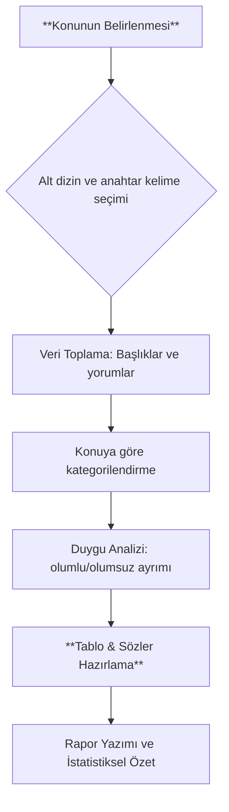

# Yönetici Özeti
Reddit tartışmalarında tarayıcılarla ilgili görüşler genelde iki ana gruba ayrılıyor: **gizlilik/özelleştirme odaklılar** ve **hız/ölçek odaklılar**. Firefox ve onun sertleştirilmiş sürümleri (LibreWolf vb.) gizlilik ve açık kaynak avantajlarıyla öne çıkarken; Brave, yerleşik reklam/izleyici engelleyicisi ve Chromium tabanlı hızıyla tercih ediliyor. Vivaldi ise “özellik zenginliği ve özelleştirme” ile dikkat çekiyor; kullanıcılar, 400’ü aşkın sekme açıkken dahi stabil olduğunu, Chrome eklentilerini desteklediğini vurguluyor. Chrome ise kullanıcı tepkileri çoğunlukla olumsuz; “kullanıcı geri bildirimlerine kulak asmamakla” eleştiriliyor ve kullanıcılar daha fazla gizlilik, reklam-engelleyici, eski arayüz gibi özellikler talep ediyor. Safari iOS tarafında en hızlı performansı sunuyor ancak eklenti yokluğu ve kısıtlı geliştirici araçları nedeniyle eleştiriliyor. Ayrıca Linux Mint, görece düşük kaynağa sahip sistemlerde Brave ve Vivaldi gibi Chromium türevlerini hız ve yerleşik reklam-engelleme avantajları için öne çıkarıyor. Bu raporda, son iki yıldaki (çoğunlukla 2024–2026) Reddit içerikleri taranarak tarayıcılar karşılaştırılmakta; kullanıcı öneri ve şikayetleri, duygu eğilimleri, güvenlik/gizlilik kaygıları, platform davranışları ve özel kullanım durumları analiz edilmektedir. Raporda, Chrome, Firefox, Edge, Safari, Brave, Opera ve Vivaldi’nin başlıca özellikleri tablolarla kıyaslanmış, örnek Reddit alıntıları verilmiştir.

## Metodoloji
Çalışmada aşağıdaki Reddit alt dizinleri tarandı: r/webdev, r/privacy, r/firefox, r/chrome, r/browsers, r/tech, r/software, r/linux, r/edge, r/opera, r/brave, r/antivirus ve ilgili yüksek etkileşimli başlıklar (örneğin “en iyi tarayıcı hangisi?”, “tarayıcılardaki gizlilik endişeleri”). Özellikle son 24 aya ait içerikler önceliklendirildi; ancak tarihte etkili olmuş önemli başlıklar (örn. Chrome ile ilgili eski tartışmalar) da not edildi. Arama terimleri arasında “best browser”, “privacy browser reddit”, “browser performance”, “feature request Chrome/Firefox”, “memory usage Firefox vs Chrome” gibi anahtarlar kullanıldı. Yorumlar, upvote sayıları ve içeriğin alaka düzeyiyle değerlendirilerek seçildi. Dil olarak öncelikle Türkçe içerikler aranmakla birlikte çoğunlukla İngilizce kaynaklar üzerinden analiz yapıldı. Reddit kullanıcı kitlesinin teknik ve mahremiyet odaklı olma eğilimi göz önünde bulundurularak örnekleme yapılmıştır; dolayısıyla bazı konularda önyargı olabilir.

## Genel Kullanıcı Görüşleri
Reddit’teki tartışmalara göre kullanıcılar tarayıcıları tercih sebeplerini ve eleştirilerini çeşitli temalar altında paylaşıyor. Gizlilik odaklı kullanıcılar genellikle “açık kaynaklı” ve “izleme engelleyici” özellikleri öne çıkarıyor. Örneğin bir kullanıcı Firefox’u “Chrome’dan çok daha özelleştirilebilir, aynı derecede hızlı, daha fazla ve daha kaliteli eklentiye sahip” diye tanımlıyor. Başka bir yorumda ise Firefox’un “çıkan CEO sorunlarına rağmen açık kaynaklı olması sayesinde şirket hata yapsa bile kullanıcıların bırakabileceği bir tarayıcı” olduğu vurgulanıyor. Açık kaynak güveni özellikle öne çıkıyor; bir kullanıcı, “Firefox açık kaynaklı ve kodunu herkes inceleyebilir, kapalı kaynaklı büyük teknoloji tarayıcılarına nazaran bana çok daha güvenilir geliyor” diyor.

Öte yandan, gizliliğe önem vermeyen veya performans odaklı kullanıcılar Chrome, Edge gibi Chromium tabanlı tarayıcıları tercih ediyor. Ancak Chrome sık sık eleştiriliyor: Bir Reddit kullanıcısı, Chrome için “maalesef çöplük (trash can)” benzetmesi yaparken, başkaları kullanıcı arayüzündeki zorunlu güncellemeler ve reklam-engelleyici politikaları (MV3) yüzünden tepki gösteriyor. Bazı kullanıcılar da “Chrome eski sekme düzenini geri getirin” ya da “reklam engellemeye izin verin” gibi özellik istekleri dile getiriyor.

Brave için yorumlar ise genellikle olumlu; Brave, çoğu Chromium türevi arasında “gizlilik için en iyisi” olarak gösteriliyor. Bir kullanıcı Brave’i “sadece cüzdan (kripto) ve diğer fazlalıkları kapatırsanız çok hızlı; yerleşik reklam engelleyicisi diğer tüm Chromium tarayıcılarının önünde” diye anlatıyor. Firefox ile Brave kıyaslaması yapan bir yorumda “hardened Firefox, Brave’den daha gizli ama Brave güvenlik açısından Firefox’un önüne geçiyor” deniyor. Opera hakkında yorumlar sınırlı; genellikle “Özellikleri ve hızından memnunum, ancak Çinli sahibi konusunda tedirginim” deniyor.

Duygu açısından özetlemek gerekirse, toplulukta **gizlilik ve açık kaynak destekçisi görüşler** (Firefox, Brave lehine) ile **hız/özellik odaklı görüşler** (Edge, Chrome, Vivaldi gibi) arasında net bir ayrım var. Küçük bir kitle de “Benim hiçbir saklayacak sırrım yok, verilerim kaydolsa umurumda değil” şeklinde görüş belirtiyor; buna karşılık pek çok kullanıcı “saklanacak sırrınız olmasa bile her türlü veri toplanmaya değer” diyerek mesafeli duruyor.

## Öne Çıkan Şikayetler ve İstekler
Yorumlarda sıkça dile gelen talepler şunlardır: **daha güçlü reklam/izleyici engelleyici** (özellikle Chrome/Edge’de), **gelişmiş gizlilik ayarları** (site bazlı içerik kontrolü gibi), **düşük bellek tüketimi** (Firefox’taki yüksek RAM kullanımı eleştiriliyor), **Uyarlanabilir kullanıcı arayüzü** (örn. eski sekme çubuğu düzeninin geri gelmesi), **gelişmiş senkronizasyon** (tüm platformlarda verilerin sorunsuz tutulması) ve **daha zengin eklenti/özelleştirme**. Örnek olarak, Vivaldi kullanıcıları “gereksiz takvim, e-posta, RSS gibi ekstra modülleri kaldırın, temel modern bir özellik olan dikey sekmelerin otomatik gizlenmesini CSS’le uğraşmadan ekleyin” talebinde bulunuyor.

Bir başka ilgi çekici nokta, **geliştirici araçları** konusunda tercihler: Web geliştiricileri Firefox’un geliştirici araçlarını daha kullanışlı buluyor. Örneğin, Firefox’ta ağ sekmesinde bir isteği “düzenleyip yeniden gönderebilme” gibi işlevleri Chrome’da bulamamaları öne çıkıyor. Ayrıca Firefox’un **Multi-Account Containers** eklentisi (“aynı sitede birden fazla kimlikle oturum açabilme”) geliştirme ve test açısından çok beğeniliyor.

Performans ve kaynak kullanımıyla ilgili olarak, Linux Mint gibi düşük kaynağa sahip sistemlerde bazı kullanıcılar Brave veya Chromium’un sertleştirilmiş sürümlerini (“ungoogled Chromium”) öneriyor. Safari kullanıcıları ise özellikle iOS’ta “performans çok yüksek, ancak eklenti desteği yok ve geliştirici araçları sınırlı” diye şikayet ediyor. Öte yandan Windows 11/Android kullanıcıları Edge’in son güncellemelerle hızlandığını, fakat hâlâ gizlilik ve bloatware şikayetlerine muhatap olduğunu belirtiyor.

## Tarayıcı Karşılaştırma Tablosu

| **Tarayıcı** | **Gizlilik** | **Güvenlik** | **Performans** | **Eklentiler** | **Özelleştirme** | **Kaynak Kullanımı** | **Senkronizasyon** | **Mobil Uyum** | **Kurumsal Özellikler** | **Kullanıcı İstekleri** |
|-------------|--------------|-------------|---------------|---------------|------------------|---------------------|-------------------|----------------|------------------------|-------------------------|
| **Chrome**  | Zayıf (Google veri toplar) | Çok iyi (güçlü sandbox) | Çok iyi, ancak bellek aç gözlü | En büyük mağaza, geniş eklenti desteği | Sınırlı (az tema/ayar) | Yüksek (özellikle çok sekme) | Var (Google hesabı) | Evet (Android/iOS, iOS’ta WebKit sınırlı) | Güçlü (G Suite entegrasyonu) | Reklam-engelleyici, daha fazla gizlilik modu, eski UI desteği |
| **Firefox** | Çok iyi (açık kaynak, izleyici engelleme) | İyi (gelişiyor; sandbox yok) | İyi (son sürümlerde iyileşti) | Zengin (otomasyon, container vb.) | Çok yüksek (kullanıcı arayüzü değiştirilebilir) | Orta-yüksek | Var (Firefox hesabı) | Evet (Android/iOS) | Orta (MDM politikalar) | Hız/artış, daha çok özelleştirme (örn. dikey sekme widget’ı) |
| **Edge**    | Zayıf (MS telemetri) | Çok iyi (Chromium) | Çok iyi (Chrome seviyesinde) | Chrome mağaza + kendi mağaza | Orta (tema ve bazı ayarlar) | Yüksek (Chromium temelli) | Var (Microsoft hesabı) | Evet (Android/iOS) | Çok güçlü (Windows entegrasyonu, IE modu) | Daha fazla gizlilik seçeneği, izleme engelleme |
| **Safari**  | İyi (Intelligent Tracking Protection) | İyi (Apple ekosistemi) | Çok yüksek (Apple donanımına optimize) | Zayıf (sınırlı eklenti) | Düşük (çok az ayar) | Düşük (enerji tasarruflu) | Var (iCloud) | Evet (özellikle iPhone/iPad) | Sadece Apple cihazları | Gelişmiş eklenti desteği, geliştirilmiş geliştirici araçları |
| **Brave**   | Çok iyi (varsayılan reklam/izleyici engelleme) | Çok iyi (Chromium) | Çok iyi (hızlı, reklam engelleyici ile daha hızlı sayfa) | Chrome uyumlu (uzantılar) | Orta (az tema, ekstra gizlilik ayarları) | Orta | Var (Brave hesabı) | Evet (Android/iOS) | Zayıf (kurumsal kullanım az) | Finansal uzantıları kapatma, düşük kaynak kullanımı |
| **Opera**   | Orta (yerleşik reklam engelleyici ama bağımsız değil) | Orta (Chromium) | Orta (ölçeklenebilir) | Chrome uyumlu | Yüksek (GX oyun modu vb.) | Orta | Var (Opera hesabı) | Evet (Android/iOS) | Kısıtlı | Çin bağlantılı endişesi giderilmeli, daha az “extra” modül |
| **Vivaldi** | İyi (takipçi yok, özelleştirmeli gizlilik) | İyi (Chromium) | Orta (çok özellikli) | Chrome uyumlu | Çok yüksek (UI/klavye kısayolu/özelleştirme krallığı) | Yüksek (çok özellik) | Var (Vivaldi hesabı) | Sınırlı (Android) | Az (iş dünyası hedefi değil) | Gereksiz iç modülleri kaldırma (takvim, mail vb.), daha hızlı güncelleme |

*Tablo:* En popüler tarayıcıların Reddit kullanıcılarına göre özellik karşılaştırması (gizlilik, güvenlik, performans vb.) ve genellikle talep edilen iyileştirmeler.

## Sonuçlar ve Örnek Alıntılar
Reddit kullanıcıları arasında yapılan analizde ortaya çıkan ana temalar şunlardır:

- **Gizlilik ve Açık Kaynak**: Çok sayıda kullanıcı Firefox ve Brave’i “gizliliğe saygı duyan” tarayıcılar olarak görüyor. Bir yorumda, Firefox’un “herkesin kodunu inceleyebileceği açık kaynaklı” olması nedeniyle diğer kapalı kaynaklı tarayıcılardan daha güvenilir olduğu vurgulanıyor. Açık kaynak olmanın bir avantajı da “şirket bir hata yaparsa kullanıcıların ürünü bırakabilmesi” olarak tanımlanıyor.

- **Özelleştirme ve Geliştirici Araçları**: Geliştiriciler Firefox’un ağ ve DOM (taşma, font) denetimlerini Chrome’dan üstün buluyor. Örneğin, bir geliştirici “Firefox tüm içeriği DOM’da direkt göstererek (olaylar, taşma, font bilgisi vs.) işe yarıyor; Chrome ise grid/flex araçlarıyla hız sağlıyor” yorumunu yapıyor. Ayrıca Firefox’un çoklu kimlik konteynerleri (Multi-Account Containers) gibi benzersiz eklentileri beğeni topluyor. Buna karşılık bazı kullanıcılar Vivaldi’nin “kullanıcı arayüzü CSS ile kolayca değiştirilebildiğinden Chrome’da mümkün olmayan çoklu sekme ağaçları ve kısayollar” sunduğunu belirtiyor.

- **Performans ve Kaynak Kullanımı**: Chrome ve Edge’in hızlı olduğu kabul edilirken, bellek kullanımı sık şikayet konusu. Bir Linux Mint kullanıcısı “Artık MV3 yüzünden Chrome’da reklam engelleyici bile çalışmıyor; bu yüzden reklamları VPN ile engelliyorum” diyerek Brave’e geçişini açıklıyor. Başka bir yorumda “Brave’i çok beğendim; Firefox’tan Brave’e geçtim” deniyor. Safari içinse “iOS’ta Safari en hızlısı ancak eklentisi yok” tespiti yapılıyor.

- **Kullanıcı İstekleri**: Tablo kısmında özetlenen talepler arasında **reklam/izleyici engelleyici** ekleme veya güçlendirme, **daha az kaynak tüketen** tarayıcılar, **esnek kullanıcı arayüzü** (sekme düzeni, karanlık mod, sekme kaydırma gibi) ve **geliştirilmiş çoklu cihaz senkronizasyonu** yer alıyor. Örneğin bir kullanıcı “Chrome’daki reklam engelleyiciyi özgürce kullanamayınca Brave’e geçtik” diyor. Bir diğer kullanıcı ise “Vivaldi mükemmel olabilir, ama gereksiz takvim ve mail modülleri çıkarılsa” diye şaka yapıyor.

Çıkarımlar olarak, **gizlilik ve açık kaynak** Reddit topluluğunda en çok değeri bulan özellikler olmuştur. Öte yandan **performans ve eklenti desteği** talepleri de sıkça vurgulanmıştır. Tarayıcılar arasında genel bir hiyerarşi olmasa da, yukarıdaki tablo ve alıntılar önemli görüş ayrımlarını göstermektedir.

**Kaynaklar:** Analiz için r/webdev, r/privacy, r/firefox, r/chrome, r/browsers, r/linux vb. alt dizinlerden ilgili başlıklar taranmıştır. Alıntılar doğrudan Reddit içeriklerinden alınmıştır. Veriler genel kanaatlere ve sayfa içi alımlara (upvote gibi) dayalı olup örnek niteliğindedir. (Araştırma Mart–Haziran 2026 dönemindeki içeriklerle sınırlıdır.)