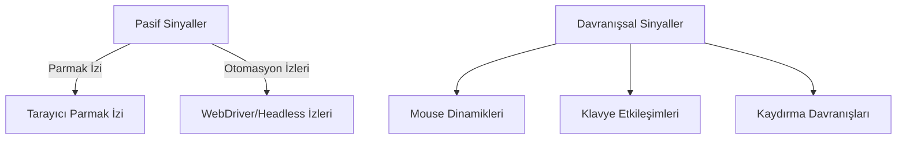

# Tarayıcı Otomasyon Tespiti: Davranışsal ve Çevresel Sinyallerin Analizi

## Yönetici Özeti
Tarayıcı düzeyinde otomasyon tespiti, hem “parmak izi” tabanlı hem de dinamik davranışsal sinyalleri kapsayan karmaşık bir süreçtir. Pasif sinyaller (tarayıcı özellikleri, WebGL/Canvas, audio fingerprint, yüklü fontlar vb.) ve tarayıcı ortamına özgü işaretler (ör. `navigator.webdriver`, `window.chrome`) otomasyon araçlarının izlerini verebilir. Aktif analiz ise fare, klavye ve kaydırma verilerini inceler; örneğin botlar sıklıkla sabit hız ve düz çizgi hareketleri gösterirken, insanlar rastgele hız değişimleri ve dolambaçlı yollar kullanır. Zamanlama metrikleri (olay arası aralık dağılımı, entropi) ve birinci derece Markov modelleri gibi yöntemlerle bu farklılıklar nicellenebilir. Gelişmiş çözümler makine öğrenimi ile bu öznitelikleri birleştirir; örneğin HUMAN (PerimeterX) ve Imperva ürünleri yüzlerce özelliğe dayalı modeller kullanır. Öte yandan, otomasyon kaçırma teknikleri (rastgele gürültü ekleme, insan benzeri gecikmeler, gerçek donanım üzerinden fare hareketi vb.) savunmayı zorlaştırsa da, her yöntemin hâlâ sınırlamaları ve yanlış pozitif riskleri vardır. Aşağıda tüm sinyaller, yöntemler, örnek algoritmalar, karşı tedbirler ve deney önerileri detaylıca incelenmiştir.

## Tespit Yöntemleri Sınıflandırması
Bot/otomasyon tespiti genellikle çok katmanlı bir yaklaşımla ele alınır. Özetle şu kategoriler ön plana çıkar:

- **Tarayıcı Parmak İzi (Fingerprinting)**: Tarayıcı ve cihaz özellikleri analiz edilir (ör. `navigator.userAgent`, WebGL/Canvas çıktıları, AudioContext fingerprint, yüklü fontlar). Bu pasif sinyaller, her istemcinin kendine özgü profili olarak kullanılır.
- **Davranışsal Analiz**: Fare/klavye/kaydırma dinamikleri gözlemlenir. Fare hızları, açılar, düzensizlikler ve klavye giriş örüntüleri hesaplanarak insan‑bot farkları bulunmaya çalışılır.
- **Otomasyon Artefaktları**: WebDriver veya headless mod işaretçileri kontrol edilir. Örneğin `navigator.webdriver` özniteliği ve `window.chrome` nesnesi sorgulanır. Selenium’a özgü `$cdc_…` değişkenleri gibi imzalar taranır.
- **İstatistiksel ve ML Tabanlı Yöntemler**: Yüzlerce nitelik makine öğrenimi modellerine (rastgele orman, LSTM, vb.) verilir. Cloudflare, HUMAN ve Imperva gibi sistemler, global trafik verisi üzerinden öğrenilmiş modellerle sahte etkinlikleri otomatik sınıflandırır.



## Fare/Klavye/Kaydırma Davranış Öznitelikleri
Gerçek kullanıcılarla otomatik komut üreten botlar arasında fare, klavye ve sayfa kaydırma (scroll) desenlerinde tutarlı farklar gözlenir. Temel öznitelikler şunlardır:

- **Fare (Mouse) Hareketleri**: İnsanlar fareyi düzensiz hızlarla, küçük sapmalar ve duraksamalarla hareket ettirir. Botlar ise genellikle düz çizgilerde, sabit hızda gider (ivme ~ 0). Yön açıları (movement angle) açısından insan hareketleri geniş açılıyken, bot hareketleri 0°, 90°, 180° gibi sabit açılarla karakterize olur. Fare yolu verimliliği (başlangıç-bitiş doğrusal mesafesi / toplam yol) botlarda yüksek, insanlarda düşüktür. Olaylar arası *pause* dağılımı incelendiğinde, insanların duraklama süreleri değişken ve geniş dağılımlıyken, botların duraklamaları sıkıca kümelenir. Ayrıca bir fare hareket dizisinde tetiklenen `mousemove` olay sayısı da farklıdır; basit botlar birkaç olayla imleci hedefe taşırken, insanlar yüzlerce `mousemove` olayı üretir.

- **Klavye Girişi**: İnsanlar tuşlara basış sürelerinde ve aralıklarında büyük değişkenlik gösterir. Otomasyon ise çok hızlı veya çok düzenli vuruşlar yapabilir. Tuş basma süresi (Hold Time) ve tuşlar arası gecikme (Flight Time) yaygın birer özniteliktir. Örneğin botlar metni bütünüyle yapıştırabilir; bu durumda `paste` olayının varlığı çok ayırt edici bir özelliktir. Klavyede otomatik doldurma senaryoları, beklenenden fazla veya sıra dışı `input`/`change` olayları üretir (örneğin birden fazla `change` olayı tetiklenmesi).

- **Sayfa Kaydırma (Scroll)**: İnsanlar genellikle küçük, kademeli kaydırma hareketleri yapar. Botlar ise tek seferde büyük atlamalar yapmaya meyillidir. Kaydırma hızının ve adımlarının dağılımı (scroll delta zamanları) önemli bir sinyaldir. Örneğin sık ve düzenli aralıklarla sabit kaydırma, gerçek kullanıcıdan ziyade otomatik sistem karakteristikleri taşır. Kaydırma sırasında oluşan kesikli `wheel` veya `scroll` olayları da benzer şekilde analiz edilebilir.

## Düşük-Seviyeli Web API’leri ve Olay Özellikleri
Etkinlik verilerinden bot farklarını çıkarmada tarayıcı API’lerindeki meta özellikler önemli rol oynar. **PointerEvent, MouseEvent, KeyboardEvent, WheelEvent** gibi olaylar aşağıdaki açılardan incelenir:

- **isTrusted**: Tüm olaylarda bulunan bu bayrak, olayın gerçek kullanıcı etkileşimi sonucu (`true`) mi yoksa `dispatchEvent()` gibi yöntemle üretilmiş (`false`) olduğunu belirtir. Örneğin `HTMLElement.click()` ile tetiklenen click olaylarında `isTrusted = false` olarak gelir. Ancak Puppeteer/Playwright gibi çerçeveler Chrome DevTools Protokolü (CDP) ile olayları tarayıcının donanım hattına enjekte ederek `isTrusted = true` yapabilir.
- **event.detail**: Mouse çift tıklama sayısı gibi art arda oluşan tıklama sayısını gösterir; doğal çift tıklamalarda `detail` 2 olurken, yapay etkileşimlerde tutarsız olabilir.
- **screenX/Y, clientX/Y, movementX/Y**: Fare koordinatları ve önceki konuma göre değişimleri gösterir. Botlar genellikle ani büyük sıçramalar yapabildiğinden, `movementX/Y` değerleri insan hareketine kıyasla alışılmadık sıfır veya sabit değerler alabilir.
- **buttons ve pointerType**: `buttons` özelliği hangi fare tuşlarının (sol, sağ, orta) basılı olduğunu belirtir; otomatik araçlar genelde sadece sol tuş (button0) kullanırken, insanlar ara sıra sağ veya tekerlek tuşlarına da basabilir. `pointerType` ise "mouse", "pen", "touch" gibi cihaz tipini gösterir; örneğin fare olayında `pointerType` tutarsız bir değer gelmesi otomasyon göstergesi olabilir.

## Tarayıcı Parmak İzi Sinyalleri
Pasif fingerprinting yöntemleri geniş bir bilgi seti kullanır. Örneğin **`navigator`** öznitelikleri ve eklenti (plugin) listesi gözlemlenebilir. Headless/otomasyon modlarında çoğu zaman `navigator.plugins` sıfır eleman içerir ve `navigator.languages` boş döner. Ayrıca `navigator.webdriver` özniteliği otomasyonda genelde **true** olur. Tarayıcı özellikleri (screen çözünürlüğü, dokunmatik desteği, donanımConcurrency vb.) da çok boyutlu bir parmak izi oluşturmada kullanılır. **WebGL/Canvas** çıktıları (özellikle GPU sürücüsü ve modeline bağlı minik renk/piksel farkları) ve **AudioContext** fingerprinting (sessiz bir ton gönderip çıkışını analiz etme) gibi yöntemler yaygın kullanılır. Örneğin headless Chrome’da ses/video oynatma genellikle devre dışı olduğundan audio/video desteği testleri yapılabilir. Ayrıca **yüklü yazıtipleri** listesi, grafik donanım özellikleri ve diğer tarayıcı özellikleri (örneğin WebRTC desteği) da kullanıcıyı ayırt eden sinyallerdir. Bu sinyallerle oluşan parmak izi, botların tipik ortamlarından farklılıklar içerir.

## WebDriver / Otomasyon İşaretleri
Tarayıcıda otomasyon çalıştırıldığında geride kalan belirli izler de tespit edilebilir. Örneğin `navigator.webdriver` özniteliği, Chrome’da `--enable-automation` veya `--headless` ile başlatıldığında **true** döner. Benzer şekilde, Chrome’da `window.chrome` nesnesi headless modda sıklıkla tanımsızdır. Selenium WebDriver’ın ürettiği `$cdc_*` veya `$wdc_*` gibi global değişkenler de yaygın tespit hedefidir; bazı betikler tarayıcı nesnesindeki “selenium” veya “webdriver” yazılarını ya da `$cdc`/`$wdc` isimli değişkenleri arar. Bu tür izler kolayca silinebilse de hâlihazırda birçok sistem tarafından kontrol edilir. Ayrıca, CDP üzerinden gelen aktivitelerin zamanlaması veya performans izleri (örneğin ağ gecikmeleri, toplu hızlı resim yüklemeleri) incelemeye tabi tutulabilir. Özetle, otomasyon modlarına özgü olan bu işaretler (WebDriver bayrağı, bilinen global değişkenler vb.) ve harici betiklerin erişebildiği tarayıcı imzası bilgilerinden oluşan çok boyutlu fingerprintler, botları tespit etmek için kullanılır.

## Zamanlama ve Entropi Metrikleri
İnsan ve bot davranışları arasındaki doğrusal olmayan farkları sayısal olarak modellemek için zamanlama istatistikleri ve bilgi kuramı ölçümleri kullanılır. Örneğin tuş vuruşları veya fare olayları arasındaki süreler dağılımı hesaplanır; Shannon entropisi ölçüsü ile bu dağılımın rastgeleliği değerlendirilir (düşük entropi, düzenli otomasyon örüntüsü gösterebilir). Örnek formül:
```
H = -\sum_i p_i \log(p_i)
```
burada p_i her aralık sınıfının göreli frekansıdır. Benzer şekilde birinci dereceden Markov zinciri ile olay dizileri modellenebilir: her sonraki olayın olasılığı sadece bir önceki olaya bağlı kabul edilerek geçiş matrisleri hesaplanır; botlar tek tipleşmiş ardışık geçişlere (örneğin hep aynen tıklama-bağlama) meyilliyken, insanlar daha çeşitli geçişler gösterir. Klavye dinamikleri alanında yapılan çalışmalarda, tutma süresi (Hold Time) ve tuşlar arası gecikme (Flight Time) gibi özelliklerin istatistikleri özellik vektörlerine dönüştürülerek makine öğrenimi ile sınıflandırma yapıldığı gösterilmiştir. Örneğin, otomatik klavye enjeksiyonu tespitinde mevcut basit hız/tempo temelli yöntemler kolayca atlatılabileceğinden, bu HT/FT özellikleri gibi karmaşık ölçümler gerektiği vurgulanır.

## Öznitelik Tabanlı Algoritmalar (Algoritmik ve ML Yaklaşımları)
Çoğu modern bot algılama sistemi, yukarıdaki sinyallerden sayısal özellikler çıkarır ve bunları sınıflandırmaya tabi tutar. Örnek bir algılama kuralı şu şekilde olabilir:

```
# Pseudokod: Basit karar kuralı örneği
Hız_std = stdev(mouse_velocity)
Olay_sayısı = mousemove_event_count
if Hız_std < ε veya Olay_sayısı < N_min:
    etiket = "bot"
else:
    etiket = "insan"
```

Bu tip kurallar, ivme veya `mousemove` sayısı gibi tekil özniteliklere bakar. Daha karmaşık yaklaşımlar ise birden çok özelliği bir araya getirir. Örneğin klavye için `[hold_time_mean, hold_time_std, flight_time_mean, flight_time_std]` vektörü hesaplanıp rastgele orman veya lojistik regresyon ile sınıflandırma yapılabilir. Her bir özellik için bir ağırlık tanımlanarak skorlama yapılır veya evrişimli/tekrarlayan sinir ağları kullanılabilir.

Makine öğrenmesi modelinde kullanılabilecek tipik özniteliklerden bazıları: farede yön açılarının varyansı, hareket verimliliği, duraklama ortalamaları; klavyede ortalama basış süresi, vuruşlar arası varyans, yapıştırma sayısı; kaydırmada ortalama hız ve tutarlılık gibi değerlerdir. Örneğin FP-Agent çalışması, fare için “eğrilik açısı dağılımı”, “hareket sayısı”, klavye için “yapıştırma olayı varlığı” ve “tuş basma süreleri” gibi öznitelikleri modelde en yüksek ayrıştırıcılar olarak bulmuştur. Makine öğreniminde ise genellikle eğitime ayrılan verisetine göre (örneğin denetimli olarak bot/insan etiketleriyle) doğruluk, hata matrisi gibi performans ölçümleri hesaplanır.

## Karşı Tedbirler ve Kaçış Teknikleri
Bot yazarları da tespit yöntemlerine karşı pek çok önlem alır. Yaygın kaçış teknikleri şunlardır:

- **İnsan-benzeri gürültü ekleme**: Fare hareketine rastgele küçük sapmalar veya gecikmeler katmak. Örneğin her click arasında 50–200 ms gibi değişken gecikme koymak ya da fareyi patika üzerinde doğrusallaşmaya çalışmadan rastgele yörüngeler izletecek şekilde kodlamak.
- **Zamanlama düzensizliği**: İstek aralıklarını sabit hız yerine karışık zamansal desenlere göre yapmak. Gerçek kullanıcılar asenkron ve düzensiz hareket eder; bu nedenle otomasyon da rastgele beklemeler ekleyerek bot imajını gizlemeye çalışır.
- **Donanım düzeyi giriş**: Mümkünse sistem düzeyinde sanal fare/klavye yerine fiziksel donanım kullanmak. Örneğin bir robot kol veya Arduino tabanlı bir aygıtla gerçek bir imleç hareketi gerçekleştirmek (çok daha karmaşık ve nadiren uygulanır).
- **Tarayıcı stealth eklentileri**: Puppeteer Extra Stealth gibi araçlar, tarayıcı başlatma bayraklarını ve DOM öğelerini manipüle ederek tespit edilebilen işaretleri gizler. Örneğin `navigator.webdriver=false` yapmak, `window.chrome` objesini oluşturmak veya diller, eklentiler listesini elle doldurmak gibi teknikler kullanılır.
- **Kayıtlı kullanıcı hareketlerinin taklidi**: Bir insanın etkileşimlerini kaydedip tekrar oynatmak. Bu, doğal fare yollarını birebir taklit edebilir ancak genellikle her göreve uyum sağlamak zordur.

Bu teknikler, basit tespit yöntemlerini baypas edebilse de gelişmiş sistemler halen farklı sinyalleri kombine ederek tespiti sürdürebilir. Ayrıca aşırı insan taklidi bazen yeni anormallikler doğurur; örneğin çok mükemmel rastgeleleştirme bilegerçeküstü bir doğrulukta gürültü yaratabilir. Dolayısıyla karşı tedbir/kaçış teknikleri de bir kısır döngüde sürekli geliştirilmek zorunda kalır.

## Sağlayıcı Yaklaşımları ve Artefakt Karşılaştırması

| Sağlayıcı             | Yaklaşım ve Sinyaller                                                                                  | Bilinen Otomasyon İşaretleri          |
|-----------------------|--------------------------------------------------------------------------------------------------------|---------------------------------------|
| **Google reCAPTCHA**  | Makine öğrenimli risk puanı; fare/klavye davranışı ile tarayıcı profilini (fingerprint) değerlendirir. <br>Davranış analizi ve geçmiş trafik özelliklerine göre puan verir (teknik detay gizli). | `navigator.webdriver`, şüpheli klavye/fare kalıpları. |
| **Cloudflare Bot Mgmt** | Global veriyle eğitilmiş ML modelleri ve davranış analizi. <br>Fare/scroll hareketleri, tıklama ve gezinme düzenleri, TLS/HTTP fingerprint gibi çok boyutlu veriler kullanılır. | `navigator.webdriver`, anormal TLS el sıkışmaları veya başlıklar, aşırı hızlı trafik, known bot listeleri. |
| **HUMAN / PerimeterX** | Makine öğrenimli parmak izi ve davranış analizi. <br>JavaScript sensörüyle toplanan binlerce cihaz/etkileşim sinyali işlenir. | `navigator.webdriver`, `window.chrome` nesnesi, tarayıcı konfigürasyonu (diller, eklentiler), form doldurma anormallikleri. |
| **Imperva (Distil)**  | Çok katmanlı koruma: istemci parmak izi, ML sınıflandırma, bağlantı/tetikleme analizi ve tehdit bilgisayarları. <br>700+ boyutlu sinyal seti kullanarak insan/bot ayrımı yapar. | `navigator.webdriver`, `window.chrome`, bilinen WebDriver imzaları, benzersiz TLS/HTTP fingerprint farklılıkları, hız ve davranış düzenleri. |

Yukarıdaki tablodaki örneklerde, her sağlayıcı güçlü yanlarına göre farklı kombinasyonlar kullanır; fakat genelde otomasyonla ilişkilendirilen ortak izler yine de benzer (örneğin `navigator.webdriver` ve diğer Chrome işaretçileri). Not: Google reCAPTCHA’nın içsel puanlama algoritması gizli tutulur, ancak fare/klavye etkileşimi ve tarayıcı uyumluluk kontrolleri yaptığı bilinmektedir.

## Doğrulama Deneyleri Önerileri
Farklı tespit yöntemlerini test etmek için aşağıdaki deneysel adımlar önerilir:

- **Veri Toplama**: Hem gerçek kullanıcı hem de otomasyon araçlarından **zaman damgalı etkileşim günlükleri** toplanmalıdır. Örneğin 20–50 farklı insandan imleç hareketleri, tıklamalar, klavye girişleri ve scroll oturumları kaydedilebilir. Bunların yanında Selenium, Puppeteer, Playwright gibi otomasyon çerçeveleriyle benzer oturumlar üretilerek karşılaştırma yapılmalıdır. Geniş bir çeşitli senaryo (farklı tarayıcı, farklı çözünürlük vb.) eklenmelidir. Yaygın kullanılan açık veri setleri de değerlendirilebilir; örneğin **DELBOT-Mouse** adlı açık kaynak fare hareketleri veri seti, insan ve bot etiketli oturumlar içerir.

- **Öznitelik Hesaplama**: Toplanan ham olaylardan yukarıdaki öznitelikler çıkarılır. (Fare için hız/ivme istatistikleri, açı dağılımları, yol verimliliği; klavye için tuş tutma/ara-zaman ortalamaları; scroll hızı/aralık vb.) Zamanlama için olaylar arası süreler dağılımı histogramları ve entropi hesaplanabilir.

- **Sınıflandırma ve Ölçümler**: Elde edilen özellikler kullanılarak denetimli sınıflandırma (ör. rastgele orman, lojistik regresyon, basit karar ağaçları) yapılabilir. Model doğruluğu, yanıltma (false positive) ve kaçırma (false negative) oranları hesaplanır. Ayrıca basit eşik algoritmaları (örneğin “hareket sayısı < X ise bot”) da test edilerek ROC eğrileri elde edilebilir.

- **Örnek Büyüklüğü**: Başlangıç için her sınıf (insan/bot) en az birkaç yüz oturum üzerinden ölçümler yapmak idealdir. Örneğin 10–20K fare olayı veya 500+ klavye giriş oturumu yeterli istatistiksel güç sağlayabilir. Literatürdeki çalışmalarda (ör. FP-Agent) davranışsal modellerin eğitimi için düzinelerce bot ajan ve yüzlerce etkileşim kullanılmaktadır. Deney sonuçları, **hassasiyet, özgüllük, doğruluk** gibi metriklerle rapor edilmelidir.

- **Kaçış Senaryoları**: Otomasyonun insan hareketini ne derece taklit edebileceği de test edilmelidir. Örneğin otomasyon araçlarına rastgele gecikme ve gürültü eklendikten sonra tespit yöntemlerinin performansı tekrar ölçülmelidir. Böylece hangi yöntemlerin kaçırıldığı veya korunabildiği gözlenebilir.

Bu deneylerle, farklı sinyallerin sınıflandırma üzerindeki etkisi nicel olarak değerlendirilebilir ve gerçek dünyadaki yanlış pozitif/fals negatif riskleri belirlenebilir.

**Kaynaklar:** Çalışmada kullanılan bilgiler, Cloudflare ve imperva gibi tedarikçi dokümantasyonları, akademik araştırmalar ve son yıllardaki sektör blogları ışığında derlenmiştir. Diğer ilgili çalışmalar ve araçlar referanslarda listelenmiştir.