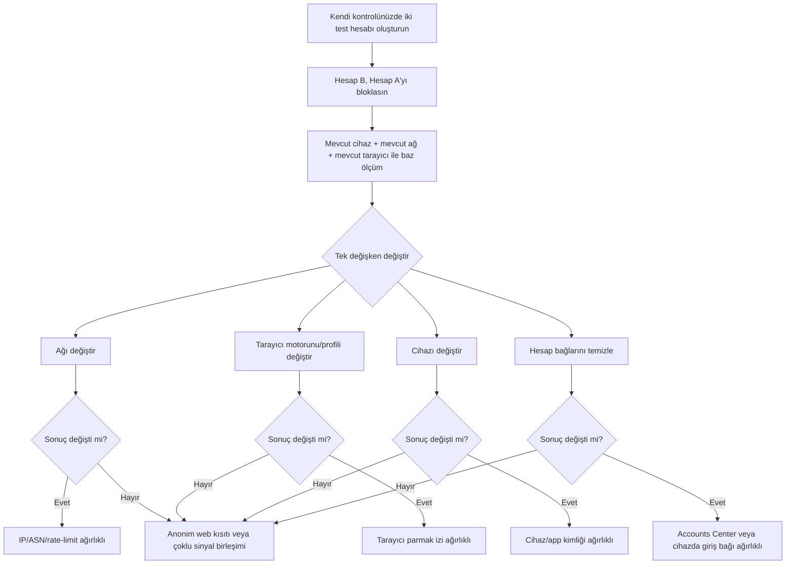
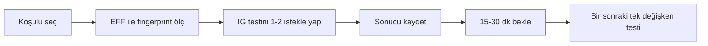

# Instagram engeli neden gizli sekmede ve farklı profilde bile devam edebilir

> **Editorial note (not part of the imported report).** Filed under the Instagram case it uses as its
> worked example, but the subject is general: **why a separate browser profile and a private window do
> not separate identity.** Renamed from `instagram-block.md` for that reason. The prose below is
> unchanged.

## Yönetici özeti

Kamuya açık belgeler, Instagram’ın tam eşleştirme algoritmasını açıklamıyor; ancak Meta’nın resmi yardım ve politika metinleri iki kritik şeyi açıkça söylüyor: Birincisi, Instagram bir hesabı engellerken o kişinin **mevcut diğer hesaplarını** ve **gelecekte açabileceği yeni hesapları** da engelleyebiliyor. İkincisi, Meta; cihaz, tarayıcı, uygulama, ağ ve davranışla ilgili çok geniş bir sinyal kümesi topladığını belgeliyor. Bunlara cihaz kimlikleri, mobil reklam kimliği, “Family Device IDs”, tarayıcı türü, eklentiler, IP adresi, mobil operatör/ISP, saat dilimi, ağdaki diğer cihazlar ve tarayıcı/cihazda saklanan tanımlayıcılar dâhil. Meta ayrıca bazı etkileşim ve cihaz sinyallerini “insanı bottan ayırmaya” yardımcı olduğu için kullandığını da yazıyor.

Bu yüzden, “başka Chrome profili + girişsiz oturum” kombinasyonu **tek başına** görünmezlik sağlamaz. Gizli mod ve farklı profil esasen **yerel geçmiş/çerez ayrımı** sağlar; buna karşılık ziyaret ettiğiniz site hâlâ IP’nizi, HTTP başlıklarınızı, tarayıcı ve cihaz özelliklerinizi, ekran/saat dilimi/dil gibi parmak izi yüzeylerini ve istek ritminizi görebilir. Chrome’un ve Firefox’un resmi açıklamaları da gizli modun internette anonimlik sağlamadığını, yalnızca cihazdaki yerel izleri sınırladığını vurgular. EFF’nin Cover Your Tracks aracı da kullanıcı aracısı, Accept başlıkları, saat dilimi, ekran boyutu, fontlar, canvas/WebGL, AudioContext, donanım eşzamanlılığı ve device memory gibi alanların kolayca gözlemlenebildiğini gösterir.

Pratik olarak en olası açıklama şudur: Instagram/Meta tarafı, tek bir çereze bakmaktan çok, **hesap ilişkileri + cihaz/ağ sinyalleri + davranış/risk skoru** birleşimiyle karar veriyor. Eğer giriş yapmadan bile aynı sonuç oluşuyorsa, bu çoğu zaman “o profilde çerez kaldı”dan ziyade **sunucu taraflı ilişkilendirme** anlamına gelir. Özellikle aynı ev interneti, aynı mobil hat, aynı cihaz, aynı tarayıcı motoru, aynı eklentiler ve benzer gezinme ritmi bu tür korelasyonu kuvvetlendirir.

Bu rapor, bir başkasının koyduğu engeli aşmaya yönelik saklanma veya kaçınma talimatı vermez. Bunun yerine, **neden böyle göründüğünü**, bunu **yalnızca kendi kontrolünüzdeki test hesaplarıyla** nasıl doğrulayabileceğinizi ve genel gizlilik/iz azaltma açısından hangi **meşru** ayarların anlamlı olduğunu açıklar.

## Kanıt tabanı ve kaynak önceliği

Bu konuda en güçlü kaynaklar dört katmana ayrılıyor. Birinci katman, **resmî Meta/Instagram dokümantasyonu**: bloklama davranışı, Accounts Center ilişkileri, cihaz-ağ-veri toplama kategorileri, cihazda saklanan giriş bilgileri ve çerez benzeri teknolojiler için bunlar birincil kaynaktır. İkinci katman, **büyük anti-bot sağlayıcılarının resmî teknik belgeleri**: Cloudflare’ın JA4/TLS parmak izi, JavaScript detections, heuristics ve rate limiting belgeleri, modern web savunmalarının hangi sinyalleri birlikte kullandığını gösterir. Üçüncü katman, **akademik çalışmalar**: DrawnApart GPU/WebGL tabanlı aygıt tanıma; 2024–2025’teki extension ve canvas fingerprinting çalışmaları; 2022–2024 özet/survey yazıları. Dördüncü katman ise **tarayıcı üreticilerinin resmî belgeleri** ve EFF: hangi yüzeylerin görünür olduğunu ve hangi korumaların bunları azaltmaya çalıştığını doğrular.

Bu kaynak tabanına göre, aşağıdaki iddiaların güven düzeyi yüksektir: Meta’nın çok sayıda cihaz/ağ kimliği toplaması; bloklamanın yeni ve mevcut ilişkili hesapları kapsayabilmesi; gizli modun anonimlik sağlamaması; modern anti-bot sistemlerinin istemci tarafı JavaScript sinyalleri, TLS parmak izi ve istek davranışını kullanması. Buna karşılık, **özellikle Instagram web’de** “DNS çözücü izi”, “SIM seviyesi bağlama” veya “yüklü tüm uzantıları doğrudan sayma” gibi davranışların kullanıldığına dair Meta’dan açık bir belge görmedim. Bu yüzden bu tür başlıkları raporda **muhtemel ama doğrulanmamış** olarak ele alıyorum.

## Meta’nın açıkça belgelendirdiği sinyaller ve hesap bağları

Meta’nın resmi gizlilik politikasının kopyasında, topladığı veriler arasında cihaz ve yazılım özellikleri, cihaz kimlikleri, mobil reklam kimliği, Family Device IDs, GPS/Bluetooth/yakındaki Wi‑Fi erişim noktaları/hücresel kuleler gibi cihaz sinyalleri, tarayıcı tipi, eklentiler, IP adresi, mobil operatör veya ISP, saat dilimi, mobil telefon numarası, ağdaki diğer cihazlar ve çerezler ile “tarayıcıda veya cihazda saklanan veriler” açıkça sayılıyor. Aynı metin, Meta’nın bazı kullanım/davranış bilgilerini, örneğin uygulamanın önde olup olmadığı veya farenin hareket edip etmediği gibi sinyalleri, insanların botlardan ayrımına yardımcı olmak için kullanabildiğini de söylüyor. Bunun önemi şu: Gizli sekme çerezleri sıfırlasa bile, Meta’nın toplama yüzeyi zaten çerezlerden çok daha geniş.

Meta’nın bloklama belgeleri ve blog yazıları da önemli. Instagram yardım merkezi ve About Instagram/Meta blog yazıları, bir kişiyi engellediğinizde **onun mevcut diğer hesaplarının** ve **oluşturacağı yeni hesapların** da engellenebileceğini; 2022 güncellemesiyle bunun özellikle “yeniden etkileşimi zorlaştırmak” için tasarlandığını söylüyor. Bu, sistemin sadece tek kullanıcı adına bakmadığını, bir “kişi/varlık kümelenmesi” mantığına sahip olduğunu açıkça gösterir.

Accounts Center da ilişkilendirme açısından önemlidir. Meta yardım belgeleri, aynı Accounts Center içindeki hesaplar arasında “logging in with accounts”, profil bilgisi eşitleme, profiller arası paylaşım ve profil linklerini gösterme gibi bağlı deneyimlerin bulunduğunu; erken 2026’dan itibaren aynı Accounts Center içindeki hesapların birbirine varsayılan olarak giriş yapabileceğini yazar. Ayrıca yeni hesap oluşturma yardımında, bazı durumlarda yeni hesabın da aynı Accounts Center’a ekleneceği belirtilir. Bunun anlamı şudur: Kendi hesaplarınız arasında kurduğunuz resmî Meta bağları, “bu hesaplar aynı kişiye ait” çıkarımını zaten kolaylaştırır.

Mobil tarafta da ilişki yüzeyleri vardır. Instagram’ın cihazda saklanan giriş bilgileri için resmî yardım sayfaları, telefonda kayıtlı giriş profillerinin kaldırılabildiğini gösterir. “Daha hızlı giriş” için telefon numarası kaydetme yardım metni ise cihazda saklanan benzersiz bir koddan söz eder. Android ve iOS üzerinde reklam takibi kontrolleri cihaz kimliklerini sınırlayabilir; ancak Google’ın kendi belgeleri, reklam kimliği silinse bile uygulamaların **başka tür tanımlayıcılar** veya kendi ayarlarını kullanabileceğini söyler. Başka bir deyişle, reklam kimliği tek başına tüm cihaz ilişkilendirmesini ortadan kaldırmaz.

Tarayıcı tarafında, Meta’nın çerez politikası ve kopyalanmış politika metni yalnızca klasik cookie’den değil, “tarayıcı veya cihazda saklanan verilerden”, cihazla ilişkili tanımlayıcılardan ve diğer yazılımlardan da söz eder. Web platformu açısından bu; cookie, localStorage, sessionStorage, CacheStorage ve service worker cache gibi yüzeylerin genel olarak kullanılabildiği anlamına gelir. Ancak teknik olarak localStorage ve service worker/cache verisi **aynı origin ve aynı profil** bağlamında kalır; gerçekten ayrı bir tarayıcı profili veya gizli oturum kapandıktan sonra bu veri otomatik olarak diğer profile sıçramaz. Bu nedenle “tamamen ayrı profil + giriş yok” durumunda tekrar yakalanma varsa, asıl ağırlık çoğu zaman **sunucu taraflı korelasyondadır**.

## Muhtemel teknik tespit zinciri

Tarayıcı parmak izi açısından, EFF’nin ayrıntılı no-JS raporu ve Firefox’un anti-fingerprinting dokümantasyonu; user agent, Accept başlıkları, saat dilimi, dil, ekran boyutu/renk derinliği, fontlar, canvas, WebGL, WebGL vendor/renderer, AudioContext, donanım eşzamanlılığı, device memory, touch support ve bazı eklenti/engelleyici işaretlerinin web siteleri tarafından görülebileceğini gösterir. Firefox’un kendi savunma metinleri de özellikle canvas, font görünürlüğü, bazı donanım/browse sinyallerinin hassasiyeti ve WebGL gibi yüzeyleri azaltmak için korumalar eklediğini söyler; bu, bu yüzeylerin gerçek dünyada önemli olduğunu dolaylı olarak doğrular.

Akademik literatür bu alanın ne kadar güçlü hale geldiğini gösteriyor. DrawnApart, sıradan JavaScript kullanarak GPU yığını üzerinden aygıtı tanıyabilen bir yöntemin, birbirine çok benzeyen cihazları bile ayırabildiğini gösterdi. 2025’teki canvas fingerprinting ölçüm çalışması, en popüler sitelerin anlamlı bir bölümünde canvas fingerprinting görüldüğünü ve bunun hem güvenlik hem de takip amaçlı kullanıldığını raporladı. 2024’teki tarayıcı uzantısı fingerprinting çalışması da, sayfa içinde gözlenebilen yan etkiler ve yürütme izleri üzerinden binlerce eklentinin ayırt edilebildiğini gösterdi. Dolayısıyla “farklı Chrome profili” çoğu zaman yalnızca çerezleri ayırır; cihaz, GPU, ekran, yazı tipleri ve uzantı kaynaklı imza ise benzer kalabilir.

Ağ tarafında, büyük WAF/anti-bot sistemlerinin kamuya açık dokümantasyonu IP, ASN, TLS parmak izi, HTTP başlıkları ve istek örüntülerinin birlikte kullanıldığını gösteriyor. Cloudflare, JA3/JA4’ü açıkça “SSL/TLS tabanlı tanımlayıcı” olarak tanımlar; heuristics motorunun istekleri kötü niyetli parmak izi veritabanlarıyla karşılaştırdığını, JavaScript Detections’ın istemci tarafı görünmez kod enjekte ederek her istekte sinyal topladığını ve isteğin doğrulanması sonucunu bir clearance cookie’ye yazdığını belgeler. Ayrıca rate limiting kuralları; IP, user agent ve diğer alanlar temelinde yoğun istekleri sınırlamanın standart savunma olduğunu gösterir. Bu belgeler Instagram’ın doğrudan Cloudflare kullandığını kanıtlamaz; ancak “girişsiz trafikte bile istemciyi ayırma”nın modern web güvenliğinde çok standart olduğunu güçlü biçimde gösterir.

Buna göre, sizin tarif ettiğiniz “diğer tarayıcıda login olmasam bile yakalıyor” gözlemine en olası açıklama şu zincirdir: Önce istemci tarafında tarayıcı/cihaz yüzeyi ölçülür; aynı anda IP/ASN/ağ itibarı ve istek hızı değerlendirilir; varsa Accounts Center, cihazda kayıtlı giriş, daha önce aynı cihazdaki Meta hesapları ve mobil uygulama kimlikleri gibi iç sinyaller risk skoruna eklenir; son olarak, bloke edilen hesabın “mevcut/gelecek hesaplar” politikası bu risk skoruna uygulanır. Meta bu tam boru hattını kamuya açmıyor; ancak resmî politika ve güvenlik kaynakları bir araya getirildiğinde bu model, eldeki kanıtlarla en uyumlu açıklamadır.

Aşağıdaki karar akışı, hangi sinyalin baskın olduğunu anlamak için faydalıdır:

## Kontrollü deney tasarımı

Bu testleri yalnızca **kendi sahip olduğunuz iki hesap** üzerinde yapmanızı öneririm. En temiz kurgu şudur: Hesap A ve Hesap B sizde olsun; B, A’yı bloklasın. Sonra A ile B’nin profilini görüntüleme denemelerini yalnızca sizin test matrisiniz içinde yapın. Her koşulda **tek değişken** değiştirin; her koşul arasında en az 15–30 dakika bırakın; her koşulda 1–2 istekten fazla üretmeyin; hızlı art arda denemeler yapmayın. Bunun nedeni, rate limiting ve bot/risk motorlarının yoğun ve tekrarlı denemeleri başlı başına şüpheli sayabilmesidir.

Ayrıca her koşulda şu alanları kayıt altına alın: profil gerçekten açıldı mı; “User not found / Sayfa yok / Login wall / Something went wrong” gibi ne görüldü; EFF Cover Your Tracks veya benzeri ölçümde fingerprint önemli ölçüde değişti mi; Instagram’ın cihazda kayıtlı giriş listesinde hâlâ ilgili hesap var mı; Accounts Center içinde hesaplar bağlı mı; mobilde Login Activity tarafında aynı cihaz/ağ geçmişi görünüyor mu. EFF ve Instagram yardım sayfaları bu doğrulama noktalarını destekler.

Aşağıdaki test matrisi, en fazla bilgi getiren değişkenleri öncelik sırasıyla verir. “Beklenen sonuç”, mevcut literatür ve resmî belgelerden türetilmiş analitik beklentidir; kesinlik değildir.

| Test koşulu | Yalnızca değişen değişken | Neyi izole eder | Beklenen sonuç |
|---|---|---|---|
| Baz durum | Hiçbiri | Referans | Sorun burada tekrarlanıyorsa sonraki kıyaslar anlamlı olur |
| Gizli sekme | Çerez/oturum depolaması | Salt yerel state etkisi | Sonuç aynıysa tek sebep cookie değildir |
| Farklı Chrome profili | Profil düzeyinde storage | localStorage/cached state etkisi | Sonuç aynıysa profil içi state’den çok cihaz/ağ korelasyonu ağır basar |
| Çerez + site verisi temizlenmiş normal profil | Cookie/localStorage/cache | Kalıcı site verisi etkisi | Değişim varsa cookie/storage etkisi vardır; yoksa sunucu tarafı ilişki daha güçlüdür |
| Eklentiler kapalı | Uzantı yüzeyi | Extension fingerprint etkisi | Değişim varsa uzantı izi katkıda bulunuyor olabilir |
| Chrome yerine Firefox | Tarayıcı motoru ve fingerprint yüzeyi | Motor/API farkı | Değişim varsa browser fingerprint önemli olabilir |
| Aynı cihaz, farklı ağ | IP/ASN/reputation | Ağ etkisi | Değişim varsa IP/ASN/rate-limit baskındır |
| Farklı cihaz, aynı ağ | Donanım/app/device izleri | Cihaz etkisi | Değişim varsa cihaz izi baskındır |
| Mobil web yerine masaüstü web | Platform/fingerprint seti | Mobil/desktop ayrımı | Farklı sonuç, cihaz/UA/sensör yüzeylerinin etkisini düşündürür |
| Girişsiz oturum yerine yeni ama ilişkisiz test hesabı | Anonim erişim kısıtı vs hesap ilişkisi | Hesap düzeyi bağlantı | Girişsizde başarısız, temiz test hesabında başarılıysa anonim web kısıtı da rol oynuyor olabilir |
| Hızlı art arda deneme | İstek ritmi | Rate limiting/bot skoru | Başarısızlık artarsa davranış/rate-limit önemli olabilir |
| Uzun zaman aralığı sonrası tekrar | Geçici risk cezası | Zamana bağlı skor | Düzelme varsa süreli risk/rate-limit ihtimali güçlenir |

Aşağıdaki örnek sonuç şablonu, not tutmayı kolaylaştırır:

Kısa yorumlama kuralı şöyledir: **Sadece ağ değişince** sonuç değişiyorsa IP/ASN/risk tarafı baskın; **sadece tarayıcı motoru veya eklentiler değişince** sonuç değişiyorsa fingerprint baskın; **sadece farklı cihazda** değişiyorsa device/app kimliği baskın; **hiçbiri tek başına çözmüyorsa** hesap bağları + ağ + fingerprint kombinasyonu veya Instagram’ın anonim görüntülemeyi kısıtlama politikası baskın olabilir.

## Meşru gizlilik azaltımları ve ödünleşimler

Aşağıdaki adımlar, bir başkasının engelini aşmak için değil, **kendi hesaplarınız üzerinde teşhis yapmak** ve genel anlamda çapraz-oturum iz bırakmayı azaltmak için uygundur. En etkili ve en pratik olanlar, önce Meta içi bağları ve cihazdaki saklı kimlikleri temizlemektir. Meta belgeleri, Accounts Center içinde hesaplar arası giriş ve profil eşleme olduğunda hesapların daha belirgin şekilde bağlanabildiğini gösterir. Bu yüzden önce Accounts Center’ı gözden geçirmek mantıklıdır. Instagram/Meta yardım akışları buna izin verir.

**Uygulanabilir ve meşru ayarlar**

| Önlem | Nasıl uygulanır | Muhtemel fayda | Sınır / ödünleşim |
|---|---|---|---|
| Accounts Center temizliği | Instagram veya Meta içinde Accounts Center > Profiles/Manage accounts; gereksiz bağlı hesapları çıkarın; “Logging in with accounts” ayarlarını gözden geçirin | Hesaplar arası resmî Meta bağlarını azaltır | Tüm veri bağını kaldırmaz; bazı bağlı deneyimler kaybolur  |
| Cihazdaki kayıtlı girişleri silme | Instagram giriş ekranında Options > Remove profiles from this device | Cihaz üstündeki doğrudan oturum/kolay giriş bağlarını azaltır | Sunucu taraflı ilişkiyi tek başına silmez  |
| Çerez ve site verisini temizleme | Tarayıcıda Privacy/Security > Clear browsing data > Cookies and site data + cache | Yerel state’i sıfırlar | Farklı ağ/cihaz izlerini etkilemez  |
| Firefox’ta sıkı anti-fingerprinting | Firefox > Privacy & Security > Strict; ileri düzeyde about:config içinde Resist Fingerprinting | Canvas/font/WebGL gibi yüzeyleri azaltabilir | Bazı siteler bozulabilir veya yavaşlayabilir  |
| Android reklam kimliğini silme | Settings > Privacy > Ads > Delete Advertising ID | Mobil reklam kimliği yüzeyini azaltır | Google açıkça, uygulamaların başka tanımlayıcılar kullanabileceğini söyler  |
| iPhone app tracking kısıtlama | Settings > Privacy & Security > Tracking > Allow Apps to Request to Track kapalı | Uygulamalar arası reklam/ölçüm takibini azaltır | Meta’nın kendi hesap/cihaz sinyallerini tamamen kaldırmaz  |
| Eklentileri azaltma | Gereksiz uzantıları kapatın veya ayrı temiz profil kullanın | Uzantı fingerprint yüzeyini küçültebilir | Kullanılabilirlik düşer; bazı uzantılar gerekebilir  |
| Tekrarlı hızlı testlerden kaçınma | Koşul başına 1–2 istek, araya bekleme koyma | Rate limiting ve bot skoruna takılma riskini azaltır | Teşhis daha yavaş ilerler  |

**Yüksek sürtünmeli ama kısmen etkili yöntemler**

VPN/proxy, Tor, tamamen yeni cihaz, fabrika ayarı, user-agent spoofing veya fingerprint spoofing uzantıları gibi yöntemler bazı sinyalleri değiştirebilir; ancak bunlar modern sistemlerde genellikle **kesin çözüm değildir**. Bunun iki nedeni var: İlki, savunmalar yalnızca IP’ye değil, istemci tarafı ve davranışsal sinyallere de bakar. İkincisi, tutarsız veya yapay görünen fingerprint’ler de başlı başına risk işareti olabilir. Tor Browser kendi belgelerinde parmak izini azaltmak için kullanıcıları “aynı görünür kılmayı” hedeflediğini söyler; bu, rastgele spoofing’in değil, **standartlaştırmanın** önemli olduğunu gösterir. Buna rağmen bu tür araçlar pratikte ek challenge, yavaşlık, site kırılması veya platform politikalarıyla uyumsuzluk üretebilir. Bu nedenle bunları bir “engeli aşma reçetesi” olarak önermiyorum.

Özellikle “SIM bağı” ve “DNS izi” başlıklarında kamuya açık Meta belgesi zayıf. Meta, mobil operatör, telefon numarası, IP ve hücresel kule/yakındaki ağ sinyallerini topladığını belgeler; fakat Instagram web’de “DNS resolver parmak izi” veya “SIM kart kimliği” kullandığını açıkça söylemez. Bu yüzden bu iki başlığı, teşhiste yardımcı bir olasılık olarak düşünmek gerekir; doğrulanmış çekirdek mekanizma olarak değil.

## İzleme göstergeleri ve önerilen eylem planı

Başarıyı doğrulamanın en iyi yolu, tek tek numaralar değil **tutarlı farklar** aramaktır. İzlemeniz gereken göstergeler şunlardır: Aynı test hesabı için hangi koşullarda profil görünür, hangi koşullarda login wall veya “not found” oluşur; ağ değişince sonuç değişir mi; tarayıcı motoru değişince sonuç değişir mi; EFF testinde fingerprint belirgin biçimde standartlaşıyor mu; Accounts Center içindeki gereksiz bağlar kaldırıldı mı; cihazdaki kayıtlı giriş profilleri silindi mi; Instagram Login Activity veya cihazda kayıtlı oturumlar tarafında hâlâ eski bağlar var mı. Bu göstergelerin birlikte okunması, tek bir “sihirli” ayardan daha anlamlıdır.

Benim önceliklendirilmiş eylem planım şu olurdu. Önce, başka birinin profili üzerinde deneme yapmayı bırakıp iki **kendi test hesabınız** ile kontrollü bir lab kurun; aksi halde hem etik hem de metodolojik olarak sonuçlar kirlenir. Sonra, en pratik bağları kesmek için Accounts Center ve cihazdaki kayıtlı girişleri temizleyin. Ardından üç kısa seri test yapın: yalnız ağ değişikliği, yalnız tarayıcı motoru/profil değişikliği, yalnız cihaz değişikliği. Bu üçlü, sorunun nereden geldiğini en hızlı ortaya çıkarır. Eğer **yalnız ağ** fark yaratıyorsa IP/ASN/rate-limit tarafına; **yalnız cihaz veya tarayıcı** fark yaratıyorsa fingerprint tarafına; **yalnız hesap bağlarını temizlemek** fark yaratıyorsa Accounts Center/cihazda saklı giriş tarafına odaklanın. Hiçbiri tek başına fark yaratmıyorsa, en muhtemel açıklama “çoklu sinyal birleşimi” veya Instagram’ın anonim web erişimini daha agresif kısıtlamasıdır.

Kısa kontrol listesi:

- Kendi sahip olduğum iki test hesabı ile mi deniyorum?
- Accounts Center’da gereksiz bağlı hesapları çıkardım mı?
- Cihazdaki kayıtlı Instagram girişlerini kaldırdım mı?
- Her testte yalnızca **tek** değişkeni mi oynatıyorum?
- Hızlı tekrar denemeleri yerine aralıklı ve düşük hacimli test mi yapıyorum?
- Sonucu yalnız “açıldı/açılmadı” diye değil, fingerprint ve bağ göstergeleriyle birlikte mi kaydediyorum?

Sonuç olarak, sizin gözleminiz teknik olarak makul: Instagram/Meta’nın sizi **login çerezi olmadan da** aynı kişi/aynı ortam olarak görmesi mümkündür. Mevcut kamuya açık kanıtlar, bunun en güçlü açıklamasının **cookie’den daha geniş bir ilişkilendirme modeli** olduğunu gösteriyor: hesap bağları, cihaz kimlikleri, ağ sinyalleri, tarayıcı parmak izi ve davranış/risk skorunun birleşimi. En etkili ve pratik yol, bu mekanizmayı başkasının profili üzerinde zorlamak değil; kendi test hesaplarınızla izole etmek, Meta içi hesap bağlarını azaltmak ve genel gizlilik yüzeyinizi küçültmektir. 