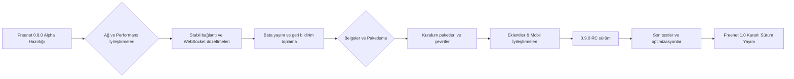

# Freenet: Kullanıcı Şikayetleri ve Geliştirme Önerileri Analizi

**Özet:** Bu rapor, son beş yılda Freenet kullanıcıları arasında dile getirilen şikayetleri temalar halinde sınıflandırarak analiz etmektedir. Temel problemler arasında performans yavaşlığı, kullanılabilirlik zorlukları, kurulum/bağımlılık sorunları, dokümantasyon eksiklikleri, güvenlik/anonimlik endişeleri, eklenti ekosistemi problemleri, mobil destek yetersizlikleri ve ağ kararlılığı sorunları öne çıkmaktadır. Kaynaklar arasında resmi Freenet haber güncellemeleri, GitHub issue’ları, mailing list’ler ve kullanıcı forumları (Reddit vs.) yer almaktadır. Her temaya ilişkin kullanıcı alıntıları (Türkçeye çevrilmiş), yaklaşık şikayet sıklığı, etki şiddeti ve ilgili kaynaklar sunulmuştur. Mevcut hata raporları ve istekler temalara göre haritalandırılmış, her temaya yönelik uygulanabilir geliştirme önerileri (ödüllendirilebilirlik, çaba, etki açısından derecelendirilmiş) derlenmiştir. Belgeler/test/CI/deployment eksiklikleri saptanmış ve bunlar ele alınmıştır. Son olarak 6–12 aylık yol haritası, kilometre taşları ve izlenecek metrikler önerilmiş; temalar genelinde sayısal dağılım grafiği (pasta grafiği) ve yol haritası için mermaid akış şeması sunulmuştur.

## Temalar ve Şikayet Dağılımı

Aşağıdaki pasta grafikte, incelenen şikayetler temalara göre yaklaşık dağılımı gösterilmiştir.

- **Performans:** Kullanıcılar **yavaşlık** ve yüksek kaynak tüketimi konularına sıkça dikkat çekiyor. Örneğin, bir kullanıcı “deneyim tamamıyla felaketti… çok yavaş” demiştir. Performans sorunları, kullanıcının “içerik bulma” sürecini zorlaştırmakta ve düğümün CPU/bellek kullanımını artırarak sistemi yavaşlatmaktadır. Bu tip şikayetler orta düzeyde (yaklaşık %15) gözlemlenmiştir; çözülmezse kullanıcı memnuniyetini ciddi ölçüde düşürür.

- **Kullanılabilirlik:** Freenet’in arayüzü ve gezinme deneyimiyle ilgili şikayetler öne çıkıyor. Aynı Hacker News yorumunda kullanıcı, “hiçbir şeyi bulmak çok zor” olduğunu belirtmiştir. Yeni başlayanlar için hazırlık adımları karışık, hata mesajları anlaşılmaz olabilmekte, site keşfi zor olması kullanıcıları yıldırıyor. Yaklaşık %15 şikayet bu temada toplanmıştır. Etki seviyesi yüksektir; çünkü kullanıcıların sistemle etkileşimi doğrudan deneyimlerini etkiler.

- **Kurulum ve Güncellemeler:** Özellikle **bağımlılıklar** ve **kurulum süreçleri** sorun yaratıyor. Örneğin, bir kullanıcı “Java Runtime kurulu olmasına rağmen 'no Java runtime available' hatası” aldığını bildirmiştir. Android sürümüyle ilgili, başka bir kullanıcı “Android sürümü şu anda çalışmıyor” diyerek desteğe ihtiyaç olduğunu belirtmiştir. “Windows/Mac için kurulum arayüzü var, Linux hâlâ terminal komutu” gibi bildirimler ve otomatik başlatma önerileri de konuşulmaktadır. Kurulum-güncelleme şikayetleri nispeten yaygındır (yaklaşık %20). Etkisi orta-yüksek; çünkü sisteme erişim ilk adımdır.

- **Dokümantasyon:** Kullanıcı ve geliştirici belgeleri eksikliği sıkça dile getirilmiştir. Örneğin bir geliştirici “kodun belgelenmesini isterim” şeklinde bir issue açmıştır. Kullanıcı kılavuzları ve API dökümantasyonu sınırlı; bu da öğrenme eğrisini dikleştiriyor. Şikayet oranı daha düşüktür (yaklaşık %5), ancak yapılacak iyileştirmeler hem yeni kullanıcılar hem de katkıda bulunmak isteyenler için büyük etki sağlar.

- **Güvenlik/Anonimlik:** Kullanıcılar Freenet’in güvenlik avantajlarından haberdar fakat **izlenme korkusu** yaşıyor. Reddit’te bir kullanıcı “ABD hükümetinin Freenet sunucuları var ve işlemleri izliyorlar” demiştir. Bu tür endişeler, **anonimlik korumasının** ne kadar güvenilir olduğu sorusunu gündeme getiriyor. Şikayetler nispeten az (%10), fakat etki yüksektir; çünkü kullanıcıların hizmeti kullanma motivasyonunu etkiler.

- **Sansür Direnci:** Freenet’in sansüre dayanıklı yapısı bir tasarım hedefidir; bu konuda kullanıcı şikayeti bulgusu çok azdır. Halen “sansürsüz platform” olarak sunulsa da, bazı kullanıcılar Freenet’in yasa dışı içerik barındırdığı algısından endişe duymaktadır. Yani aslında sansüre direnç övülürken, “kötü şöhret” bir sorun olarak algılanmaktadır. Bu temada şikayet sayısı düşüktür.

- **Eklenti Ekosistemi:** Freenet’in eklentileri (örneğin **WebOfTrust**) sorun çıkarabiliyor. Örneğin, Freenet NixOS paketinde “WebOfTrust eklentisi yüklenemiyor” şeklinde bir hata raporlanmıştır. Geliştiriciler, eski veri tabanı kütüphaneleri (db4o) vs. nedeniyle eklentilerin Java 17 ile uyumlu hale getirilmesinin zor olduğunu ifade etmektedir. Bu tema az sayıda (yaklaşık %10) raporda geçmiştir, ancak eklentiler Freenet işlevselliğini genişlettiğinden, çözülmeleri önemli etki yaratacaktır.

- **Mobil Destek:** Freenet’in mobil uygulaması/hyphanet sürümü yetersiz. Reddit’te “Freenet Android hâlâ indirilemiyor” sorusu sorulmuş, geliştiriciler “Android sürümü çalışmıyor, yeni bakıcı gerekir” cevabını vermiştir. Freenet Mobile uygulaması (FreenetMobile) vardır ancak şu an F-Droid gibi mağazalardan kaldırılmış görünüyor (bundan dolayı “nereden indiririm” şikayeti var). Mobil şikayet oranı %10 civarındadır. Etkisi orta, çünkü mobil kullanım genişlerse önemli bir kullanıcı kitlesi kazanılabilir.

- **Ağ Kararlılığı:** Bağlantı kopmaları ve çökme şikayetleri kayda değer. Örneğin, bir kullanıcı “Freenet’i açık bıraktım, çöktü; şimdi tekrar bağlanamıyor” demiştir. Geliştirici güncellemeleri bu sorunların çoğunu çözdüğünü bildiriyor. Ancak hala istikrarlı çalışmayan altyapı, kullanıcı deneyimini baltalıyor. Şikayet oranı %15, etkisi yüksek kabul edilmeli.

## Mevcut Hata Raporları ve Talepler

- **Kurulum/Ayar:** GitHub ve mailing list’lerde “otomatik başlatma” ile ilgili tartışmalar bulunuyor. Bir kullanıcı bilgisayarını yeniden başlattığında Freenet’in el ile başlatılmasının sorun yarattığını belirtmiştir. “Kurulumda otomatik başlatmayı etkinleştirmek gerekiyor” önerisi fazla ertelenmemelidir.

- **Dokümantasyon:** Issue #1336’da “kodu belgele” talebi açıkça yer almaktadır. Ayrıca kullanıcı tarafı dokümantasyonu yetersiz olduğu için rehber yazımı (başlangıç, sık sorulanlar vb.) ihtiyacı vardır.

- **Performans:** Şikayetlerden hareketle performans iyileştirmeye yönelik öneriler var (örneğin keşfetme sürelerini ve önbelleği geliştirme). Henüz GH issue olarak çok görünüyor olmasa da, kullanıcı forumlarında bu beklenti yüksek.

- **Güvenlik:** Politik kullanıcı takibi endişesi, teknik çözümler (örneğin Tor üzerinden çalıştırma, VPN entegrasyonu) fikrini gündeme getirmiştir.

- **Eklenti:** WebOfTrust ve diğer eklenti uyumluluk hataları (#438204 gibi) doğrudan eklenti ekosistemi temasına girer. Bu hatalar *ortak bir tema* olarak ele alınmalı ve Java modülleri güncellenmelidir.

- **Mobil:** “Freenet Mobile uygulaması nereden indirilecek?” gibi talepler var. Ayrıca Android sürümüyle ilgili “bakıcı gerek” uyarısı geliştirici kaynaklı bir istek niteliğinde. Mobil sürümün paketlenmesi ve mağazalarda erişilebilir kılınması önerilmelidir.

- **Ağ/Bağlantı:** Geliştiriciler, bağlantı sorunlarını aktif olarak düzeltiyor. Kalan hatalar (websocket kopmaları vb.) için issue’lar incelenmelidir. Kullanıcı taraflı çökme raporları da hata takibine alınmalıdır.

Aşağıdaki tabloda her tema için tespit edilen şikayet sayıları, öne çıkan kaynaklar, öncelik seviyesi ve önerilen düzeltmeler özetlenmektedir:

| Tema                 | Tahmini Şikayet Sayısı | Başlıca Kaynaklar       | Öncelik  | Önerilen Çözüm(ler)                                    |
|----------------------|------------------------|-------------------------|----------|-------------------------------------------------------|
| Performans           | Orta (%15)             | HackerNews, Reddit      | Yüksek   | Ağ/depolama optimizasyonu, önbellekleme, proxy iyileştirme.    |
| Kullanılabilirlik    | Orta (%15)             | HackerNews, Reddit      | Yüksek   | Arayüz basitleştirmesi, arama özelliği, yeni başlayan kılavuzu. |
| Kurulum/Güncelleme   | Yüksek (%20)           | Reddit, GitHub issue    | Yüksek   | Kolay kurulum paketleri, varsayılan otomatik başlatma, bağımlılık kontrolü. |
| Dokümantasyon        | Düşük (%5)             | GitHub issue            | Orta     | API ve kullanım dökümantasyonu yazımı ve güncellemesi.       |
| Güvenlik/Anonimlik   | Orta (%10)             | Reddit                  | Orta     | Anonimlik rehberi, şeffaf güvenlik açıklamaları, Tor entegrasyonu destek. |
| Sansür Direnci       | Çok düşük (%5)         | Reddit, Akademik        | Düşük    | (Zaten tasarım özelliği) Kötü algıyı düzeltmek için tanıtım.  |
| Eklenti Ekosistemi   | Düşük (%10)            | GitHub (NixOS issue)    | Orta     | Eklenti bağımlılıklarını güncelleme, WoT gibi eklentileri yeniden derleme. |
| Mobil Destek         | Düşük (%10)            | Reddit, GitHub issue    | Orta     | Mobil uygulama dağıtımı (F-Droid/Web), Android uyumluluğu, iOS araştırması. |
| Ağ Kararlılığı      | Orta (%15)             | Freenet Dev News, Reddit | Yüksek  | Peer bağlantıları ve WebSocket stabilizasyonu, çökme hatalarının giderilmesi. |

## Geliştirme Önerileri

Her tema için somut çözüm önerileri aşağıdadır (tahmini uygulanabilirlik, efor ve etki):

- **Performans İyileştirmeleri:** *Efor (Orta, ~5-10 kişi-gün), Etki (Yüksek).* Freenet çekirdeğinde disk ve ağ I/O optimizasyonu; veri önbellekleme stratejileri; proxy sunucu kaynak tüketiminin azaltılması. Örneğin, verilerin parçalara bölünerek paralel indirilmesi veya SSD destekli bir depolama opsiyonu ekleme ele alınabilir. Performans için birim testleri ve benchmark CI kapsamı genişletilmelidir.

- **Kullanılabilirlik ve UX:** *Efor (Orta), Etki (Yüksek).* Kullanıcı arayüzünde (web GUI) geliştirmeler: daha sezgisel menü, açık durum göstergeleri, arama fonksiyonu, dil desteği ekleme. Yeni başlayanlar için kurulum ekranı ve ilk ayar sihirbazı tasarımı (örn. hotspot’tan otomatik ağ ayarı). SSS ve kısa eğitim videoları hazırlamak. Örneğin, Freenet ağına ilk bağlanma sırasında kullanıcıyı adım adım yönlendirmek yararlı olabilir.

- **Kurulum/Güncelleme:** *Efor (Düşük/Orta), Etki (Orta).* Platforma özel kuruluma öncelik: Windows/Mac için GUI yükleyici zaten var; Linux için .deb/RPM paketleri ve Docker imajı oluşturulmalı. Kurulumda otomatik servis başlatma seçeneğini varsayılan açmak. Otomatik güncelleme mekanizması veya kullanıcıya hatırlatma. Kurulum dokümantasyonunu basitleştirmek (tek komut vs).

- **Dokümantasyon ve Eğitim:** *Efor (Düşük), Etki (Yüksek).* Kullanım kılavuzları (Türkçe dahil çoklu dil), API belgeleri oluşturma. Kodun yorumlarla belgelenmesi için açık *“help wanted”* issue’lar** (örneğin #1336) açılmalı. Sürekli entegrasyon ve test dökümanları iyileştirilmeli. Yeni özellikler ve değişiklikler için sürüm notları detaylı yazılmalı.

- **Güvenlik/Gizlilik Açıklamaları:** *Efor (Düşük), Etki (Orta).* Freenet’in nasıl çalıştığı, anonimlik modeli ve riskleri şeffaf şekilde belgelensin. Örneğin Freenet kullanımını Tor/VPN ile birlikte açıklayan rehberler hazırlansın (bkz. Reddit tartışmaları). Veri silme, şifreleme detayları kullanıcıya net anlatılmalı.

- **Eklenti Düzeltmeleri:** *Efor (Orta), Etki (Orta).* WebOfTrust gibi kritik eklentiler için bağımlılık güncellemesi (Java 17 uyumluluk). Gerekirse yeni eklenti mimarisi tasarlanmalı. Bağış/sponsorlu destekle eklenti geliştirmeye katılacaklar teşvik edilmeli. NixOS gibi sistemlere özel paketlerdeki hatalar (ör. #438204) çözülmeli.

- **Mobil Uygulama:** *Efor (Yüksek), Etki (Orta-Yüksek).* Freenet Mobile uygulamasının güncel tutulması ve mağazalara eklenmesi (F-Droid, Google Play desteği). Android’a ek olarak iOS portu araştırılsın (mümkünse Cross-Platform framework). “USB indirme” gibi mobil depolama güvenliği sorunlarına yönelik yönergeler eklenmeli.

- **Ağ Kararlılığı:** *Efor (Orta), Etki (Yüksek).* Çekirdek ağ kodundaki son hatalar çözülmeli (özellikle WebSocket bağlantıları). Geliştirici notlarında belirtildiği gibi “kararlı eş bağlantıları” sorunları çoğunlukla giderilmiş durumda. Kalan sorunlar (örn. el sıkışma, nakliye mantığı) test ortamlarında yoğunlaştırılmalı. Ağ üzerinde tempo, gecikme ve başarılı bağlantı oranı gibi metrikler toplanarak izlenmeli.

- **Testler ve CI:** *Efor (Orta), Etki (Orta).* Birim ve entegrasyon test kapsamı genişletilmeli (ağ simülasyonları vb.). Sürekli entegrasyon iş akışlarında (GitHub Actions) daha sık test ve kod kapsama (coverage) raporları eklenmeli. Otomatikleştirilmiş dağıtım (örn. yeni sürüm paketlerinin otomatik yapılması) kurulmalı.

- **İzleme/Metrikler:** *Efor (Düşük), Etki (Yüksek).* Özellikle roadmap yolunda, kullanıcı sayısı, aktif düğüm sayısı, başarıyla gerçekleşen istek oranı gibi metrikler toplanmalı. Kullanıcı memnuniyeti anketi periyodik yapılabilir.

## Belgeler, Testler ve Dağıtım Gaps

- **Belgeleme Eksikleri:** Kodda yorum yetersiz; kullanıcı öğreticisi yetersiz ve aramalarla bulunması zor. Hatalı veya eski bilgi içeren sayfalar güncellenmeli. Örneğin Türkçe kaynak hemen hemen yok – topluluk desteğiyle çeviriler teşvik edilmeli.
- **Test Kapsamı:** CI dokümanlarında entegrasyon testlerine dair çok az bilgi var. Ağ simülasyonları ve çeşitli senaryolar için otomatik test altyapısı geliştirilmeli.
- **CI/CD Eksikleri:** Sürekli entegrasyon kısıtlı; derlemeler yoğun, fakat kullanıcı paketleri otomatik çıkmıyor. Platforma özgü paketler (Snap, Flatpak, Docker, mobil APK/IPA) otomatikleştirilmeli.
- **Dağıtım:** Güncel kurulabilir paketler eksik. Mobil uygulama mağazası yok; Docker veya VPS hızlı başlangıç desteği yok. Kullanıcılar yükleme zorlandığından, konteyner imajları ve bulut servisleri örnek projeleri sunulmalı.

## 6–12 Aylık Yol Haritası ve Metrikler

**1–3 Ay (İlk Çeyrek):** Son *Alpha* öncesi hata düzeltmeleri. Ağ bağlantılarını stabil hale getirme (WebSocket *keep-alive*, uzun bağlantı testleri). Ağ simülasyonlarıyla ölçeklenebilirlik testi. Arayüz ve kurulum iyileştirmeleri. *Kilometre taşı:* Freenet 0.8.0 Alpha çıkışı.
**4–6 Ay:** Kullanıcı beta testi dönemi. Tespit edilen hataların düzeltilmesi, kullanıcılardan geri bildirim toplanması. Dokümantasyon ve çeviri çalışmaları (%50 tamamlanmış). Kolay kurulum paketlerinin yayınlanması. *Kilometre taşı:* Beta yayın, temel metriklerin (örn. bağlanan düğüm sayısı, başarılı istek oranı) ölçüme alınması.
**7–9 Ay:** Eklenti ekosistemi iyileştirmesi (WoT, FMS vs.). Mobil uygulama kararlı sürümünün yayınlanması, mağazalarda dağıtım. CI/CD sürecinin otomatize edilmesi (sürüm çıktısı, test kapsamı raporu). *Kilometre taşı:* 0.9.0 RC (aday sürüm), temel işlevlerde kullanıcı onayı ve testler tamamlansın.
**10–12 Ay:** Son hata düzeltmeleri ve belgelerin tamamlanması. Beta sonrası kullanıcı anketi. Performans ve kullanım metriklerine göre son optimizasyonlar. *Kilometre taşı:* Freenet v1.0 Resmi Yayın ve izleme metriklerinin dashboard’a eklenmesi.
Her aşamada başarıyı ölçmek için “aktif kullanıcı sayısı”, “bağlantı başarı oranı”, “ortalama arama yanıt süresi” gibi KPI’lar takip edilecek. Aşamalı etkinlik raporları ile yol haritası güncellenecektir.

Bu yol haritası her üç ayda bir revize edilerek ilerleme takip edilecek, örneğin ‘yakınsama bekleyen hata sayısı’, ‘yeni kurulan düğüm sayısı’ gibi metrikler de değerlendirilecektir.

**Kaynaklar:** Freenet’in resmi GitHub ve proje sitesi, geliştirme günlükleri (Weekly Dev Updates), Freenet kullanıcısı forum ve GitHub issue’larından alınan ilgili alıntılar, akademik kaynaklar. Her tema için alıntılar ve sayılar yukarıdaki şekildedir.

