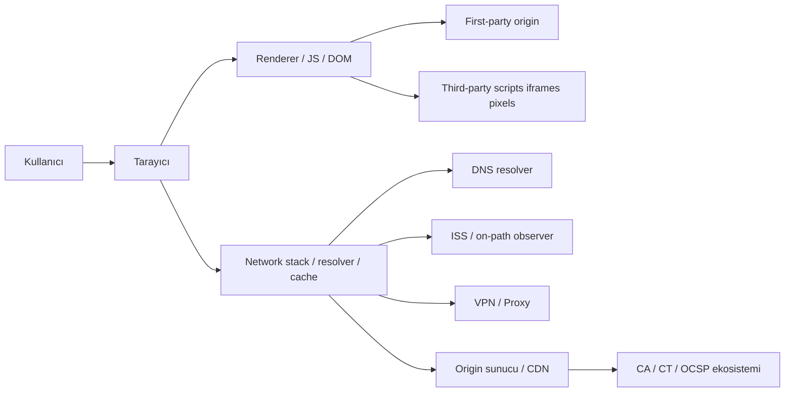

# Tarayıcıların web siteleri ve ISS’ler tarafından izlenebilirliğinin teknik anatomisi

## Yönetici özeti

Bu raporun temel sonucu şudur: bir tarayıcıyı “takip edilebilir” yapan şey tek bir özellik değil, ağ protokollerinin kaçınılmaz metaverileri, tarayıcının durum tutan depoları, sayfa ve üçüncü taraf komut dosyalarının erişebildiği API’ler, arka plan iletişim mekanizmaları ve tarayıcının kendi telemetri/crash-reporting kanallarıdır. HTTPS içerik gizliliğini büyük ölçüde sağlar; ancak DNS, IP hedefi, zamanlama, paket boyutu, bazı TLS/QUIC handshake ayrıntıları ve istemci davranış kalıpları hâlâ anlamlı iz bırakabilir. ECH, DoH/DoT/DoQ, depolama bölümlendirme, SameSite, site isolation ve sandboxing bu yüzeyi daraltır; ama bunların hiçbiri tek başına yeterli değildir.

Tarayıcı geliştiricisi açısından en kritik ilke, **privacy by design ve privacy by default** yaklaşımıdır: varsayılan ayarlar veri minimizasyonu yapmalı, URL/kimlik taşıyan telemetri açıkça gerekçelendirilmeli, depolama ve ağ erişimi mümkün olduğunca top-level site bağlamına göre partition edilmeli, güçlü özellikler izin modeliyle korunmalı ve kullanıcıya gerçek denetim veren arayüzler sunulmalıdır. Bu yaklaşım hem mühendislik hem de hukuki gerekliliktir; Avrupa’da GDPR “internet üzerinde davranış izleme”yi açıkça düzenler, ePrivacy terminal ekipmandaki bilgiye erişim/depoyu ayrıca sınırlar, KVKK rehberleri de çerez ve benzeri izleme mekanizmalarında açık rıza, aydınlatma ve geri alma ergonomisine özel önem verir.

Pratikte hedef mimari şu olmalıdır: ağ katmanında şifreli DNS + ECH + titiz sertifika doğrulama; uygulama katmanında sıkı cookie/storage politikaları ve cross-origin izolasyon; ürün katmanında minimum telemetri, opt-in URL-keyed ölçüm, scrubbed crash reports ve kullanıcı kontrolleri; güvenlik katmanında site isolation, renderer sandbox, fuzzing ve WPT/otomasyon testleri; uyumluluk katmanında veri envanteri, retention politikaları ve DPIA. Bu kombinasyon, izlemeyi tamamen yok etmez; ama izlemeyi pahalı, kırılgan ve hukuken savunulması zor hâle getirir.

Bu raporda hedef tarayıcı tipi belirtilmediği için varsayım **platform bağımsız**dır. Gerekli yerlerde desktop/mobile farkları ayrıca belirtilmiştir; özellikle process isolation, sandboxing ve bazı ağ servislerinin süreç modeli mobilde masaüstünden farklılaşabilir.

## Tehdit modeli ve mimari bağlam

Tarayıcıyı izleme problemi, aslında bir **çok taraflı gözlem problemi**dir. Birinci taraf site, kendi origin’ine gelen istekleri ve sayfadaki JavaScript’in eriştiği verileri görür. Üçüncü taraflar, gömülü script/iframe/pixel/cookie veya fingerprinting vektörleri üzerinden aynı kullanıcıyı siteler arası bağlamda ilişkilendirmeye çalışır. ISS veya ağ üzerindeki pasif gözlemci, içerik şifreli olsa bile DNS, hedef IP/port, bağlantı zamanlaması, hacim ve bazı handshake verilerini görebilir. Proxy/VPN, ISS’den gizlenen bir şeyin yerini kendi gözlem gücüyle alabilir. CA/CT/OCSP ekosistemi de sertifika doğrulama zincirinde ayrı bir görünürlük ve güven yüzeyi yaratır.

Chromium ve Gecko gibi modern motorlarda bu görünürlük, mimarinin hangi parçanın nereye erişebildiğine göre belirlenir. Chromium tarafında network service, URL loader, cache, cookie jar, host resolver ve proxy resolver gibi parçalar merkezi bir ağ katmanı oluşturur; renderer ise çok süreçli mimari ve sandbox içinde çalışır. Gecko tarafında Necko ağ protokollerinin uygulanmasından sorumludur; Gecko ise HTML parsing, rendering, JS, IPC ve ağın birlikte çalıştığı büyük bir yürütme ortamıdır. Bu ayrımlar, bir güvenlik açığının “ne kadar veri”ye erişebileceğini belirlediği için mahremiyet açısından da kritiktir.



Bu akışta en önemli gerçek şudur: içerik genellikle origin ile tarayıcı arasında korunur, ama **yol üzerindeki her bileşen içerikten farklı türde metaveri** görür. Bu yüzden “HTTPS var, sorun yok” yaklaşımı teknik olarak eksiktir. DNS, SNI/ECH, QUIC Initial, cache doğrulama, revocation kontrolü ve arka plan senkronizasyonu gibi yüzeyler ayrıca değerlendirilmelidir.

Site isolation ve sandboxing bu tabloda ayrı bir yere sahiptir. Chromium’un resmi tasarım belgeleri site isolation’ı, sandboxed renderer süreçlerini siteler arası güvenlik sınırı yapmak için kullandığını açıkça söyler; Firefox’ta Fission benzer amaca hizmet eden site isolation yaklaşımıdır. Masaüstünde bu korumalar daha olgun ve yaygındır; mobilde süreç modeli ve izolasyon kapsamı platforma göre daha değişkendir. Tasarım kararlarınızı “tek süreçli hafif mimari” lehine alırsanız, hem Spectre/XS-Leaks gibi yan kanal türlerine hem de renderer exploit sonrası veri yayılımına daha açık hâle gelirsiniz.

## İzleme mekanizmaları ve ISS görünürlüğü

### HTTP, başlıklar, çerezler, cache ve durum depoları

HTTP katmanı, izleme için hem işlevsel hem de tesadüfi metaveri taşır. `Host`, `Cookie`, `Set-Cookie`, `Referer`, `User-Agent` benzeri başlıklar, cache doğrulama başlıkları (`ETag`, `If-None-Match`) ve originler arası yüklemeler kullanıcının gezinti akışı hakkında güçlü sinyaller üretir. `Referrer-Policy` bunu sınırlamak için vardır; modern varsayılan olarak `strict-origin-when-cross-origin`, aynı origin’de tam referrer, çapraz origin’de ise çoğunlukla yalnız origin gönderir ve HTTPS→HTTP downgrade durumunda referrer’ı keser. Bu, tam URL/path/query sızıntısını azaltır ama tamamen ortadan kaldırmaz.

Cookie mekanizması HTTP durum yönetiminin standart yoludur ve oturum, kimlik, tercih ve izleme için kullanılır. `Secure`, `HttpOnly`, `SameSite`, `Partitioned` ve `__Host-`/`__Secure-` önekleri güvenlik ve kapsamı daraltır; buna rağmen cross-site bağlamlar ve kötü tasarlanmış üçüncü taraf entegrasyonlar kullanıcıyı siteler arasında ilişkilendirebilir. `SameSite=None` kullanılan bir cross-site cookie’nin `Secure` ile birlikte gönderilmesi gerekir; partitioned cookies ise top-level site anahtarına göre iki anahtarlı saklanır ve siteler arası bağlanabilirliği azaltır.

`LocalStorage`, `SessionStorage`, `IndexedDB` ve `CacheStorage`, ağda görülmeyen ama origin içinde kalıcı kimlik taşıyabilen istemci tarafı depolardır. Özellikle IndexedDB büyük ve yapılandırılmış veri depolayabildiği için “evercookie” tarzı kalıcılık stratejilerinde kullanılabildiği akademik çalışmalarda gösterilmiştir. Storage partitioning bu depoları üçüncü taraf bağlamında top-level site’e göre izole ederek cross-site korelasyonu azaltır; ancak uygulama uyumluluğu, federated login ve gömülü servisler için ek istisnalar/heuristics gündeme gelir.

HTTP cache ve `ETag`, performans için tasarlanmıştır; fakat benzersiz veya kullanıcıya özel değerlerle kötüye kullanıldığında cookie silinse bile yeniden tanımlama yapılabilir. Bu risk, “The Web Never Forgets” ve önceki araştırmalarda pratikte de gözlenmiştir. Tarayıcı geliştiricisi olarak cache doğrulama semantiklerini bozmak istemezsiniz; dolayısıyla savunma katmanı, partitioning, third-party cache kısıtları, state clearing doğruluğu ve anti-respawn testleri olmalıdır.

### DNS, TLS, HSTS, OCSP, session resumption ve QUIC

Şifreleme yoksa DNS sorgusu alan adını açıkça sızdırır. DoH ve DoT bunu şifreleyerek üçüncü taraf gözlemini zorlaştırır; Firefox’un kullanıcı belgeleri DoH’un alan adını HTTPS üzerinden gönderdiğini ve plain-text DNS’e kıyasla üçüncü tarafların hangi sitelere gidildiğini görmesini engellediğini açıkça belirtir. Ancak bu, görünürlüğü ISS’den resolver’a taşır; seçtiğiniz resolver hâlâ güçlü bir gözlem noktasıdır.

TLS 1.3 içerik gizliliği sağlar; fakat klasik TLS’de SNI, hedef host adını ClientHello içinde açıkça taşır. RFC 6066 SNI’yi tam da bu amaç için tanımlar. ECH ise ClientHello’nun hassas alanlarını şifreler ve sunucu adının ağ üzerindeki görünürlüğünü azaltır; bootstrapping için HTTPS/SVCB kayıtları kullanılır. ECH etkin değilse, ISS veya on-path gözlemci host bilgisini SNI’den çıkarabilir; ECH etkin olduğunda bu yüzey daralır ama resolver seçimi, IP hedefi ve trafik metaverisi yine kalır.

HSTS, bir host’un yalnız HTTPS ile açılmasını sağlayarak downgrade ve kullanıcıyı hata ekranından “geçmeye zorlama” risklerini azaltır. Güvenlik faydası yüksektir; ancak HSTS state’inin geçmişte “supercookie” olarak suistimal edilebildiği de gösterilmiştir. Bu yüzden HSTS’yi bir yandan zorunlu kılarken, diğer yandan state clearing, partitioning ve görünmez alt-kaynaklardan HSTS state yazımı gibi abuse senaryolarına karşı koruma eklemek gerekir.

OCSP ve revocation kontrolü ayrı bir mahremiyet yüzeyidir. İstemci doğrudan OCSP responder’a giderse, CA veya ağ tarafı kullanıcının hangi sertifikayı doğruladığını görebilir. OCSP stapling, durumu sunucunun TLS akışında “zımbalayarak” bunu daha mahrem ve ölçeklenebilir kılar; Firefox’un CRLite yaklaşımı ise revocation bilgisini istemciye push ederek çoğu bağlantıda özel sorgu ihtiyacını kaldırmayı hedefler. Tarayıcı geliştiricisi için doğru yön, istemci tarafı revocation sorgularını minimuma indiren, fail-open/fail-soft davranışlarını dikkatle yöneten ve gizlilik kaybını açıkça değerlendiren bir modeldir.

TLS session resumption ve TLS 1.3 PSK/resumption yapıları performans kazandırır; fakat tekrar kullanım ve ticket tabanlı linkability nedeniyle mahremiyet etkileri vardır. Akademik analizler, session ticket’ların belirli koşullarda kullanıcı bağlantılarını ilişkilendirme riski taşıdığını; TLS 1.3’ün bu konuda tamamen “mahremiyet nötr” olmadığını göstermiştir. Bu nedenle ticket ömrü, partitioning, state clearing ve private mode davranışı açık bir tasarım konusu olmalıdır.

QUIC/HTTP3, HTTP semantiğini UDP üzerinde QUIC taşımasına map eder ve akış başına teslimatla HOL blocking’i azaltır. Ancak QUIC Initial paketlerinin anahtarları iyi bilinen sabitlerden türetilebildiği için bu ilk paketler gizlilik sağlamaz; dolayısıyla handshake evresinin bir kısmı pasif gözlem tarafından anlaşılabilir. ECH yoksa, HTTP/3’e geçmiş olmanız otomatik olarak “ISS alan adını göremez” anlamına gelmez. Bunun yanında QUIC connection ID, bağlantı göçünü kolaylaştırırken gözlemci linkability’si için olumlu ya da olumsuz tasarım etkileri yaratabilir; manageability dokümanları bu alanı özellikle tartışır.

### WebSockets, Service Workers, Beacon, arka plan görevleri ve WebRTC

WebSocket, RFC 6455’e göre iki yönlü iletişim sağlayan bir protokoldür. `ws://` kullanıldığında taşıma düz metindir ve ISS içerik dâhil her şeyi görebilir; `wss://` TLS ile korunur ve görünürlük daha çok IP/port/zamanlama/handshake metaverisine düşer. Uygulama tarafında önemli nokta, WebSocket bağlantılarının uzun ömürlü olması ve trafikte periyodik “heartbeat” veya abonelik davranışlarıyla ek korelasyon sinyali üretebilmesidir.

Service Worker’lar, fetch interception, offline çalışma, CacheStorage ve arka plan davranışları sağlayan event-driven worker’lardır. Bu güç, izleme ve telemetri için de kullanılabilir: ağ yokken biriken işlerin daha sonra gönderilmesi, sayfa kapandıktan sonra background sync veya cache üzerinden yeniden tanımlama yapılması mümkündür. Spesifik olarak Beacon API, analitik ve teşhis verisini sayfa unload çevresinde asenkron ve non-blocking biçimde teslim etmek için tasarlanmıştır; bu yüzden kötü tasarlanırsa “kullanıcının fark etmeden veri gönderildiği” hissini çok kolay yaratır.

WebRTC, NAT geçişi için ICE/STUN/TURN kullandığından ağ adreslerine dokunan ayrı bir izleme yüzeyi yaratır. RFC 8828, WebRTC implementasyonlarında IP adreslerinin nasıl ele alınması gerektiğini tanımlar; modern tarayıcılar özel IP adreslerini doğrudan expose etmek yerine mDNS adayları gibi teknikler kullanarak obfuscation yapmaya yönelmiştir. Buna rağmen uygulama tasarımı, izin akışı, relay kullanımı ve aday filtreleme politikaları yanlışsa özel IP, ağ topolojisi veya kurumsal ağ ipuçları sızabilir.

Aşağıdaki tablo, varsayılan durumda en sık karıştırılan görünürlük ayrımlarını özetler:

| Mekanizma | Siteye tipik olarak sızan veri | ISS/on-path gözlemciye tipik görünürlük | Öncelikli azaltım |
|---|---|---|---|
| Düz DNS | Alan adı, sıklık, zamanlama | Alan adı açıkça görünür | DoH/DoT/DoQ |
| HTTPS | URL/path/query ve cookie origin’e gider | İçerik tipik olarak gizli; IP/port/timing görünür | TLS 1.3, ECH, trafik minimizasyonu |
| TLS + SNI | Hedef host seçimi origin için gerekir | ECH yoksa host adı sızabilir | ECH + şifreli DNS |
| QUIC/HTTP3 | İçerik şifreli, daha düşük gecikme | QUIC Initial gizli değildir; IP/timing yine görünür | ECH, careful QUIC policy |
| Cookies | Oturum ve kalıcı kimlik | Ağda HTTPS içinde görünmez | SameSite, Secure, Partitioned |
| LocalStorage / IndexedDB | Origin içi kalıcı durum | Ağda görünmez | Partitioning, state clearing |
| ETag / Cache | Performans + olası re-identification | İstek örüntüsü görünür; içerik HTTPS ile gizli | Partitioning, anti-respawn testleri |
| Beacon / Background Sync | Analitik/teşhis verisi | Gönderim zamanlaması ve hedef görünür | Açık politika, opt-in, rate limits |
| WebRTC | ICE adayları, ağ topolojisi, relay bilgisi | STUN/TURN hedefleri ve trafik örüntüsü görünür | mDNS, relay-first, host-candidate kısıtı |
| WebSocket | Uzun ömürlü oturum davranışı | `ws` açık; `wss` metaveri düzeyinde görünür | `wss`, kısa ömürlü tasarım, padding/rate limits |

Kaynak notu: Tablo, ilgili IETF/W3C standartları ve tarayıcı belgelerinin sentezidir. Özellikle DNS, TLS, ECH, QUIC, WebSocket, Service Worker, Beacon ve WebRTC için bkz. RFC 7858, RFC 8484, RFC 8446, RFC 6066, RFC 9848, RFC 9849, RFC 9000, RFC 9001, RFC 9114, RFC 6455, Service Worker ve Beacon spesifikasyonları.

## Tarayıcı içi bileşenler, telemetri ve üçüncü taraf izleme

### Network stack, resource loader, prefetch, push ve crash/metrics kanalları

Tarayıcının network stack’i yalnız “paket gönderip almak” yapmaz; cookie jar, host resolver, proxy resolver, cache, socket havuzu, sertifika doğrulama ve politika kararları da burada bulunur. Chromium belgeleri URLRequest/URLRequestContext yapısının bu bağlamsal verileri merkezileştirdiğini, Firefox belgeleri de Necko’nun HTTP, QUIC, cache ve DNS gibi ağ özelliklerinin ana uygulaması olduğunu açıkça gösterir. Bu nedenle network stack, mahremiyet tasarımında merkezî policy enforcement noktasıdır; renderer içinde dağınık bir uygulama, sızıntı yüzeyini büyütür.

Resource loader ve speculative loading özellikleri performans kazandırır ama aynı zamanda niyet sızıntısı üretir. `dns-prefetch`, `preconnect`, `prefetch`, `prerender` ve Speculation Rules, kullanıcının henüz gitmediği bir yere ağ trafiği çıkarabilir. W3C Resource Hints ve Chrome’un Speculation Rules belgeleri bunu açıkça performans optimizasyonu olarak tanımlar; Chrome’un private prefetch proxy çalışması ise cross-origin prefetch’in doğrudan kullanıcı bilgisini hedef siteye sızdırmaması için özel ara katman kullandığını anlatır. Geliştirici olarak kural şudur: **aynı site içinde temkinli prefetch kabul edilebilir; çapraz site speculative fetch varsayılan kapalı veya privacy-preserving proxy ile olmalıdır**.

“Push” tarafında güncel durum özellikle önemlidir. HTTP/2 ve HTTP/3 spesifikasyonlarında server push kavramsal olarak yer alır; ancak Chromium ekosistemi HTTP/2 Server Push desteğini Chrome 106 itibarıyla varsayılan olarak kaldırmıştır. Bu yüzden yeni bir tarayıcı geliştiriyorsanız push’u ana performans stratejisi yapmayın; preload, Early Hints, safe prefetch ve güçlü cache politikaları daha sürdürülebilir tercihlerdir.

Tarayıcı telemetrisi iki ayrı riski birlikte taşır: toplanan ölçümlerin içeriği ve iletim mekanizması. Chromium tarafında URL-Keyed Pseudonymous Metrics gibi URL’ye bağlı metrikler vardır; Chrome belgeleri bunun özel ayarlar ve metrics collection ile ilişkili olduğunu söyler. Firefox/Mozilla tarafında Glean modern telemetry çözümüdür; crash reports ise kullanıcının seçimine göre gönderilebilir ve bazı privacy-sensitive alanlar kısıtlı erişimle korunur. Browser geliştiricisi için doğru ilke, **URL-keyed veya olay düzeyi metriklerin açık gerekçe olmadan varsayılan açık olmaması**, sıralı veri gözden geçirmesi, PII scrub ve retention sınırlarıdır.

Crash reporting özellikle sinsi bir yüzeydir; minidump, stack, modül listesi, URL, eklenti ve çevresel metaveri bir araya geldiğinde beklenenden daha hassas olabilir. Chromium belgeleri Chrome’da gönderimin opt-in olduğunu, Chromium’da ise raporların varsayılan olarak yerelde tutulduğunu belirtir. Firefox belgeleri de crash report içeriğinin ne olduğunu ve bazı hassas alanların sınırlı erişimli olduğunu açıklar. Kural nettir: crash dump **gözlem verisi değildir**; yalnızca teşhis için gerekli alanlar gönderilmeli, URL/token/query redaction yapılmalı ve kullanıcıya ayrıntılı “ne gidiyor?” görünürlüğü verilmelidir.

### Üçüncü taraf izleme, cookie sync ve fingerprinting

Üçüncü taraf izleme, çoğu zaman yalnız üçüncü taraf cookie’den ibaret değildir. Gömülü script, iframe, pixel, redirect chain, header korelasyonu ve cookie syncing ile farklı taraflar kullanıcıyı ortak bir kimlik etrafında eşler. “The Web Never Forgets” ve OpenWPM ekosistemi bu davranışların sahada ölçülebilir ve yaygın olduğunu göstermiştir. Üçüncü taraf cookie’leri engelleseniz bile ETag, IndexedDB, canvas ve başka vektörlerle durum yeniden kurulabilir.

Fingerprinting, stateful izleme yokmuş gibi davranıp stateless sinyalleri birleştirerek kimlik çıkarır. W3C fingerprinting guidance bunu spesifikasyon yazarları için bir mahremiyet problemi olarak ele alır; Mozilla belgeleri de fingerprinting’i, tarayıcı ve cihaz yapılandırma verilerinin birleşiminden oluşturulan dijital parmak izi olarak tanımlar. Araştırmalar, tekil vektörlerin entropisi değişse de kombinasyonun güçlü olduğunu, özellikle uzun vadeli gözlemde trackability’nin yüksek kalabildiğini göstermiştir.

Önemli vektörler şunlardır: canvas rasterizasyon farklılıkları; Web Audio işleme ve FFT/oscillator davranışları; font metrikleri; zamanlayıcı hassasiyeti ve mikro-zamanlama; pil durumu; ekran/GPU/çekirdek/sensör ve hareket API’leri; HSTS veya favicon cache gibi yan durum depoları. Mozilla ve akademik kaynaklar özellikle canvas ve suspected/known fingerprinters bloklamasını, zaman hassasiyetini düşürmeyi ve daha geniş anti-fingerprinting savunmalarını belgeler.

Device sensor ve movement API’leri ayrıca dikkat ister. Permissions spesifikasyonu güçlü özellikler için ortak izin altyapısı tanımlar; Device Orientation spesifikasyonu ve MDN belgeleri de orientation erişiminin izin gerektirebildiğini gösterir. Sensör verisi işlevsel olabilir; ama fingerprinting ve davranışsal profil çıkarımı için de değerli sinyaller taşır. Bu yüzden “izin verildiğinde ham ve yüksek hassasiyetli veri” yerine, göreve özel, oran sınırlı ve düşük çözünürlüklü erişim tercih edilmelidir.

Tespit stratejisi tarafında, tarayıcı geliştiricisinin iki yolu vardır: davranışsal bloklama ve yüzey küçültme. İlki, bilinen tracker/fingerprinter listeleri ve istek kalıplarıyla çalışır; ikincisi ise fark yaratır, çünkü API davranışını standardize eder, gürültü ekler, timer hassasiyetini azaltır, storage’ı partition eder ve çapraz bağlam state erişimini varsayılan reddeder. İkinci yaklaşım, liste güncellemesine bağımlılığı azaltır ve uzun vadede daha dayanıklıdır.

## Gizlilik ve güvenlik kontrolleri

### Cookie ve storage kontrolleri

`SameSite` cookie attribute’ü, siteler arası otomatik cookie gönderimini kısıtlayarak CSRF ve cross-site izlemenin bir kısmını azaltır; ancak bunu “tam anti-tracking çözümü” gibi görmek hatalıdır. `Secure`, `HttpOnly`, `__Host-`, `__Secure-` ve `Partitioned` ile birlikte kullanıldığında etki katlanır. Güvenlik rehberi düzeyinde minimum set, oturum cookie’si için `Secure; HttpOnly; SameSite=Lax` veya duruma göre `Strict`, host-only kullanım için `__Host-` ve üçüncü taraf embed gereksinimi varsa sadece gerekçeli ve bölümlenmiş cookie’dir.

Storage partitioning artık yalnız cookie meselesi değildir. Chrome belgeleri, üçüncü taraf bağlamlarındaki çoğu storage ve iletişim API’sinin partition edildiğini söyler; MDN state partitioning belgeleri de top-level site tabanlı anahtarlamayı açıklar. Bunun anlamı, bir üçüncü tarafın farklı ana sitelerde aynı local state’i okuyamamasıdır. Zayıf nokta ise uyumluluktur: federated login, ödeme, gömülü chat ve analitik ürünleri bazen Storage Access API veya özel heuristics ister; bu istisnalar dar, gözlemlenebilir ve kullanıcı kontrollü olmalıdır.

### CSP, CORS, izin modeli ve süreç izolasyonu

CSP, tarayıcının “hangi içeriği yükleyebilirim/çalıştırabilirim?” kararını declarative bir politika ile sınırlar. Sıkı CSP, özellikle nonce/hash tabanlıysa XSS yüzeyini ciddi azaltır; dolayısıyla üçüncü taraf script enjeksiyonu ve onun üzerinden yapılacak fingerprinting/telemetry/Beacon abuse’u da dolaylı olarak sınırlar. CORS ise cross-origin okuma yetkisini server’ın verdiği HTTP başlıklarıyla yönetir; yanlış ayarlanmış CORS, yalnız veri ifşası değil, internal network ve XS-Leaks zincirleri için de katalizör olabilir.

Permissions ve Permissions Policy ayrı ama tamamlayıcı kontrollerdir. Permissions API, kamera, mikrofon, konum, bildirim ve sensör gibi güçlü yetenekler için ortak durum modeli sunar. Permissions Policy ise belge ve alt-çerçevelerin hangi API’leri kullanabileceğini sınırlayabilir. En iyi uygulama, istemi kullanıcı etkileşimi sonrasına ertelemek, bağlam içinde açıklamak, alternatif akış sunmak ve “kalıcı engellendiyse nasıl geri alınacağını” açıkça göstermektir. Tarayıcı UX’i, agresif prompt karanlık desenlerine karşı bizzat savunma hattıdır.

Sandboxing ve site isolation, yalnız exploit containment değil, aynı zamanda mahremiyet containment sağlar. Chromium belgeleri renderer’ın yalnız browser process üzerinden ağa eriştiğini ve site isolation’ın her süreci tek siteyle sınırlandırarak cookie ve hassas veriye erişimi filtrelediğini vurgular. Firefox Fission da benzer şekilde siteye atfedilmiş izole süreçler kullanır. Bir tarayıcı geliştiricisi olarak bu çizgiyi zayıflatmak, “tek bug = çok origin verisi” riskini büyütür.

### Private browsing ve çapraz site sızıntıları

Private browsing/incognito modları çoğunlukla **yerel artıkları** temizler: history, session cookie ve bazı geçici durumlar oturum sonunda silinir. Ancak Mozilla yardım belgeleri bu modların ISS’ye, işverene, okul ağına veya ziyaret edilen sitelere karşı görünmezlik sağlamadığını dolaylı ve doğrudan açıklar. Ayrıca fingerprinting’e karşı etkisi sınırlıdır; bazı tarayıcılar private mode’da daha sert anti-tracking açsa da bu tam anonimlik değildir.

Cross-site leaks ise SOP/CORS doğru olsa bile “yan kanal” üzerinden bilgi sızdırabilir. MDN ve OWASP, XS-Leaks’i bir tarayıcı tabanlı side-channel sınıfı olarak tanımlar. Savunmada SameSite yararlıdır ama tek başına yetmez; COOP, COEP, CORP, Fetch Metadata ve popup/opener ilişkisinin sınırlandırılması gerekir. Özellikle hassas uygulamalarda cross-origin isolation yalnız performans/gelişmiş API konusu değil, veri sızmasını engelleyen aktif bir güvenlik kontrolüdür.

## Ağ düzeyi koruma, performans dengesi ve saldırı vektörleri

### DoH, DoT, DoQ, ECH, VPN, proxy ve pinning

DoH ve DoT DNS’i şifreler; DoQ aynı fikri QUIC üzerinde sunar. DoQ, RFC 9250’e göre DoT’ye benzer gizlilik özellikleri sunarken QUIC’in gecikme avantajlarından yararlanır. Mahremiyet kazanımı açıktır; yine de sorgularınızı hangi recursive resolver’a verdiğiniz belirleyicidir. Tarayıcı geliştiricisi olarak resolver seçimini sessizce merkezîleştirmek yerine, şeffaf sağlayıcı politikası, enterprise kontrolü, opt-out ve yerel ağ/ebeveyn denetimi gibi senaryoları açıkça yönetmeniz gerekir.

ECH, bugün TLS katmanındaki en önemli mahremiyet yükseltmelerinden biridir; ama practical deployment hâlâ DNS ve sunucu ekosistemine bağlıdır. Firefox yardım belgeleri ECH’nin ilk “hello” mesajını şifreleyerek hangi sitelere gidildiğinin ağ aracıları tarafından anlaşılmasını zorlaştırdığını açıklar. Buna rağmen ECH, hedef IP’yi veya trafik kalıp analizini yok etmez; dolayısıyla “SNI kapandı, ISS hiçbir şey göremez” demek yanıltıcı olur.

VPN ve proxy, görünürlüğü yeniden dağıtır. MDN proxy belgeleri proxynin istemci ile hedef arasında herhangi bir yerde bulunabileceğini söyler; Mozilla VPN belgeleri VPN’in IP’yi maskeleyip ağ etkinliğini şifrelediğini vurgular. Sonuç: ISS’den sakladığınız şeyin önemli kısmını VPN veya proxy operatörü görür. Bu yüzden tarayıcı seviyesinde VPN/proxy entegrasyonu geliştiriyorsanız, “ISS’den gizleme” vaadini “uç noktadan gizleme” ile karıştırmamalı, trust shift’i kullanıcıya açıkça anlatmalısınız.

TLS pinning konusunda tasarım notu nettir: web platformunda HPKP artık ölüdür. MDN ve Chromium deprecation kaynakları HPKP’nin kaldırıldığını ve modern tarayıcıların desteklemediğini açıkça belirtir. Web için önerilen yön, Certificate Transparency, sağlam revocation ve kontrollü trust store/policy yönetimidir; “pinning” gerekiyorsa bu daha çok native app / enterprise-controlled client problemidir.

### Performans, UX ve işlevsellik dengesi

Mahremiyet ile performans neredeyse her zaman gerilimlidir. Prefetch ve prerender latency’yi düşürür; ama yanlış yapılandırılırsa kullanıcının “niyetini” erken sızdırır. Büyük, uzun ömürlü cache’ler performansı artırır; ama re-identification ve respawn riskini büyütür. Batarya ve ağ durumuna göre uyarlanmış API’ler UX’i iyileştirir; ama cihaza özgü entropy ekleyebilir. Bu nedenle kural, “varsa kullan” değil, **ölçülebilir bir fayda için minimum veriyle kullan** olmalıdır.

Ölçüm tarafında izlenecek metrikler yalnız TTFB/LCP/CPU değil, aynı zamanda **privacy cost** da olmalıdır. Örneğin: aynı-site prefetch hit oranı, cross-site prefetch sayısı, background gönderim hacmi, third-party storage erişimi, permission prompt kabul/ret oranı, state partition bypass olayları, private mode residual state testleri ve anti-fingerprinting yüzey standardizasyon kapsamı. Lighthouse performans ve best-practices tarafına yardımcı olabilir; fakat mahremiyet için ek özel testler gerekir.

### Saldırı vektörleri ve mitigasyon

MITM, DNS spoofing ve TLS downgrade klasik tehditlerdir. HSTS, modern TLS, CT ve sağlam doğrulama bu sınıfı azaltır. QUIC/HTTP3, TCP kaynaklı bazı darboğazları iyileştirir ama yeni gözlem/middlebox sorunları getirir; QUIC Initial ve manageability başlıkları bu nedenle önemlidir. Sertifika zinciri ve revocation tarafında CT + stapling/özel sorgusuz revocation en iyi kombinasyona yakındır.

Cross-site leaks ve side-channel saldırıları daha modern ve daha sinsi bir sınıftır. Zamanlayıcı hassasiyetinin azaltılması, cross-origin isolation, site isolation ve storage partitioning bu yüzden sadece “privacy features” değil, **aktif güvenlik özellikleri**dir. Spectre sonrası site isolation’ın hızla yaygınlaşması da bunun sonucudur. Tarayıcı geliştiricisi, performans ölçümünde yüksek hassasiyetli zamanlayıcılar ve paylaşımlı yürütme kaynakları sunduğunda, her yeni API’yi covert/side channel lensiyle de değerlendirmelidir.

WebRTC IP sızıntıları, Private Network Access, iç ağ hedefleri ve kurumsal cihazların istemeden web’e açılması da önemlidir. PNA spesifikasyonu, public web sayfalarının private network hedeflerine erişim risklerini azaltmak için Fetch/HTML değişiklikleri tanımlar. Bir tarayıcı geliştiricisi olarak özel ağlara yönelik istekler, local network discovery ve ICE host candidate politikaları aynı tehdit modelinde değerlendirilmelidir.

Aşağıdaki tablo, ağ korumalarının neyi çözdüğünü ve neyi çözmediğini özetler:

| Koruma | Esas fayda | Hâlâ görünür kalanlar | Geliştirici notu |
|---|---|---|---|
| DoH / DoT / DoQ | DNS adını yoldan gizler | Resolver sağlayıcısı sorguyu görür; IP/timing kalır | Resolver seçimi ve enterprise kontrolleri kritik |
| ECH | SNI/ClientHello hassas alanlarını gizler | IP hedefi, trafik örüntüsü, resolver tarafı | Şifreli DNS ve HTTPS/SVCB ile birlikte düşünülmeli |
| VPN | ISS görünürlüğünü azaltır, IP’yi maskeler | VPN sağlayıcısı güçlü gözlem noktası olur | Trust shift net anlatılmalı |
| Proxy | Trafiği ara düğümden geçirir | Proxy tarafı istekleri görür | Policy/allowlist/logging açık olmalı |
| HSTS | Downgrade/MITM riskini azaltır | HSTS state abuse edge-case’leri mümkündür | State clearing ve abuse mitigations ekleyin |
| OCSP stapling / CRLite | Revocation’ın mahremiyet maliyetini azaltır | Tam ekosistem desteği değişkendir | Client-side özel sorguyu en aza indirin |
| HPKP değil, CT | Misissuance görünürlüğü sağlar | Pinning’in operasyonel riski yok olur | Web’de HPKP’ye dönmeyin |

Kaynak notu: DoH/DoT/DoQ, ECH, HSTS, OCSP stapling, CRLite, HPKP ve CT için ilgili RFC ve tarayıcı belgeleri kullanılmıştır.

## Hukuk, uyumluluk, test ve uygulama rehberi

### GDPR, KVKK, ePrivacy, CA/B ve telif boyutu

GDPR açısından internet üzerinde davranış izleme, tarayıcı geliştiricisi için doğrudan konu dışı değildir. Resmî metin, AB’deki veri sahiplerinin davranışlarının internet üzerinde izlenmesini açıkça kapsama bağlar; ayrıca veri minimizasyonu, kayıt tutma, security of processing, privacy by design/default ve yüksek risk işleme için DPIA zorunluluklarını düzenler. Tarayıcı telemetrisi, URL-keyed ölçüm, crash dump ve sync verileri bu çerçevede değerlendirilmeli; “ürün telemetrisi ayrı, kişisel veri değil” refleksiyle hareket edilmemelidir.

ePrivacy tarafı daha da spesifiktir: terminal ekipmandaki bilgiye erişim veya bilgi depolama, kullanıcıya açık ve kapsamlı bilgi verilmesi ve kural olarak rıza/ret hakkı ile ilişkilidir; istisna yalnız iletim için zorunlu veya açıkça talep edilen hizmetin sağlanması için kesin gerekli hâllerdir. EDPB’nin 2024 kılavuzu, bu mantığın sadece klasik cookie’lere değil, emerging tracking tools ve device fingerprinting’e de uygulanması gerektiğini açıkça ortaya koyar. Bu nedenle fingerprinting’i “cookie değil” diye rıza kapsamı dışında düşünmek hukuken risklidir.

KVKK tarafında, Kişisel Verileri Koruma Kurumu’nun çerez rehberi özellikle önemlidir. Rehber, aktif olumlayıcı eylem olmadan rızanın geçerli sayılamayacağını, sadece siteye girmenin rıza anlamına gelmeyeceğini, kabul/reddet/tercihler düğmelerinin eşdeğer görünürlükte olması gerektiğini, rızanın geri alınabilir olmasını ve çerez duvarlarının özgür iradeyi sakatlayabileceğini vurgular. Tarayıcı veya gömülü browser geliştiriyorsanız, consent UI bileşenlerinizi buna göre tasarlamak gerekir.

Sertifika ekosisteminde CA/B Forum Baseline Requirements ve Certificate Transparency politikaları web PKI’nin fiilî zemini hâline gelmiştir. Chrome CT policy ve Firefox 135 notları, kamusal TLS sertifikaları için yeterli CT kanıtının güven ilişkisi açısından kritik olduğunu gösterir. Tarayıcı geliştiricisi olarak kendi trust store ve doğrulama politikanız varsa, CA/B ve CT çizgisinden sapmak ciddi uyumluluk ve ekosistem maliyetleri doğurur.

Telif boyutunda temel not şudur: tarayıcının sayfa göstermek için oluşturduğu geçici ekran ve cache kopyaları, AB hukukunda belirli koşullarda “temporary, transient or incidental” kopya istisnasına girebilir. Ancak bu, persistent arşivleme, yeniden dağıtım veya DRM by-pass için genel bir lisans değildir. Browser cache tasarımında retention ve kullanıcı kontrolü hâlâ önemlidir.

“Zorunlu kayıtlar” konusunda tek cümlelik evrensel kural yoktur. GDPR Art. 30, işleme kayıtlarını ve genel güvenlik önlemlerini kurumsal ölçekte zorunlu kılar; ePrivacy Art. 15 belirli ulusal mevzuatlarla sınırlı ve amaçla orantılı veri saklama tedbirlerine kapı açar. Bu yüzden doğru yaklaşım, blanket log tutmak değil; ürününüzün işlediği veri kategorileri, amaç, hukuki dayanak, saklama süresi ve silme prosedürlerini ayrı ayrı tanımlamaktır.

### Test, denetim ve izleme azaltma stratejisi

En iyi pratik, “özellik çıktıktan sonra privacy review” değil, tasarım başında threat model + data flow mapping yapmaktır. Bunu şu test katmanlarıyla destekleyin: spesifikasyona dayalı davranış testleri için Web Platform Tests; güvenlik regresyonları için OWASP WSTG tabanlı senaryolar; parser, network parser, media parser ve policy engine bileşenleri için fuzzing; privacy ölçümü için büyük ölçekli crawl ve instrumentation. Chromium ve Firefox resmî dokümanları fuzzing’i çekirdek otomasyon tekniği olarak kullanır; OpenWPM ise web tracking davranışlarını saha ölçümü için pratik çerçeve sunar.

Uygulanabilir otomasyon seti şu özellikleri kapsamalıdır: üçüncü taraf cookie ve partition bypass testleri; private mode state leakage testleri; ETag/HSTS/favicon respawn testleri; izin istemi spam testleri; WebRTC host candidate ve mDNS testleri; prefetch/prerender’in çapraz site istek üretip üretmediği; crash report scrub testleri; URL-keyed metrics’in gerçekten opt-in olup olmadığı. Privacy regressions için “golden screenshots” yetmez; paket/istek akışını, storage durumunu ve clearing sonrasını da doğrulamak gerekir.

Kullanıcı tarafına dönük kontroller teknik savunmanın parçasıdır. Private browsing, anti-fingerprinting modu, third-party cookie toggle, clear-site-data, per-site permission paneli, network indicator’ları ve telemetry opt-in ekranları “nice to have” değil, güvenlik-uyumluluk gereği olarak düşünülmelidir. Özellikle permission prompts ve telemetry açıklamaları, reddetme seçeneğini görünmez kılan karanlık desenlerden arındırılmalıdır.

### Geliştirici kontrol listesi

Aşağıdaki liste, yeni bir tarayıcı veya gömülü browser geliştirirken başlangıç kontrol seti olarak kullanılabilir:

- Ağ katmanında varsayılan TLS 1.3, şifreli DNS desteği, ECH uyumluluğu ve sıkı sertifika doğrulama uygulayın; revocation tarafında istemci mahremiyetini bozan özel sorguları asgariye indirin.
- Cookie ve storage politikasını varsayılan olarak sınırlandırın: `Secure`, `HttpOnly`, `SameSite`, host-only önekler, partitioned state ve güçlü clearing semantics kullanın.
- Üçüncü taraf state ve communication API’lerini top-level site’e göre bölümleyin; Storage Access istisnalarını dar ve denetlenebilir tutun.
- Renderer’ı sandbox içinde tutun; site isolation’dan geri adım atmayın; mobilde de mümkün olan en güçlü süreç izolasyonunu hedefleyin.
- Prefetch/prerender ve background sync varsayılanlarını performans yerine mahremiyet lehine ayarlayın; çapraz site speculative traffic’i sınırlandırın.
- Telemetriyi olay türüne göre sınıflandırın; URL-keyed ve teşhis verilerini ayrı izin katmanlarına bağlayın; retention ve scrub kuralları yazılı olsun.
- Anti-fingerprinting’i liste tabanlı bloklamayla sınırlamayın; timer precision, canvas/audio/sensor yüzeyleri ve font/screen standardizasyonu gibi platform savunmaları ekleyin.
- Consent ve permission UX’ini hukuka uygun, dengeli ve geri alınabilir tasarlayın; kabul/reddet eşit görünürlükte olsun.
- WPT, fuzzing, privacy crawl ve adversarial tests’i CI/CD’ye koyun; privacy regressions’ı performans regressions kadar ciddiye alın.

### Örnek başlık ve yapılandırma parçaları

Aşağıdaki parçalar **ürün politikasını anlatan örneklerdir**; doğrudan belirli bir tarayıcı iç API’sinin bire bir sözdizimi oldukları iddia edilmemektedir. Başlıkların kendisi standart davranışlara dayanır.

```http
Strict-Transport-Security: max-age=31536000; includeSubDomains
Referrer-Policy: strict-origin-when-cross-origin
Content-Security-Policy: default-src 'self'; script-src 'self' 'nonce-{RANDOM}'; object-src 'none'; base-uri 'none'; frame-ancestors 'none'
Cross-Origin-Opener-Policy: same-origin
Cross-Origin-Embedder-Policy: require-corp
Permissions-Policy: geolocation=(), camera=(), microphone=(), accelerometer=(), gyroscope=()
X-Content-Type-Options: nosniff
```

```http
Set-Cookie: __Host-session=abc123; Path=/; Secure; HttpOnly; SameSite=Lax
Set-Cookie: prefs=lang=tr; Path=/; Secure; SameSite=Lax
Set-Cookie: widget_id=xyz; Path=/; Secure; SameSite=None; Partitioned
```

```json
{
  "dns": {
    "mode": "doh",
    "resolver_template": "https://resolver.example/dns-query{?dns}",
    "bootstrap_ips": ["203.0.113.10"],
    "fallback_to_plain_dns": false,
    "enterprise_opt_out": true
  },
  "tls": {
    "min_version": "1.3",
    "ech_enabled": true,
    "session_ticket_lifetime_seconds": 3600,
    "clear_resumption_state_on_private_exit": true
  },
  "webrtc": {
    "expose_host_candidates": false,
    "mdns_obfuscation": true,
    "relay_only_in_private_mode": true,
    "require_user_activation_for_capture": true
  },
  "telemetry": {
    "base_metrics": "minimal",
    "url_keyed_metrics": "opt_in",
    "crash_upload": "ask_each_time",
    "redact_urls_tokens_and_query": true
  }
}
```

```nginx
add_header Content-Security-Policy "default-src 'self'; script-src 'self' 'nonce-$request_id'; object-src 'none'; base-uri 'none'; frame-ancestors 'none'" always;
add_header Referrer-Policy "strict-origin-when-cross-origin" always;
add_header Cross-Origin-Opener-Policy "same-origin" always;
add_header Cross-Origin-Embedder-Policy "require-corp" always;
add_header Permissions-Policy "geolocation=(), camera=(), microphone=()" always;
add_header Strict-Transport-Security "max-age=31536000; includeSubDomains" always;
```

Bu örneklerde dikkat edilmesi gereken tasarım ilkesi şudur: header’lar ve cookie attribute’leri tek başına “privacy feature” değil, politika kodudur. Ürününüzde bunları yalnız web içeriğine bırakmak yerine, browser default’ları, enterprise policies ve per-site override’larla birlikte düşünün. Özellikle `CSP`, `Referrer-Policy`, `SameSite`, `Partitioned`, `COOP/COEP` ve permission yüzeyleri birbiriyle etkileşimlidir.

### Açık sorular ve sınırlamalar

Bu rapor platform bağımsız varsayımla yazıldığı için, bazı mobil platformlarda süreç izolasyonu, sandboxing kapsamı, ECH/DoH varsayılanları ve anti-fingerprinting davranışı masaüstü platformla bire bir aynı değildir. Özellikle mobilde site isolation ve network service süreç modeli ürün ve işletim sistemi kısıtlarına göre değişebilir. Ayrıca ECH dağıtımı 2026 itibarıyla bile tarayıcı, resolver, CDN ve enterprise policy kombinasyonuna bağlı olduğundan “her ağda aynı görünürlük azalması” beklenmemelidir.

## Kaynaklar

Aşağıdaki kaynaklar, bu konuyu derinlemesine çalışmak için en yüksek öncelikli referans kümesini oluşturur:

- **IETF RFC’leri ve standartları:** RFC 8446 (TLS 1.3), RFC 6066 (SNI), RFC 6960 (OCSP), RFC 6961 (OCSP stapling v2), RFC 7858 (DoT), RFC 8484 (DoH), RFC 9000/9001 (QUIC ve QUIC-TLS), RFC 9114 (HTTP/3), RFC 6455 (WebSocket), RFC 8828 (WebRTC IP handling), RFC 9848/9849 (ECH bootstrapping ve ECH).
- **W3C / WHATWG dokümanları:** Service Workers, Beacon API, IndexedDB, Permissions, Permissions Policy, Referrer Policy, Fetch Standard, Device Orientation and Motion, Battery Status, fingerprinting guidance.
- **Chromium resmî belgeleri:** network stack, network service, multi-process architecture, resource loading, site isolation, sandbox, CT policy, RenderingNG, crash reports, UKM.
- **Firefox / Mozilla resmî belgeleri:** Necko/networking, Gecko, Fission/process model, DoH, ECH, private browsing, anti-fingerprinting, crash reports, Glean/telemetry, CRLite.
- **Hukuk ve uyumluluk kaynakları:** GDPR resmi metni, ePrivacy Directive 2002/58/EC, EDPB 2024 Art. 5(3) kılavuzu, KVKK Çerez Uygulamaları Rehberi, CA/B Forum Baseline Requirements, Chrome ve Firefox CT politikaları.
- **Seçilmiş akademik çalışmalar:** *How Unique Is Your Web Browser?*; *Browser Fingerprinting: A Survey*; *The Web Never Forgets*; *Long-Term Observation on Browser Fingerprinting*; *Process Separation for Web Sites within the Browser*; *Automated Discovery of Cross-Site Information Leaks in Browsers*; Web Audio fingerprinting ve Battery API mahremiyet çalışmaları. 