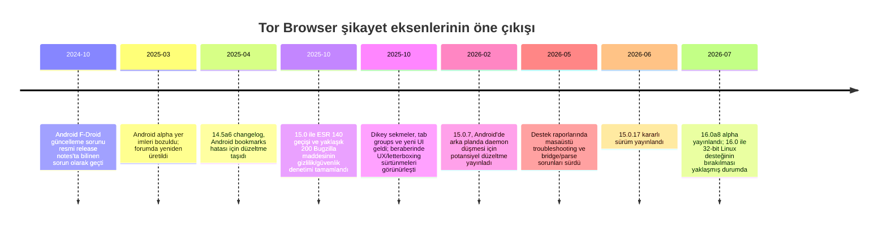

# Tor Browser kullanıcı şikayetleri ve geliştirme önerileri

## Yönetici özeti

Bu rapor, **2026-07-05** itibarıyla Tor Browser kullanıcılarının başlıca şikayetlerini; Tor Project’in resmi destek sayfaları, resmi sürüm notları, Tor forumu, GitLab/GitHub hata kayıtları, Mozilla Bugzilla, Reddit r/TOR, Tor Stack Exchange ve Türkçe forum örnekleri üzerinden birleştirerek inceler. Bu tarih itibarıyla güncel **kararlı sürüm Tor Browser 15.0.17**, güncel **alpha sürüm ise 16.0a8**’dir. Tor Project’in kendi yönlendirmesi, sorunların önce resmi **Tor Browser issue tracker** içinde aranmasını ve gerekirse **GitLab issue** açılmasını söyler; buna karşılık bazı tamamlayıcı mobil/bridge bileşenleri GitHub’da, Firefox/GeckoView’den devralınan üst-akış sorunlar ise Mozilla Bugzilla’da izlenir.

Toplu resim şu: **en ağır kullanıcı acısı “anonimlik teorisi” değil, “çalıştırabilme ve istikrarlı bağlanabilme” problemidir.** Tor’un resmi kullanıcı destek raporlarında 2026 boyunca en büyük hacim; sansürü aşma, köprüler, Android sorun giderme ve mevcut kurulumları ayağa kaldırma başlıklarında toplanmıştır. İkinci katmanda web sitesi uyumluluğu, CAPTCHA/hesap kilitlenmesi, Android’e özgü “proxy refused” benzeri arızalar ve mobil–masaüstü özellik farkları öne çıkmaktadır. Performans ve arayüz şikayetleri de çok görünürdür; ancak bunların önemli bölümü, Tor’un kasıtlı gizlilik savunmaları ile kullanılabilirlik arasındaki gerilimden kaynaklanır.

En yüksek getirili geliştirme alanları kısa vadede şunlardır: **Android istikrarı**, **bridge/clipboard girdisi sağlamlaştırma**, **site uyumluluğu için daha iyi açıklama ve güvenli kaçış yolları**, **Türkçe ve bölgesel bağlantı yardımcıları**, ayrıca **mobil özellik eşitlemesi**. Orta ve uzun vadede ise **Android’de New Identity / circuit görünürlüğü / Onion-Location eşitlemesi**, **sabit önayarlarla güvenli içerik engelleme araştırması**, ve **üst-akış Firefox/GeckoView değişikliklerine daha sistematik ESR uyarlaması** en mantıklı yatırım görünmektedir.

## Sorunların tablo özeti

| Kategori | Örnek şikayet | Doğrulama kaynağı | Öneri | Öncelik | Zorluk |
|---|---|---|---|---|---|
| Gizlilik ve anonimlik | Kullanıcılar “parmak izi sızıyor mu”, “ülkem görünüyor mu”, “Fingerprint.com beni yine tanıyor” diye endişe ediyor; Tor ise fingerprinting’e karşı bucket/letterboxing/canvas rastgeleleştirme kullandığını, ama bunun bazen kullanılabilirlik sürtünmesi yarattığını söylüyor.  | Tor fingerprinting savunmaları; kullanıcı forum başlıkları; üst-akış letterboxing geçmişi.  | “Neden böyle görünüyor?” türü doğrudan UI açıklamaları; fingerprint test sonuçlarını yorumlayan güvenli yardım katmanı | Yüksek | Orta |
| Performans | “Site çok yavaş açılıyor”, “bağlantı kurmak çok uzun sürüyor”, “slow loading speed feels extremely slow” şikayetleri tekrar ediyor.  | Resmi hız dokümanı Tor’un daha yavaş olmasının relay/latency/load kaynaklı olduğunu söylüyor; forum ve Reddit bunu doğruluyor.  | Devre kalitesi ve gecikme nedenlerini kullanıcıya anlatan yerel tanı paneli; daha iyi bridge tavsiyesi | Yüksek | Orta-Yüksek |
| Uyumluluk | CAPTCHA döngüleri, hesap kilitleri, X/Twitter benzeri giriş sorunları, Cloudflare engelleri en görünür şikayet kümesi.  | Resmi destek sayfaları ve akademik ölçümler Tor çıkış IP’lerinin farklı muamele gördüğünü açıkça doğruluyor.  | “Yeni Devre”yi daha görünür kılma; site-uyumluluğu laboratuvarı; captcha/lockout yardım akışı | Çok yüksek | Orta |
| Kullanıcı arayüzü | Letterboxing/şeritler, dikey sekmeler, restart isteyen güvenlik seviyesi değişimleri, Android ilk-açılış ayar renk bozulmaları gibi sürtünmeler yaşanıyor.  | TB 15.0 release notları, forum şikayetleri ve Bugzilla üst-akış sekme/snap sorunları.  | Açıklayıcı mikro-kopya, daha öngörülebilir pencere/sekme davranışı, güvenlik seviyesi değişiminde daha net uyarılar | Orta-Yüksek | Orta |
| Eklenti ve özellik eksikleri | Kullanıcılar reklam engelleme istiyor; Tor yeni eklentilerin fingerprint’i bozabileceğini söylüyor. Android’de New Identity, circuit görünürlüğü ve Onion-Location eksik.  | Resmi destek ve forumda uBlock Origin entegrasyonunun araştırma aşamasında olduğu yazıyor.  | Sabit önayarlı, kullanıcıca özelleştirilemeyen içerik engelleme araştırması; Android parity planı | Yüksek | Yüksek |
| Kurulum ve güncelleme | Windows’ta non-ASCII yol, eski işletim sistemleri, Linux 32-bit desteğinin kaldırılması, güncelleme sonrası bozulmalar öne çıkıyor.  | Resmi known issues ve legacy OS desteği sayfaları.  | Kurulum sırasında yol/doğrulama denetimi; sürüm-sonu uyarıları; otomatik taşıma/onarım araçları | Yüksek | Düşük-Orta |
| Mobil ve masaüstü farkları | Android’de masaüstündeki bazı işlevler yok; iOS’ta resmi Tor Browser yok, Onion Browser ise WebKit yüzünden aynı korumaları veremiyor.  | Resmi kurulum ve known issues sayfaları.  | Platform matrisi, eksik özellikleri net gösterme, parity backlog’ını halka açık önceliklendirme | Yüksek | Orta-Yüksek |
| Android istikrarı | “Proxy refused” sınıfı hata ve arka planda daemon düşmesi, 2025–2026 boyunca tekrar eden bir kullanıcı ağrısı oldu; 15.0.7 ile bir düzeltme yayınlandı ama Samsung-benzeri tekrarlar destek raporlarında yaşamaya devam etti.  | Resmi user support reports, destek forumları, Stack Exchange ve Reddit.  | Battery optimization/arka plan öldürme tespiti; vendor-specific tanılama; otomatik daemon sağlık kontrolü | Çok yüksek | Yüksek |

## Şikayet manzarası

Resmi destek raporları, şikayetleri **tekil bug’lardan çok kullanım senaryosu** etrafında kümeliyor. 2026 Ocak, Mart ve Mayıs raporlarında en büyük hacim; sansürlü bölgelerde Tor’a bağlanma, köprü kullanımı, mevcut kurulumların sorun giderilmesi ve Android/Tor VPN kökenli bağlanma problemleri oldu. Mayıs 2026’da yalnızca e-posta destek kanalında **52 masaüstü Tor Browser kurulum/troubleshooting** bileti raporlandı; buna karşılık Rusça, Farsça ve Çince sansür aşma talepleri yüzlerle ifade edildi. Bu tablo, çekirdek kullanıcı şikayetinin çoğu zaman “Tor Browser çok gizlilikçi” değil, “Tor Browser benim ağ koşulumda güvenilir biçimde çalışmıyor” olduğuna işaret ediyor.

Performans ve hız şikayetleri çok görünür; fakat burada “bug” ile “mimari trade-off” sürekli iç içe geçiyor. Tor Project, Tor Browser’ın relay zinciri, gecikme, yük ve saldırı savunmaları nedeniyle diğer tarayıcılardan daha yavaş hissedilebileceğini açıkça söylüyor. Türkçe ve İngilizce topluluk mesajları da aynı resmi veriyor: kullanıcılar kimi zaman “az da olsa hızlandırmanın bir yolu”nı, kimi zaman da “neden bağlantı bu kadar uzun sürüyor”u soruyor.

Uyumluluk boyutunda karşılaşılan problem daha yapısal: Tor çıkış IP’leri paylaşıldığı için siteler Tor kullanıcılarını bot veya kötüye kullanım kaynağı gibi görebiliyor. Tor Project’in kendi destek sayfaları CAPTCHA’ları, beklenmedik güvenlik uyarılarını, Gmail uyarılarını ve hesap kilitlenmelerini beklenen bir yan etki olarak belgeliyor; akademik çalışmalar da Tor çıkış engellemelerinin kullanıcıları CAPTCHA ve açık bloklamaya maruz bıraktığını göstermişti. Bu nedenle kullanıcı “Tor bozuk” diye şikâyet ettiğinde, altta yatan gerçek bazen tarayıcıdan çok **site tarafı ayrımcılığı** oluyor.

Türkçe kaynaklarda şikâyetlerin profili özellikle dikkat çekici: tartışma dili çoğu zaman kriptografi, parmak izi veya tehdit modeli değil; **“Tor yavaş”, “siteye bağlanılmıyor”, “köprü nerede?”, “yeni link mi lazım?”** gibi pratik sorunlar etrafında dönüyor. Bu, Türkiye bağlamında kullanıcı acısının çoğu kez erişim, hız ve köprü UX’unda toplandığını düşündürüyor. Bu sonuç istatistiksel bir nüfus sayımı değil; fakat resmi destek belgeleriyle birleştirildiğinde oldukça tutarlı bir nitel örüntü oluşturuyor.

Aşağıdaki kısa alıntılar, bu örüntünün nasıl göründüğünü gösterir:

> “Hızlandırmanın bir yolu var mı az da olsa?”

> “Türkiye'de Tor ağı engelli olduğu için köprü kullanmak gerekiyor.”

> “Tam olarak ayarlarda nerde hocam.”

> “Why the insane captchas”

> “website loading speed feels extremely slow”

> “Proxy server refused connection” tekrar, özellikle Android tarafında, yıllardır topluluk başlıklarında dönüyor.

Tor Browser şikayetlerinin 2024 sonundan 2026 ortasına kadar nasıl yoğunlaştığını şu zaman çizelgesi özetliyor; çizelge, resmi sürüm notları, kullanıcı destek raporları ve ilgili forum/issue kayıtlarına dayanır.

## Doğrulanmış açık sorunlar ve yeniden üretim

Tor Project’in resmi destek portalı, kullanıcıya önce “latest stable release” notlarını ve issue tracker’ı kontrol etmesini, sonra da gerekiyorsa **GitLab issue** açmasını söyler. Bu, Tor Browser çekirdeği için **GitLab’ın kanonik hata izleyici** olduğunu gösterir. Bunun yanında, Orbot gibi yan bileşenlerde aktif GitHub issue’ları da bulunmaktadır; ESR/GeckoView’den taşınan üst-akış kusurlar ise Mozilla Bugzilla’da izlenir. Tor Browser 15.0 geçiş yazısında ekip, ESR 140 geçişinde **yaklaşık 200 Bugzilla maddesini** gizlilik/güvenlik açısından taradığını da açıkça not etti.

Aşağıdaki tablo, en sık görülen veya ürün stratejisini en çok etkileyen doğrulanmış sorunları özetler. “Durum” sütununda özellikle üç şeyi ayırıyorum: **halen açık**, **resmi olarak mevcut kısıt**, **tarihsel ama önemli regresyon**.

| Sorun | Platform | Yeniden üretim veya tetikleyici | Durum | Neden önemli |
|---|---|---|---|---|
| **DNSTT bridge satırları Orbot’a yapıştırılınca “Invalid bridge format”** | Android / Orbot | GitHub issue’da açık adımlar var: e-posta ile gelen DNSTT bridge satırını kopyala, Orbot’ta Custom Bridges’e yapıştır, hata gör; boşlukları elle yeniden yazınca sorun kalkıyor.  | **Açık GitHub issue** (#1695)  | Sansür aşma akışını doğrudan kırıyor; özellikle bridge’e muhtaç bölgelerde “Tor çalışmıyor” algısını artırıyor.  |
| **Android’de “proxy refused” / arka planda Tor daemon düşmesi** | Android | Resmi destek raporları bunun uzun süreli, özellikle bazı Samsung cihazlarında tekrar eden bir sorun olduğunu söylüyor; 15.0.7 ile “potential fix” yayınlandığı ve Play Store yorumlarında iyileşme görüldüğü yazıldı. Topluluk raporları, uygulamadan çıkış/dönüş ve arka plan uyutmanın tetikleyici olabildiğini gösteriyor.  | **Kısmen iyileşmiş, ama artık tekrarlayan sınıf sorun** (#42714)  | Mobil güvenilirlik algısını aşındıran en pahalı UX kusurlardan biri. |
| **Android Alpha 14.5a4/a5’te yer imleri kullanılamıyor** | Android Alpha | Forum raporunda kullanıcı yer imlerine erişemediğini söylüyor; Tor destek ekibi aynı gün “I am able to reproduce the bug” diye doğruluyor; 14.5a6 changelog’da ilgili bug listeleniyor.  | **Tarihsel regresyon, düzeltilmiş** (#43581)  | Mobil regression test kapsamının neden kritik olduğunu gösteren öğretici örnek. |
| **Android’de New Identity yok** | Android | Resmi known issues sayfası bu eksikliği doğrudan listeliyor; masaüstünde New Identity nasıl çalıştığı ayrı bir destek sayfasında anlatılıyor.  | **Resmi, halen mevcut özellik açığı** (#28800)  | Kullanıcıların linkability’yi hızlı biçimde kesmesine yarayan temel güvenlik ergonomisi mobilde eksik kalıyor. |
| **Android’de Tor circuit görünürlüğü yok** | Android | Resmi known issues bunu eksik özellik olarak listeliyor; forum/rapor referansları “Port circuit display to Android” biletiyle ilişkilendiriyor.  | **Resmi, halen mevcut özellik açığı**  | “Bu site neden çalışmıyor?” sorusunda kullanıcıya güvenli self-service teşhis olanağı verilmiyor. |
| **Android’de Onion-Location deneyimi eksik veya sorunlu** | Android | Support portal, Onion-Location özelliğinin Android’de bulunmadığını söylüyor; forumda ayrıca Android’de Onion-Location simgesi görünmüyor diye issue açıldığı belirtilmiş.  | **Resmi, halen mevcut özellik açığı / eksik parity**  | Masaüstünde onion karşılığına güvenli geçiş akışının mobilde geride kalması anlamına geliyor. |
| **Windows’ta non-ASCII klasör yolunda Tor başlamıyor** | Windows | Resmi known issues, Tor Browser’ın klasör yolu non-ASCII karakter içerirse başlamayacağını söylüyor; tam issue body halka açık değil, ancak kısıt doğrudan belgelendi.  | **Resmi, mevcut kısıt**  | Türkçe/Yerel kullanıcı adlarında ve dizin adlarında gerçek kurulum engeli yaratabilir. |
| **Android’i SD karta taşıyınca bağlanmıyor** | Android | Resmi known issues bunu doğrudan listeliyor.  | **Resmi, mevcut kısıt** (#31814)  | Düşük depolamalı telefonlarda yükleme deneyimini bozar. |
| **uBlock Origin entegrasyonu** | Masaüstü | Resmi forum cevabı, uBO entegrasyonunun fingerprinting kaygıları nedeniyle hâlâ araştırıldığını; kullanıcı kurulumunun tavsiye edilmediğini söylüyor.  | **Açık araştırma/geliştirme başlığı** (#43365; ayrıca eski istek #17569)  | Reklam/izleme rahatsızlığını azaltmak ile kullanıcı parmak izini büyütmemek arasında zor bir mimari denge var. |
| **WebAuthn/U2F devre dışı** | Masaüstü | Resmi known issues, WebAuthn/U2F desteğinin kapalı olduğunu söylüyor; eski Tor bug arşivi U2F API denetiminin “new” durumda açıldığını gösteriyor.  | **Açık güvenlik/uyumluluk borcu, özellik kısıtı** (#34193 arşiv izi)  | Güvenlik anahtarı kullanımını engeller; ama açık bırakılması da anonimlik ve saldırı yüzeyi riski yaratabilir. |

Bu tabloya ek olarak, Tor Browser 15.0 geçişi özel önem taşır. Dikey sekmeler, tab groups ve ESR 140’den gelen bir yıllık upstream değişiklikler kullanılabilirlik artışı getirdi; fakat aynı geçiş, yeniden başlatma gerektiren güvenlik seviyesi akışları, letterboxing güncellemeleri, sidebar görünürlüğü ve Android ayarlar/arama çubuğu regresyonları gibi çok sayıda Tor-özel uyarlama bug’ını da doğurdu. Bu, “özellik ekleme” ile “Tor-özgü gizlilik audit’i”nin ayrılmaz olduğunu gösteriyor.

Şunu özellikle not etmek gerekir: bazı çok görünür uyumluluk şikayetleri **zaman içinde çözülmüş** olabilir. Örneğin X/Twitter giriş döngüsü 2025 boyunca yoğun şikayet aldı; fakat aynı forum dizisinde Mayıs 2026’da bazı kullanıcılar problemin çözüldüğünü bildirdi. Dolayısıyla bug backlog değerlendirmesinde “yüksek görünürlük” ile “halen açık olma” aynı şey değildir.

## Risk değerlendirmesi

Tor Browser’daki birçok “eksik özellik” aslında bilinçli bir **güvenlik–kullanılabilirlik takasıdır**. Örneğin Tor Project, yeni eklenti kurulumunu güçlü biçimde caydırır; çünkü eklentiler tarayıcıyı öngörülemeyen biçimde değiştirip kullanıcıyı daha ayırt edilebilir hâle getirebilir. Aynı mantıkla Tor kullanırken başka tarayıcıları proxy’lemek; gerçek IP, DNS/WebRTC, işletim sistemi ayrıntıları ve kalıcı izler üzerinden deanonymization riskini büyütür.

Bazı kullanıcı şikayetleri doğrudan güvenlik riskiyle bağlantılıdır. Tor’un destek sayfaları, Tor Browser’ı varsayılan tarayıcı yapmanın güvenilmez olabileceğini; bazı bağlantıların başka tarayıcıda açılmasının anonimliği kırabileceğini söyler. Aynı sayfalarda birden fazla Tor örneğinin aynı anda çalıştırılmasının beklenmedik davranış doğurabileceği, VPN+Tor kombinasyonunun da ileri düzey bilgi olmadan tavsiye edilmediği yazılıdır. Bunlar “konfor” değil, yanlış anlaşılırsa **gizlilik kırılması** doğurabilecek alanlardır.

Belge indirme ve harici uygulama açma akışları da kritik risk bölgesidir. Tor Project, harici uygulamalarla açılan DOC/PDF benzeri dosyaların Tor dışından internet kaynağı çekebileceğini ve böylece gerçek IP’yi ifşa edebileceğini açıkça uyarıyor. Bir kullanıcının “niçin tarayıcı bunu açmıyor?” şikayeti bu yüzden sıradan bir UX problemi değil; yanlış tasarlanmış kolaylık, doğrudan IP sızıntısına dönebilir.

DRM konusu bunun en net örneklerinden biridir. Kullanıcı açısından problem basit görünür: “Neden yayını açmıyor?” Ancak resmi forum tartışmalarında, DRM’in kapalı tutulmasının gerekçesi kapalı kaynak blob’ların ne yaptığını doğrulayamamak ve en azından bazı platformlarda DRM-korumalı medya üzerinden gerçek IP açığa çıkabilmesi riskidir. Bu nedenle “Netflix/Telegram/servis videosu çalışsın” isteği, Tor Browser bağlamında sadece bir codec veya lisans problemi değildir; **anonimlik modelini zedeleyebilecek bir saldırı yüzeyi**dir.

Bunun ters yönlü bir riski de vardır: çok fazla sürtünme, kullanıcıyı güvensiz workaround’lara iter. Resmi destek sayfaları CAPTCHA, site blokları ve hesap kilitlenmelerinin beklenen sorunlar olduğunu söylerken; forum ve Reddit’te kullanıcıların “başka tarayıcıya geçeyim”, “VPN ile birlikte başka bir şey kullanayım”, “normal tarayıcıyı Tor’a proxy’leyeyim” türü çözümlere yönelmesi sık görülür. Dolayısıyla kullanılabilirlik kusurları yalnızca memnuniyet problemi değil, **ikincil güvenlik riski üreticisi**dir.

Akademik literatür de bu genel resmi destekliyor. Tor çıkış engellemesi çalışmaları, paylaşılan itibar modeli nedeniyle Tor kullanıcılarının CAPTCHA ve bloklara maruz kaldığını gösterdi. Yakın dönem website fingerprinting çalışmaları ise Tor’un güçlü olmasına rağmen trafik analizi ve web fingerprinting riskinin tamamen ortadan kalkmadığını, dolayısıyla Tor Browser’ın her yeni ESR geçişinde gizlilik audit’i yapmasının rasyonel olduğunu teyit eder.

## Teknik çözümler ve yol haritası

Aşağıdaki öneriler, **kısa / orta / uzun vade** olarak önceliklendirilmiştir. Saat tahminleri **analist tahmini**dir; Tor ekibinin resmi planı değildir. Tahminlerde işin çapı, platform sayısı, üst-akış bağımlılığı ve güvenlik-risk katsayısı dikkate alınmıştır.

| Vade | Öneri | Gerekçe | Tahmini geliştirici saati | Zorluk |
|---|---|---|---:|---|
| Kısa | **Android daemon sağlık denetimi ve vendor-aware tanılama** | “Proxy refused” ve arka planda daemon düşmesi, Android kullanıcı deneyimini yıllarca aşındırdı; 15.0.7 ile ilerleme sağlandı ama destek raporlarında tekrarları sürdü. Uygulama, pil optimizasyonu / arka plan öldürme / üretici kısıtı tespit ettiğinde bağlamlı uyarı vermeli.  | 120–220 saat | Orta-Yüksek |
| Kısa | **Bridge paste-sanitization ve whitespace normalizasyonu** | DNSTT satır biçimi hatası, sansür aşma zincirini doğrudan kırıyor. Yapıştırma sırasında Unicode boşlukları ve zengin metin artıkları temizlenmeli; hata mesajı “geçersiz format” yerine kendi kendini onarabilmeli.  | 40–80 saat | Düşük-Orta |
| Kısa | **Uyumluluk açıklama katmanı** | CAPTCHA, lockout, Gmail warning, DRM ve WebAuthn/U2F kısıtları kullanıcıya dağınık sayfalarda anlatılıyor. Bunlar, ilgili hata ekranına gömülü kısa açıklama + güvenli alternatif + “Yeni Devre” yönlendirmesi olarak sunulmalı.  | 60–120 saat | Düşük-Orta |
| Kısa | **Türkçe ve bölgesel bağlantı yardımının güçlendirilmesi** | Türkçe şikayetlerde köprü/panel/ayar yön bulma sorusu yoğun. Connection Assist ve bridge yönlendirmelerinin yerel dilde daha net olması onboarding sürtünmesini azaltır.  | 40–100 saat | Orta |
| Orta | **Android parity paketi: New Identity + circuit display + Onion-Location** | Bunlar masaüstünde temel ergonomi, Android’de resmi olarak eksik. Tek paket hâlinde planlanırsa kullanıcıya görünür değer üretir.  | 250–500 saat | Yüksek |
| Orta | **Site uyumluluk laboratuvarı ve smoke-test demeti** | X/Twitter, Google/Gmail, Facebook, Telegram web, DRM isteyen servisler ve CAPTCHA-heavy siteler için kalıcı regresyon testleri yoksa sorunlar tekrar eder. Tor’a özgü güvenlik seviyeleri ve anti-fingerprinting davranışları bu testlere dahil edilmeli.  | 180–320 saat | Orta-Yüksek |
| Orta | **Yerel performans teşhis paneli** | Kullanıcı “Tor yavaş” dediğinde sebebin relay gecikmesi mi, bridge mi, site bloklaması mı, Android uyutması mı olduğu belirsiz kalıyor. Telemetri toplamadan, yalnızca cihaz üstü tanı ve açıklama sağlanmalı.  | 140–260 saat | Yüksek |
| Orta | **Sabit önayarlarla içerik engelleme araştırması** | uBlock Origin isteği gerçek; fakat özelleştirilebilir bloklama fingerprint riski doğuruyor. Eğer entegrasyon olacaksa, kullanıcıca serbestçe şekillendirilemeyen, birkaç sabit profil ile ve kapsamlı fingerprint testiyle gelmeli.  | 200–400 saat | Yüksek |
| Uzun | **ESR geçişleri için üst-akış uyumluluk erken uyarı sistemi** | TB 15.0 geçişinde yaklaşık 200 Bugzilla maddesi audit edildi. Bu iş yükünü azaltmak için UI/windowing/privacy regression kümeleri önceden sınıflandırılmalı ve otomatik triage yardımı geliştirilmeli.  | 180–320 saat | Yüksek |
| Uzun | **Bridge ekosistemi birleştirme** | Tor Browser, Orbot, Onion Browser ve Tor VPN-benzeri akışlarda bridge alma, kopyalama, parse etme, hata mesajı ve platform farkları parçalı. Birleşik “bridge UX contract” kullanıcı şikayetini önemli ölçüde düşürür.  | 300–600 saat | Yüksek |

Bu yol haritasının özündeki fikir şudur: Tor Browser için “iyi ürün” demek, yalnızca daha çok özellik eklemek değildir. Asıl hedef, **kullanıcıyı daha güvenli davranışa zorlayan ama onu ürün dışına itmeyen** sürtünme seviyesini bulmaktır. Örneğin eklenti meselesinde doğru cevap muhtemelen “herkese serbest uBO” değil; sabit, test edilmiş ve fingerprint etkisi sınırlandırılmış bir çözüm olacaktır. Aynı şekilde DRM’de doğru cevap “açalım geçsin” değil; neden kapalı olduğunu anlaşılır biçimde anlatmaktır.

## Belirsizlikler ve metodoloji

Bu çalışma, **kamusal ve doğrulanabilir kaynakların çapraz okunmasına** dayanır; fakat elinizdeki veri yine de tam bir nüfus sayımı değildir. Tor Project’in kullanıcı destek raporları yön göstericidir, ancak bütün kullanıcı tabanını temsil eden rastgele örneklem değildir. Reddit, forum ve Türkçe topluluk alıntıları ise yüksek sinyal verir ama doğal olarak seçilim yanlılığı taşır; bu yüzden kesin frekans ölçümü gibi değil, **şikayet temalarının görünürlüğü** olarak okunmalıdır.

Ayrıca Tor Browser ekosisteminde sorunların dağılımı parçalıdır: çekirdek tarayıcı GitLab’da, Orbot gibi bileşenler GitHub’da, Firefox/GeckoView kökenli miras sorunlar Bugzilla’da, son kullanıcı etkisi ise çoğu zaman forum dizilerinde görünür. Bu yüzden bir şikayetin “tek bir issue” ile birebir eşleşmesi her zaman mümkün değildir. Özellikle bazı GitLab issue body’lerine doğrudan kamusal erişim sınırlı olduğunda, resmi sürüm notları, destek sayfaları ve forumda yeniden üretildiği açıkça belirtilen kayıtlar bir arada kullanılmıştır.

Son olarak, bazı maddeler bilinçli biçimde **açık sorun** değil **ürün kısıtı** olarak sınıflandırıldı. iOS’ta resmi Tor Browser olmaması, Android’de New Identity/circuit görünürlüğü eksikliği, DRM’in kapalı kalması, WebAuthn/U2F’nin devre dışı tutulması ve eklenti kurulumuna karşı uyarılar buna örnektir. Kullanıcı bunları “eksiklik” diye yaşar; fakat ürün ekibi bunların bir bölümünü güvenlik modeli gereği böyle tutmaktadır. Geliştirme önerilerinin çoğu bu nedenle “kapatılmış özelliği açın” değil, **aynı güvenlik hedefiyle daha iyi UX üretin** yaklaşımını benimsiyor. 