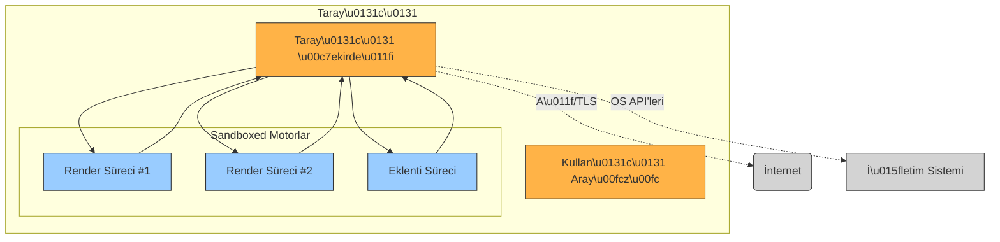

# Güvenli Web Tarayıcısı Tasarım Rehberi

## Yönetici Özeti  
Bu rapor, sıfırdan inşa edilecek bir **güvenli tarayıcı** için geliştirici odaklı bir kılavuz sunar. Öncelikle farklı **tehdit modelleri** (yerel saldırgan, ağ gözetleyicisi, parmak izi takibi, kötü amaçlı siteler, işletim sistemi düzeyi ihlaller vb.) ele alınır. Ardından, **gerekli güvenlik özellikleri** (süreç izolasyonu/sandbox, aynı kaynağa sahip politika (SOP), İçerik Güvenlik Politikası (CSP), CORS, güvenli varsayılan ayarlar vb.), **gizlilik özellikleri** (izleme engelleme, parmak izi koruması, çerez bölümlendirme, üçüncü taraf çerez engelleme, gizli mod), **ağ korumaları** (sadece HTTPS modu, HSTS, sertifika sabitleme, OCSP/CRL, DNS üzerinden HTTPS/TLS/QUIC, VPN/proxy) ve **kriptografi** (TLS yapılandırması, rastgele sayı üretimi, anahtar saklama, güncelleme imzalama) detaylandırılır. Ayrıca **eklenti modelleri**, **güncelleme & imzalama**, **telemetri/izleme** ve **sertleştirme** (ASLR, DEP, derleyici bayrakları vb.) konularına değinilir. Her bölüm, ilgili standartlar ve birincil kaynaklar ışığında analiz edilmiştir. Son olarak, bir **öncelikli MVP kontrol listesi**, **karar tabloları**, mimari ve tehdit modelleri için mermaid diyagramları ve gerekli diğer görseller sunulur.  

## Öncelikli MVP Kontrol Listesi  
1. **Çok Süreçli İzolasyon ve Sandboxing:** Tarayıcıyı en az iki ayrı işleme ayırın: *tarayıcı çekirdeği* (yüksek ayrıcalık) ve *render motoru* (kısıtlı ayrıcalık, sandboxed). Bu sayede HTML ayrıştırıcı, JavaScript motoru ve DOM gibi yüksek-riskli bileşenler ayrı işlemlerde çalışır.  
2. **Güvenli Ağ Varsayılanları:** Tüm istekler varsayılan olarak HTTPS olmalı. HSTS öniş yüklemelerini etkinleştirin ve karışık içerik engellemesini zorunlu kılın. Sertifika doğrulamasında OCSP veya CRL kontrolü yapın (Firefox’taki CRLite benzeri yaklaşımla gizlilik ihlali olmadan).  
3. **Güçlü Kriptografi:** Minimum TLS 1.2 (tercihen 1.3) kullanın ve zayıf şifreler devre dışı olsun. Rastgele sayı üretiminde işletim sisteminin CSPRNG’sine (ör. `Crypto.getRandomValues()` veya `/dev/urandom`) güvenin. Anahtarlar, işletim sistemi anahtar zincirinde veya HSM/akıllı kart gibi korunaklı ortamda tutulmalı (CABForum tavsiyesiyle “FIPS 140-2 Seviye 2” onaylı birimlerde saklanmalı). Yazılım güncellemeleri dijital olarak imzalanmalı (Kod İmzalama Sertifikası ile SHA-256 imzalama) ve her güncelleme imzası doğrulanarak yüklenmeli.  
4. **Güçlü Güvenlik Politikaları:** Aynı-kaynak politikasını **katı** şekilde uygulayın; tarayıcı çekirdeği izinleri kısıtlı tutun. CSP ve CORS ile XSS, tıkjacking vb. atakları sınırlandırın. Üçüncü taraf çerezleri varsayılan olarak engelleyin veya bölümlendirin (Firefox’un *Toplam Çerez Koruma* gibi).  
5. **İzleme ve Parmak İzi Koruması:** Yerleşik izleme engelleyici ve parmak izi koruma özellikleri ekleyin. Bilinen izleyiciler için karaliste (blocklist) kullanın ve potansiyel parmak izleme API’lerini kısıtlayın. Örneğin Brave, API yanıtlarını site/süreç başına rastgeleleştirir; Safari 17 özel modda benzer şekilde gürültü ekler.  
6. **Güncelleme & İzleme:** Otomatik güncellemeleri, kod imzalama ve sürüm yönetimini güvenli tutun. Telemetri varsa anonimleştirme yöntemleri (differansiyel mahremiyet, Prio vb.) kullanarak hassas veri göndermeden sistemi izlemesi sağlayın.  
7. **Geliştirici Sertleştirmeleri:** Derleme zamanı korumaları etkinleştirin: yığın koruyucular (`-fstack-protector-strong`), DEP/NX ve ASLR için PIE linkleme, RELRO gibi bayraklar kullanılmalı.  
8. **Test ve Doğrulama:** Güvenlik testleri (fuzzing, statik analiz, pentest) ile sürekli kontrol edin. Açık kaynaklı denetim ve sahtekarlık ödül programları (bug bounty) kurarak güvenlik açığı bulmayı teşvik edin.  

## Tehdit Modeli  
Güvenli tarayıcı tasarımında aşağıdaki tehdit aktörleri dikkate alınmalıdır:

```mermaid
flowchart LR
  subgraph "Tehdit Aktörleri"
    A1[ Yerel Sald\u0131rgan ]
    A2[ A\u011f G\u00f6zetleyicisi / Man-in-the-Middle ]
    A3[ K\u00f6t\u00fc Ama\u00e7l\u0131 Web Sitesi ]
    A4[ Parmak \u0130zi Takipcisi ]
    A5[ OS/Kernel Compromise ]
  end
  subgraph "Taray\u0131c\u0131 Sistemi"
    U[Kullan\u0131c\u0131 Verileri] 
    K[Taray\u0131c\u0131 \u00c7ekirde\u011fi (Y\u00fcksek Ayr\u0131cal\u0131k)]
    R[Sandboxed Renderer (Web İçeri\u011fi)]
    N[A\u011f Aray\u00fcz\u00fc/Ta\u015f\u0131ma]
  end
  A1 -->|Fiziksel Eri\u015fim, Zararl\u0131 Yaz\u0131l\u0131m| U
  A2 -->|E\u011fitim/Paket Yakalay\u0131c\u0131| N
  A3 -->|XSS, Exploit, K\u00f6t\u00fc Kod| R
  A4 -->|Tarama & S\u0131n\u0131flama|\u0130zle{kullan\u0131\u00e7\u0131 parmak izini elde etmeye \u00e7al\u0131\u015fanlar} 
  A5 -->|Kernel Seviye \u0130hlal| K
  K -->|Ayarlar/Do\u011fan\u0131 | U
  K --> N
  R --> K
```

Bu modelde:
- **Yerel saldırgan**: Cihaz üzerinde fiziksel veya kullanıcı düzeyi (ör. kötü amaçlı USB, yerel yazılım) erişimi olan zararlılar. Örneğin, dosya sistemine izinleri kötüye kullanabilir veya tarayıcı belleğini okuyabilir.  
- **Ağ gözetleyicisi / MitM**: Kullanıcının ağ trafiğini dinleyen veya değiştiren saldırgan. Bu nedenle her zaman **TLS üzerinden HTTPS** kullanılmalıdır. HSTS ve sertifika doğrulamaları şarttır.  
- **Kötü amaçlı web sitesi**: Kullanıcıyı kandırarak zararlı kod veya komut çalıştıran (drive-by exploit) web siteleri. Güvenli ayrıştırıcı/sandbox ve İçerik Güvenlik Politikası (CSP) ile kısıtlanmalıdır.  
- **Parmak izi takipçisi (Fingerprinting)**: Tarayıcı ve cihazın benzersiz özelliklerinden kullanıcı profili çıkaran izleyiciler. Bu tehdide karşı tarayıcı *her site için farklı profil* (Brave yaklaşımı gibi) veya *API sınırlandırması* uygulanmalıdır.  
- **İşletim Sistemi ihlali**: OS veya çekirdek düzeyinde kompromi (rootkit, kernel exploit) durumunda sandbox sınırları da zorlanabilir. Bu durumda saldırgan, tarayıcı çekirdeği üzerinden geniş erişim elde edebilir. Dolayısıyla sandbox altyapısı (ör. Windows’da Jeton/Job nesneleri, Linux’ta seccomp) önemlidir.  

Bu tehditlere karşı tarayıcı **süreç izolasyonu**, **minimal ayrıcalık** ve **katı güvenlik politikaları** ile donatılmalıdır.

## Tarayıcı Mimarisi ve İzolasyon  
Güvenlik mimarisi en az iki ana modülden oluşmalıdır: **Tarayıcı Çekirdeği** (browser kernel) ve **Render Motoru (Sandboxed Renderer)**. Chromium örneğinde, tarayıcı çekirdeği OS ile iletişim kurar; render motoru ise web içeriğini işler ve kısıtlı haklarla sandboxed çalışır. Bu mimari, HTML ayrıştırıcı, JavaScript motoru ve DOM gibi karmaşık bileşenlerin saldırıya uğraması durumunda yalnızca sandbox sınırlarının ihlal edilmesini sağlar.  



- **Çoklu İşlem (Multiprocess)**: Her sekme/alan (site) ayrı bir render işleminde çalışabilir (Chrome Site Isolation). Böylece bir sekmedeki çökme/kömülme diğerlerini etkilemez.  
- **Sandboxing**: İşletim sistemine özgü sandbox mekanizmaları kullanılmalı. Örneğin Windows için kısıtlı jeton ve job, macOS için Application Sandbox, Linux için `seccomp-bpf` filtreleri ve kullanıcı ad alanı (user namespace) tercih edilebilir. Bu yapıların asıl amacı, sandbox işlemine **yüksek ayıklık** (kernel) verilmemesidir.  
- **Aynı Kaynak Politikası**: Tarayıcı çekirdeği, her işlem için yalnızca kendi kaynağına erişim izni verir. Chromium mimarisinde render motoru *tamamen* SOP’yi uygular. Yani, farklı kaynaktan gelen script’ler aynı işlemde olsa bile birbirlerinin verisine erişemez.  
- **Diğer Bileşenler**: GPU işlemci, ağ yığını, eklenti/uzantı işlemleri (manifest izinleriyle kısıtlı) ve tüm kullanıcı verileri (çerezler, önbellek, şifre deposu vb.) uygun süreçlerde tutulmalıdır. Tarayıcı çekirdeği bu kaynaklara ara birim olarak erişir.  

## Zorunlu Güvenlik Özellikleri  
- **Süreç İzolasyonu ve Sandboxing:** Render işlemlerini tarayıcı çekirdeğinden ayrı süreçlerde çalıştırın. Örneğin Chromium, “broker” (çekirdek) ve “target” (sandbox) süreç modelini kullanır. Her render süreci düşük yetki düzeyinde tutulur; zararlı kodun sistemde geniş hak elde etmesi önlenir.  
- **Aynı Kaynak Politikası (SOP):** Tarayıcı, tüm DOM ve JavaScript erişimlerini SOP kurallarına göre sıkı uygular. Farklı kökenler (domain, port, protokol) arasında erişim denetimi sıkı olmalıdır.  
- **İçerik Güvenlik Politikası (CSP):** XSS ve diğer içerik enjeksiyonlarını önlemek için CSP ön tanımlı olarak etkin gelmelidir. Örneğin `default-src 'self'; script-src 'self'` gibi kısıtlayıcı ayarlar tavsiye edilir. CSP ayrıca `upgrade-insecure-requests` gibi yönergelerle karışık içeriği otomatik HTTPS’ye yükseltebilir.  
- **CORS ve Akış Kontrolü:** Fetch/XMLHttpRequest gibi API’lerde Cross-Origin Resource Sharing politikalarını uygulayın. Yalnızca güvenilen sunucuların CORS izinleriyle veriye ulaşmasına izin verilmeli. Aynı zamanda **Keep-Alive bağlantı süreleri**, zaman aşımı limitleri ve çerez standartları (SameSite, HttpOnly, Secure) gibi varsayılanlar katı olmalıdır.  
- **Güvenli Varsayılan Ayarlar:** Yeni kurulumda güvenlikle ilgili tüm özellikler açık olmalı (örneğin HSTS preload, üçüncü taraf izleyici engelleme). Açığa çıkabilecek eklemeler için varsayılan olarak kapalı izinler (örn. konum, kamera, mikrofon) kullanılmalı.  
- **Tarayıcı Kernel Güvenliği:** Çekirdek yazılımı güvenli dil ve kütüphanelerle yazılabilir. Bunun mümkün olmadığı durumlarda statik analiz ve hafıza koruma (ASLR, DEP, stack canaries) aktif olmalıdır. [OpenSSF bayrak yönergeleriyle] derleme yapılmalı (ör. `-fstack-protector-strong`, `-z relro` vb.).  

## Gizlilik Özellikleri  
- **İzleme Engelleme (Tracker Blocking):** Tarayıcı, varsayılan olarak popüler izleyici/ reklam listesini (örneğin EasyList/EasyPrivacy veya DuckDuckGo blocklist gibi) kullanarak zararlı üçüncü taraf içerikleri engellemelidir. Bu sayede reklam şirketleri ve analitik izleyiciler bloke edilir.  
- **Parmak İzi Koruması (Fingerprinting Resistance):** Tarayıcı, cihaz/browswer özelliklerinden yararlanarak kullanıcı takibi yapılmasını zorlaştıracak önlemler içermelidir. Örneğin Brave ve Safari, bazı Web API’lerinin yanıtlarını site/süreç başına rasgeleleştirir. Brave tarayıcı, her site için benzersiz bir “parmak izi” üretip farklı sitelerde farklı hale getirerek çapraz site takibi kırar. Safari 17 ve sonrası sürümlerde, bu gelişmiş koruma özel gezinti modunda aktif gelir. Tam gizlilik gerekliyse daha sert önlemler (Tor benzeri, API kısıtlamaları) düşünülebilir.  
- **Çerez Politika ve Bölümlendirme:** Üçüncü taraf çerezlerini varsayılan olarak yasaklayın veya tarayıcı profillerine göre izole edin. Örneğin Firefox’un *Toplam Çerez Koruma*si, her site için ayrı bir çerez deposu sunar. Özel/İnciğimode açıldığında tüm oturum verileri kapatıldığında temizlenmelidir.  
- **Veri Temizliği:** Oturum kapatıldığında veya sekme kapandığında çerezler, Önbellek ve Yerel Depolama gibi veriler otomatik silinebilmeli; otomatik “bounce tracking” engelleme (arka plandaki yeniden yönlendirmelerle takibi kırma) uygulanmalıdır. Bu bağlamda Brave ve DuckDuckGo gibi tarayıcıların sekme kapandığında veri silme özelliği inceleyebilirsiniz.  
- **Parmak İzi Koruma-Testi:** Kullanıcıya, bir web sitesinin parmak izi API’lerini kullanıp kullanmadığını gösteren araçlar sunulabilir (Brave’in *Leaks Checker* gibi). Gizli modda ekstra korumalar (ör. WebRTC IP sızıntısı engelleme, canvas fingerprint kısıtlama) kullanılabilir.  

## Ağ Katmanı Koruması  
- **HTTPS-Only Modu:** Tarayıcı ayarlarında yalnızca HTTPS’yi zorlayan bir mod bulunmalı. Manuel HTTP taleplerini otomatik HTTPS’ye yükseltecek veya kullanıcıya uyarı verecek şekilde davranmalı.  
- **HSTS (HTTP Strict Transport Security):** Bir etki alanı için HSTS başlığı alındığında veya ön yükleme (preload) listesinde ise gelecekteki tüm isteklere mutlaka HTTPS kullanılarak devam edilmeli. Güvenlik için [Chromium HSTS üreticileri](https://hstspreload.org/) göz önünde bulundurulabilir.  
- **Sertifika Sabitleme ve Şeffaflık:** Eski **HPKP** yöntemi kırılganlık ve kilitlenme riski nedeniyle artık önerilmez; onun yerine **Certificate Transparency (CT)** günlükleri takip edilmelidir. Tarayıcı, CT uyumlu kök sertifika deposu kullanarak sahte CA sertifikalarını tespit etmeye çalışabilir. Zararlı sertifikalara karşı CT zorunluluğu veya pinning içeren çözümler değerlendirilebilir, ancak HPKP desteği tarayıcılar tarafından kaldırılmıştır.  
- **Sertifika İptal Kontrolü:** Tarayıcı her sertifika sunumunda iptal (revocation) durumunu kontrol etmeli. Eski yöntem OCSP/CRL sorgulamaları güvenlik ve gizlilik sorunu yaratır. Güncel yaklaşımlar Firefox’ta olduğu gibi **tam kapsamlı revocation listesi (CRLite)** kullanabilir. CRLite örneğinde Firefox, sertifikaların iptal durumunu 300 KB civarı güncellemelerle takip ederek gizlilik kaybı olmadan kontrol yapabiliyor.  
- **DNS Güvenliği:** DNS trafiğini şifreleyerek gizliliği arttırın. Karşılaştırma tablosu aşağıdadır:
  
  | Yöntem                | Avantajları                                                                               | Dezavantajları                                                                              |
  |-----------------------|------------------------------------------------------------------------------------------|--------------------------------------------------------------------------------------------|
  | **DNS over TLS (DoT)**| UDP yerine TLS kullanarak DNS sorgularını şifreler. Ağdan izlenmesi küçüktür, operatör kolaylıkla filtreleyebilir. | Ayrı port (853) kullandığı için farkedilebilir ve engellenebilir. Daha yaygın destek gerektirir. |
  | **DNS over HTTPS (DoH)**| Sorgular HTTPS (443) içinde gider, ISP’ler ve ağ takipçileri tarafından farkedilmez. Gizlilik için iyidir. | HTTPS içine gizlendiğinden ağ tarafından engellenmesi güçtür (güvenlik açısından dezavantaj). |
  | **DNS over QUIC (DoQ)**| QUIC kullanarak düşük gecikmeli, verimli DNS şifrelemesi sunar. Yüksek gecikme ağlarda performans avantajı sağlar. | Henüz daha az yaygın; tarayıcılarda ve çözümleyicilerde desteği sınırlı. Kurulum kompleks olabilir. |
  | **VPN**              | Tüm cihaz trafiği şifrelenir ve farklı bir coğrafi konumdan gibi görünür. Sağlam güvenlik ve gizlilik sunar.             | Güvenilir bir VPN sağlayıcısına bağımlıdır. Trafiği yavaşlatabilir ve yanlış yapılandırılmaya açıktır.    |
  | **Proxy (HTTP/S veya SOCKS)**| Belirli uygulama trafiğini yeniden yönlendirir. Genellikle hızlı ve hafif çözümdür. Coğrafi engelleri geçmede kullanışlı.  | Genellikle şifreleme sağlamaz (HTTPS dışında). Sadece tek bir uygulamayı kapsar; cihazın tüm trafiği geçmez.     |

  *Kaynaklar:* DoT/DoH karşılaştırması, DoQ avantajları, VPN/Proxy farkları.  

- **Proxy/VPN Entegrasyonu:** Tarayıcı, sistem genelinde veya uygulama düzeyinde proxy/VPN ayarlarını desteklemelidir. Gelişmiş kullanıcı arayüzü üzerinden manuel proxy veya VPN (OpenVPN, WireGuard vb.) bağlantısı yapılabilir. Ancak güvenlik için, eğer tarayıcı içinden VPN özelliği sunulacaksa, güçlü protokoller (WireGuard, OpenVPN) ve kill-switch gibi kaçak önleme mekanizmaları tercih edilmelidir.

## Kriptografi ve Anahtar Yönetimi  
- **TLS Yapılandırması:** Tarayıcı içindeki TLS kitaplığı (ör. BoringSSL, Mozilla NSS) en güncel TLS versiyonunu (1.3) desteklemeli; 1.0/1.1 gibi eski sürümlere izin vermemelidir. İmzalama için RSA-2048 veya ECDSA (p-256/p-384) anahtarları, simetrik şifreleme için AES-GCM veya ChaCha20-Poly1305 tercih edilmelidir.  
- **Güçlü Rastgelelik:** Kriptografik işlemler (anahtar oluşturma, nonce, TLS el sıkışma) için işletim sisteminin sağlam *CryptoSecure RNG* kaynağı (ör. Linux’ta getrandom, Windows CryptGenRandom) kullanılmalıdır. Örneğin web tarafında Web Crypto API `crypto.getRandomValues()` güçlü entropi sunar. Kendi algoritmalarınızı yazmayın; saygın kütüphaneler (libsodium, OpenSSL/NSS) kullanılmalıdır.  
- **Anahtar Saklama:** Özel anahtarlar cihazda korunmalı depolanmalıdır. Windows için **DPAPI/AKHİS** veya Microsoft’un CNG Key Storage Provider, macOS için Keychain, Android için Keystore, iOS için Keychain/secure enclave gibi platform güvenliği kullanılabilir. Kod imzalama anahtarı kesinlikle bu güvenlik zincirine veya HSM/USB Token gibi donanımlı modül içine yerleştirilmelidir.  
- **Güncelleme İmzalama:** Her yazılım güncellemesi açık anahtarla imzalanmalı, güncelleme paketinde bu imza kontrol edilmeli. CA/Browser Forum gereksinimine göre kod imzalama sertifika anahtarı FIPS 140-2 L2 donanımda tutulmalıdır. Zaman damgası (timestamp) kullanmak, güvenliği artırır. Kod imzalama altyapınızda 3072-bit RSA veya ECC (P-384) kullanın ve anahtarları gerektiğinde döndürün.  

## Eklenti/Uzantı (Add-on) Modeli  
- **İzin Tabanlı Sistem:** Her eklenti manifestinde kullanacağı API’leri ve izinleri açıkça belirtmelidir (ör. çerezlere erişim, dosya sistemine erişim gibi). Kullanıcı onayı veya mağaza onayı gerektirerek eklentilere dar yetkiler verin. Gerekiyorsa “bağlam bazlı izin” (contextual permission) modeli uygulanabilir.  
- **İzolasyon:** Eklentiler ayrı süreçlerde çalıştırılmalı ve tarayıcı iç verilerine (kullanıcı verileri, bilgisayara erişim vb.) sınırlı erişim hakkı olmalı. Eklenti sandbox’ları, kod inceleme ve otomatik analiz yoluyla denetlenmelidir.  
- **Mağaza Denetimi:** Eklenti dağıtımı kontrollü bir mağaza aracılığıyla yapılmalıdır. Tüm eklentiler dijital olarak imzalanmalı ve yayımlanmadan önce güvenlik incelemesine tabi tutulmalıdır. Kötü amaçlı eklenti bulgularında hızlıca kaldırma mekanizması olmalıdır.  

## Güvenli Güncelleme ve Kod İmzalama  
- **Otomatik Güncellemeler:** Tarayıcı düzenli aralıklarla güncellemeleri kontrol etmeli ve güncellemeleri arka planda kullanıcı müdahalesi olmadan yükleyebilmelidir. Tüm güncelleme paketleri dijital imza doğrulamasından geçirilmelidir. İmzalanmış güncelleme, doğrulanamazsa reddedilmelidir.  
- **Kod İmzalama:** Windows’ta Authenticode (PE dosyaları), macOS’ta Apple Developer sertifikası ile kod imzalama kullanılmalı; Linux’ta ise dağıtım paketleri GPG ile imzalanabilir. CABForum’un yayınladığı kod imzalama kriterlerine uyun: İmzalama anahtarları HSM’de saklanmalı ve anahtarın FIPS-140-2 L2 uyumu sağlanmalıdır. Süre geçtikçe sertifika yenileme (örneğin 3 yıllıklar yerine 1 yıllık) ve zaman damgası ekleme unutulmamalıdır.  
- **Olay Müdahalesi:** Bir güvenlik açığı tespit edildiğinde hızlı müdahale planı olmalı (yeni güncelleme, CVE numarası ve sürüm açıklaması). Güncelleme süreçleri şeffaf olmalı; kullanıcılar kritik güvenlik güncellemeleri hakkında bilgilendirilmelidir.  

## Telemetri ve Günlük (Logging) Tasarımı  
- **Mahremiyet Öncelikli Veri Toplama:** Kullanıcı verilerini gereksiz yere toplamayın. Crash raporları ve performans telemetrisi için anonimleştirme, örneğin uçtan uca şifreli prio sistemleri kullanılabilir. Mozilla, bunu “Firefox Origin Telemetry” ile blok listesi kullanım istatistiklerini hassas veri sızdırmadan toplamıştır.  
- **Kullanıcı Onayı:** Telemetri toplama varsayılan olarak kapalı veya sınırlı olmalı; isteğe bağlı etkinleştirme sunulmalıdır. Toplanan veri, tekil kullanıcıyı geri izleyemeyecek biçimde özetlenmeli, mümkünse ayrıştırılmalıdır.  
- **Kayıtlar ve İzleme:** Tarayıcı içi günlüklerde (log) hassas bilgileri (ör. URL parametreleri, kişisel içerik) kaydetmeyin. Hata günlüklerini sunucuda analiz için toplarken, IP adresi gibi tanımlayıcı bilgiler maskelenmelidir.  

## Güvenli Varsayılanlar ve Sertleştirme  
- **Derleyici Bayrakları:** Açtığımız **Hardening Guide** önerilerine göre tüm kod `-D_FORTIFY_SOURCE=3`, `-fstack-protector-strong`, `-Wl,-z,relro -Wl,-z,now` vb. ile derlenmelidir. Çalışan kodun ASLR/DEP destekli olması için `-fPIE -pie` kullanın. Uyarıları (`-Wall -Werror`) derleme sürecinde göz ardı etmeyin.  
- **Çalışma Zamanı Koruması:** İşletim sistemi düzeyinde **ASLR (Adres Uzay Yerleşim Rastgeleleştirmesi)** ve **DEP/NX** mutlaka etkin olmalıdır. Bu, kod geri dönüş saldırılarını (ret2libc, ROP vb.) zorlaştırır.  
- **Modüller ve Kütüphaneler:** Güvenli kütüphaneler ve güncel sürümler kullanın. İmge yükleyicisi, kod çözücü vb. hassas kod parçaları sandbox’ta tutulmalı. Üçüncü taraf kütüphaneler (ör. medya oynatıcıları) ve entegre bileşenler (PDF görüntüleyici, font ayrıştırıcı) için mümkünse ek sandbox katmanları ekleyin.  
- **Politika Sertleştirme:** Tarayıcı işletim sistemi politikaları (Windows Integrity Level, Linux `seccomp` profilleri, macOS sandbox entitlements) ile birleşik korunma sağlayın.  

## Test ve Doğrulama  
- **Fuzzing:** Girdi ayrıştırıcıları, görüntü işleme kütüphaneleri ve JavaScript/WebAssembly motorlarını hedef alan kapsamlı fuzz testleri uygulayın. Örneğin Chrome ekosisteminde *ClusterFuzz* ve AFL gibi araçlarla girdi bazlı test yapılır (çok sayıda geçmiş CVE’de faydalı).  
- **Statik Analiz ve Kod İnceleme:** Kod güvenliği için `Coverity`, `Clang Static Analyzer` gibi araçlar ve manuel kod incelemesi kullanın. Özellikle kriptografik kod ve hafıza erişimi hatalarına odaklanın. Güvenlik kütüphanelerini ve bağımlılıkları düzenli güncelleyin.  
- **Tehdit Modeli:** Yeni özellik eklerken tehdit modelinizi güncelleyin. STRIDE veya OWASP tehdit modelleme yöntemlerini (hata durumları, yetkisiz erişimler vb.) kullanarak potansiyel açıkları belirleyin.  
- **Sızma Testi (Pen-test):** Tarayıcı bileşenlerini (JS motoru, eklentiler, protokoller) uzman saldırgan takımı ile test edin. Gerçek dünyadaki istismarlara yakın senaryolar kurarak açıkları ortaya çıkarın.  

## Dağıtım ve Bakım  
- **Sürekli Patching:** Tarayıcıyı kullanan platformları güncel tutun. Önemli bir güvenlik açığı bulunduğunda acil yama (hotfix) ve sonraki düzenli güncelleme yayını hazır bulundurun.  
- **İz Sürme ve CEVB:** Güvenlik açıklarını (CVE’ler) izleyin ve mümkünse kamuya açık bir şekilde (güvenlik duyuruları) takip edin. Kullanıcı topluluğu ve araştırmacılar için raporlama mekanizmaları (ör. bug bounty) oluşturun.  
- **Backport ve Alternatif:** Kritik açıklar için eski sürümlere veya çatal projelere de destek sağlayacak bir bakım planı düşünün. Örneğin, şirket içi kullanım için özel güvenlik yamaları yayınlama.  

## UX ve Performans Etkileri  
- **Kullanıcı Deneyimi:** Güvenlik önlemleri bazen uyumluluğu zorlaştırabilir. CSP gibi politikalar, bazı web uygulamalarını bozan davranışlara sebep olabilir. Parmak izi koruması web API çıktılarını değiştirebildiği için (Brave’in ekran çözünürlüğü korumasında görüldüğü gibi) bazen sitelerin bozulmasına yol açabilir. Bu nedenle kullanıcıya istisna bırakma veya gelişmiş mod seçeneği sunulabilir.  
- **Kaynak Kullanımı:** Çoklu süreç mimarisi ve sıkı sandbox, bellek ve CPU kullanımını arttırır. Bu tasarruf eden cihazlarda (özellikle mobil) kullanıcıyı zorlayabilir. Dengeyi iyi kurmak önemli: Örneğin, GPU hızlandırmayı güvenli ortamlarda kullanmak, render yükünü hafifletebilir.  
- **Tepki Süresi:** TLS ve DNS şifrelemesi, bağlantı açılışını hafifçe yavaşlatabilir. Ancak TLS 1.3 ve CRLite gibi yeniliklerle bu gecikmeler minimize edilmiştir (Firefox’ta el sıkışma süresi OCSP’den < yaklaşık 40 ms). Genel olarak **güvenlik-performans** dengesi çok kritik olup, performans metriklerini izleyerek gerektiğinde örneğin asenkron tasarımlar tercih edilmelidir.  

## Kaynaklar  
Bu raporda kullanılan bilgiler şu kaynaklara dayanmaktadır: Chromium güvenlik mimarisi, MDN ve W3C dokümantasyonları (CSP, TLS vb.), Cloudflare ve diğer teknik bloglar (DNS, VPN/proxy), Mozilla güvenlik yazıları (telemetri, sertifika doğrulama), OpenSSF sertleştirme kılavuzu, güvenlik topluluğu analizleri (parmak izi), ve resmi standart/metinler (CAB Forum kod imzalama). Ayrıca Firefox, Chrome, Safari ve Brave gibi büyük tarayıcıların güvenlik belgeleri ve açık kaynak kodları incelenmiştir. Bu bilgiler ışığında önerilen tasarım, güvenlik ve gizlilik odaklı, mükemmel uyumluluk için geliştirilmiş bir tarayıcı üretimine yöneliktir.