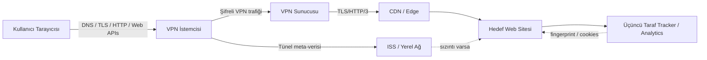
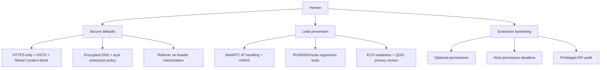

# VPN Güvenliğini Zayıflatan Etkenler ve Tarayıcı Geliştiricisi İçin Teknik Güvenlik Raporu

## Yönetici özeti

- **VPN, “anonimlik makinesi” değildir; bir yönlendirme ve tünelleme güvenlik katmanıdır.** Sağlayabildiği temel faydalar; iletim gizliliği, bütünlük, uçlar arasında kimlik doğrulama ve yerel ağ/ISS seviyesinde gözetimi azaltmadır. Buna karşılık VPN; tarayıcı parmak izi, çerezler, üçüncü taraf script’ler, CDN/edge kayıtları, uygulama hataları, kötü sunucu operatörleri, rota manipülasyonu ve meta-veri analizi karşısında tek başına yeterli değildir. Akademik literatür de ticari VPN’lerin Tor gibi daha güçlü anonimlik sistemleriyle karıştırılmaması gerektiğini açıkça vurgular. citeturn30view1turn6search2turn18search1

- **VPN’i kıran en yaygın desen, kriptografinin değil yönlendirme istisnalarının kırılmasıdır.** Özellikle “local network” ve “VPN sunucusunun kendisi” için eklenen route istisnaları; TunnelCrack ve TunnelVision sınıfı saldırılarda trafik sızdırmak için suistimal edilmiştir. USENIX 2023 çalışması bu kök nedeni “OS routing tables ve exception mantığındaki yaygın tasarım kusuru” olarak tanımlar; NVD’deki CVE-2024-3661 de DHCP option 121 üzerinden aynı aileden bir bypass’ı doğrular. citeturn32view0turn32view1turn8search1

- **ISS ve yerel ağ aktörleri, VPN yoksa veya sızıntı varsa; DNS sorguları, hedef IP, port, zamanlama, trafik hacmi, TLS ClientHello/SNI ve bazen TLS/QUIC parmak izleri üzerinden ciddi görünürlük kazanır.** ECH öncesi SNI, encrypted DNS öncesi DNS sorguları ve QUIC/TLS parmak izi gibi katmanlar; şifreli içerik görünmese bile ziyaret modeli ve uygulama tipi hakkında sinyal üretir. ECH bu boşluğun bir kısmını kapatır; DoH/DoT ise DNS gözlemini azaltır; fakat meta-veri ve resolver’a devredilen güven sorunu devam eder. citeturn7search4turn21search0turn37search1turn6search4turn5search5turn27search18turn23search13

- **Web siteleri ve üçüncü taraf takipçiler için asıl güç, IP’den çok tarayıcı durumundan gelir.** Çerezler, üçüncü taraf gömüler, `User-Agent`/Client Hints, `Accept-Language`, `Referer`, canvas/WebGL, WebRTC ICE adayları, depolama durumları ve davranışsal/timing sinyalleri; VPN kullansanız bile çapraz-oturum ve çapraz-site korelasyon mümkün kılar. W3C, MDN ve tarayıcı üreticileri bu yüzden state partitioning, CHIPS, anti-fingerprinting ve WebRTC IP kısıtlamaları gibi savunmaları hızlandırmıştır. citeturn22search0turn34search2turn34search3turn34search6turn34search11turn35search1turn4search1turn4search3turn38search0turn38search2

- **Bir tarayıcı geliştiricisi için öncelik sırası nettir:** güvenli varsayılanlar, sıkı süreç/sandbox izolasyonu, ağ katmanında sızıntı önleme, depolama bölümlendirme, görünür ve dar izin modeli, minimum telemetri, uzantı yüzeyini küçültme ve aktif test otomasyonu. Chromium belgeleri sandbox ve savunma derinliğini, Mozilla ve MDN belgeleri ise state partitioning, ECH, anti-fingerprinting ve veri minimizasyonu yönünü açık biçimde destekler. citeturn20search4turn20search16turn22search16turn38search2turn21search0turn36search1turn19search0turn19search3

## VPN mimarisi ve temel güvenlik hedefleri

### VPN’in gerçekten neyi koruduğu

- Bir VPN’in çekirdek hedefleri; **gizlilik**, **bütünlük**, **uç kimlik doğrulama**, **trafiğin tünel içinden yönlendirilmesi** ve mümkünse **ileri gizlilik** sağlamaktır. TLS 1.3, eavesdropping/tampering/message forgery’ye karşı koruma tanımlar; ephemeral anahtarlarla PFS geçmiş oturumların daha sonra anahtar sızıntısıyla çözülememesine yardım eder. IPsec mimarisi de ağ katmanı güvenliği için benzer güvenlik hedeflerini tanımlar. citeturn24search2turn24search8turn24search0

- “VPN açık” ifadesi yalnızca “paketlerin bir kısmı/çoğu bir tünelden geçiyor” demektir; **uygulama, DNS, route policy, split tunnel istisnaları, tarayıcı API’leri ve üst katman tanımlayıcıları** ayrı ayrı kontrol edilmedikçe koruma eksik kalır. Ticari VPN literatürü de VPN’lerin başlangıçta anonimlik için değil, daha çok uzak erişim ve ağ tünelleme için tasarlandığını özellikle not eder. citeturn30view1turn32view1

### Gözlem noktaları ve tehdit modeli

Aşağıdaki şema, aynı tarayıcı isteğinde hangi aktörün neyi görebildiğini özetler. Açık veya sızdıran bir yapı ile doğru yapılandırılmış bir VPN arasında esas fark, **görünür meta-veri katmanının hangi hop’ta kaldığıdır**. citeturn6search2turn8search1turn21search0turn37search1

### Hangi aktör neyi görür

| Gözlemci | Tipik olarak görebildiği şeyler | VPN varsa ne değişir | Kritik not |
|---|---|---|---|
| ISS / yerel ağ | Hedef IP, port, trafik zamanlaması/hacmi; DNS şifreli değilse DNS; ECH yoksa SNI; bazı durumlarda TLS/QUIC fingerprint | Doğru kurulumda çoğunlukla yalnızca VPN sunucusu IP’si, tünel portu/protokolü ve trafik paterni görünür | DHCP/route sızıntıları, DNS veya IPv6 kaçakları bu görünürlüğü geri getirir. citeturn8search1turn6search4turn5search5turn21search0turn37search1turn23search13 |
| VPN sağlayıcısı | Ziyaret edilen alanlar/IP’ler, zamanlama, hacim, kimi DNS çözümlemeleri | Güven ISS’den VPN operatörüne kayar | “No logs” iddiası teknik bir garanti değildir; sağlayıcı güvenilirliği ayrı bir risk sınıfıdır. citeturn13search10turn13search7turn22search4 |
| Web sitesi / CDN | VPN çıkış IP’si, TLS/HTTP başlıkları, çerezler, fingerprint, analitik olayları | Gerçek ev/iş IP’si gizlenebilir ama kimliklenebilir durum bilgileri kalır | Anti-fingerprinting ve storage partitioning olmadan VPN tek başına yetersizdir. citeturn22search1turn22search4turn34search2turn34search6turn38search2 |
| Üçüncü taraf tracker | Çerez, embedded script, iframe, analytics olayları, fingerprint sinyalleri | Aynı kullanıcıyı farklı sitelerde ilişkilendirebilir | Partitioned storage ve cookie politikaları bu yüzden kritiktir. citeturn22search0turn22search3turn38search0turn38search2 |

### Protokol ailesi karşılaştırması

| Aile | Güçlü yön | Tekrarlayan zayıf halka | Tarayıcı geliştiricisi açısından not |
|---|---|---|---|
| OpenVPN tabanlı istemciler | Yaygın kurulum, profil esnekliği | Route/DNS istisnaları; Windows interactive service ve plugin yükleme zincirleri; bazen anahtar/log hijyeni | Profil temelli istemcilerde hostname, DNS ve route yönetimi özellikle hassas. citeturn16search17turn15search0turn15search3turn15search5turn15search1 |
| IKEv2/IPsec | OS entegrasyonu ve yaygın kurumsal kullanım | Kimlik doğrulama ve implementasyon kusurları; EAP/sertifika doğrulama sorunları | Browser tarafı, OS VPN durumunu ve “kill switch/lockdown” semantiğini doğru okumalıdır. citeturn15search4turn15search6turn15search8turn12search2turn12search6 |
| WireGuard tabanlı istemciler | Daha küçük yüzey ve basit istemci modeli algısı | Yine de route/firewall ve local network exception kusurları; Windows istemci LocalNet engelleme hatası | “Daha basit protokol” ≠ “sızıntıya karşı otomatik güvenli uygulama”. citeturn16search1turn16search17 |

## VPN zafiyetleri ve bypass teknikleri

### Protokol, uygulama ve yapılandırma katmanı kusurları

- Akademik çalışmalar, ticari VPN istemcilerinde **protokol kriptosundan çok istemci yapılandırması** kaynaklı zafiyetler buldu: IPv6 leakage, DNS hijacking, local network exception abuse ve server discovery zayıflıkları bunların başlıcalarıdır. PETS 2015 çalışması, incelediği popüler VPN’lerde IPv6 sızıntısı ve DNS hijacking’i yaygın biçimde buldu; USENIX 2023 ise route exception’ların saldırı yüzeyi olduğunu sistematikleştirdi. citeturn30view1turn32view0turn32view1

- Özellikle **full-tunnel gibi görünen istemciler**, işletim sistemine şu iki istisnayı eklediğinde risk büyür: “yerel ağ trafiği dışarıdan gitsin” ve “VPN sunucusuna erişim dışarıdan gitsin.” Saldırgan, DHCP ya da DNS ile bu istisnaları manipüle ederek seçili trafiği plaintext dışarı çıkarabilir. TunnelCrack ve TunnelVision pratikte tam olarak bunu yaptı. citeturn32view1turn16search17turn8search1

### Anahtar yönetimi, kriptografi ve el sıkışma riskleri

- **PFS, kısa ömürlü anahtarlar ve çağdaş TLS ayarları** olmadan, uzun süreli anahtar sızıntıları geçmiş oturumları tehlikeye atabilir. OWASP anahtar yönetimi rehberi ephemeral anahtarların PFS sağladığını; TLS 1.3 ise modern güvenlik beklentisini karşılayan temel protokol olduğunu belirtir. citeturn24search8turn24search2

- **Sertifika doğrulama ve pinning**, yanlış tasarlanırsa savunma değil arıza üretir. OWASP pinning rehberi pinning’in yalnızca net bir tehdit modeli ve operasyon planı ile düşünülmesi gerektiğini söyler; MDN ise HPKP’nin artık **obsolete** olduğunu açıkça yazar. Başka bir deyişle, **web tarayıcısı düzeyinde HPKP geri getirilmemeli**, gerekirse yüksek güven senaryolarında uygulama içi/public-key pinning ve CT denetimi kullanılmalıdır. citeturn17search0turn17search3turn17search5

- **TLS session resumption** performans faydası sağlar, ama gizlilik boyutu dikkat ister. RFC 5077 stateless resume mekanizmasını tanımlar; akademik çalışma, resume kimliklerinin ve ticket kullanımının korelasyon/pasif gözlemci açısından izleme etkileri doğurabildiğini gösterir. Çok alan adlı CDN ortamlarında ticket anahtarlarının paylaşımı ayrıca karışıklık ve izolasyon sorunları doğurabilir. citeturn7search0turn7search5turn7search13

### DNS, IPv6, meta-veri ve trafik analizi sızıntıları

- **DNS leak**, VPN kullanıcıları için en yüksek getirili sızıntılardan biridir; çünkü ziyaret edilen alan adlarını doğrudan açığa çıkarır. PETS 2015 çalışması birçok ticari istemcide DNS hijacking ve IPv6 leakage buldu; Mozilla ve Chromium’un DoH belgeleri de DNS’in yerel ağ/ISS tarafından gözlenebilir olduğunu ve DoH’nin bunu azaltmak için tasarlandığını doğrular. citeturn30view1turn26search9turn27search4

- **DoH/DoT/DoQ**, DNS sorgusunu şifreleyerek yerel gözlemi azaltır; ancak güveni resolver’a taşır. Google Public DNS’in DoH gizlilik notu, gereksiz HTTP başlıklarının istemciyi deanonymize edebileceği uyarısını özellikle yapar. Bu nedenle encrypted DNS, **başlık minimizasyonu** ve mümkünse **resolver seçimi/DDR politikası** ile ele alınmalıdır. citeturn6search4turn5search5turn6search0turn27search18turn26search4

- **IPv6 leakage**, özellikle VPN tüneli IPv4’e odaklıyken ve istemci/OS dual-stack davranışı doğru denetlenmediğinde oluşur. 2015 çalışması bunu yaygın bir sorun olarak gösterdi; 2025 ölçüm çalışması da IPv4-only VPN’lerde yerel IPv6 adresinin sahada hâlâ sızabildiğini rapor eder. citeturn11search0turn10search4

- İçerik şifreli olsa bile **trafik analizi** devam eder: hedef IP seti, paket boyutu, burst paternleri, akış süresi, aktif saatler ve protokol parmak izi; ISS, VPN, CDN veya kurumsal middlebox’lar için değerli meta-veri üretir. IETF gizlilik çerçevesi ve ENISA’nın encrypted traffic analysis raporu, meta-verinin hâlâ yüksek bilgi değeri taşıdığını vurgular. citeturn6search2turn30view5

### Zamanlama saldırıları, kötü amaçlı sunucular ve yönlendirme düzeyi saldırılar

- **Timing ve website fingerprinting** mantığı, özellikle sabit uygulama kalıpları ve düşük gürültülü ağlarda, içeriği değil davranış izini kullanır. VPN bunu azaltabilir ama kaldırmaz; çünkü dış gözlemci hâlâ zamanlama ve hacim meta-verisini görür. ECH ve encrypted DNS bu resmi iyileştirir, fakat QUIC/TLS parmak izi ve akış davranışı sinyal üretmeye devam eder. citeturn6search2turn23search13turn37search1

- **Kötü amaçlı veya aldatıcı VPN sağlayıcıları**, tehdit modelinde doğrudan yer almalıdır. 2025 FOCI çalışması, üç gizli VPN ailesinin toplam 700 milyonu aşan indirme sayısına sahip olduğunu; bazı APK’larda hard-coded Shadowsocks parolaları bulunduğunu ve bunun istemci trafiğinin çözülmesine yol açabildiğini gösterdi. Bu, “VPN sunucusu zararlı olursa ne olur?” sorusunu teorik olmaktan çıkarır. citeturn30view3turn13search4

- **BGP/route hijacking**, VPN’i doğrudan “kırmak” yerine trafiğin gittiği ağ yolunu değiştirerek görünürlük/manipülasyon sağlayabilir. RFC 7908, route leak’i politika alanı dışına taşan duyurular olarak tanımlar; RIPE, Cloudflare ve Internet Society gerçek vakalarda daha spesifik prefix duyurularının trafik yönünü değiştirebildiğini göstermiştir. citeturn14search2turn14search16turn14search19

### Mobil ve IoT özel riskleri

- Mobil VPN uygulamaları ek risk taşır: mağaza ekosistemi baskısı, hızlı geliştirme, zayıf şeffaflık, plain HTTP kullanım hataları, DNS leakage ve izin istismarı. iOS VPN uygulamaları üzerine 2020 çalışması bu kusurları pratik testlerle gözlemledi. Android tarafında “always-on VPN” ve “lockdown” gibi mekanizmalar vardır; fakat bunların etkinliği, uygulamanın yaşam döngüsünü ve ağ geçidi entegrasyonunu doğru yönetmesine bağlıdır. citeturn30view4turn12search2turn12search6

- IoT ve servis-ile-servis trafiğinde **mTLS** yararlıdır; çünkü yalnızca sunucuyu değil istemciyi de sertifika ile doğrular. Özellikle kimlik sağlayıcı kullanamayan cihazlar için üreticiler ve edge sağlayıcılar bunu önermektedir. Ancak istemci sertifikası yaşam döngüsü, iptal ve rotasyon yönetimi zayıfsa mTLS de operasyonel bir zafiyet alanına dönüşebilir. citeturn25search0turn25search3turn25search11

## ISS ve web sitelerinin takip teknikleri

### ISS ve yerel ağın tipik sinyalleri

- **IP/port logging**, ISS ve access point seviyesinde en temel görünürlüktür. Hedef IP, kaynak IP, port ve zaman damgaları; içerik şifreli olsa da erişim kalıbını verir. CDN/edge sistemleri de benzer meta-veriyi yoğun biçimde loglayabilir; Cloudflare Logs ve request header belgeleri bunun ticari olarak sistematik biçimde tutulduğunu gösterir. citeturn22search4turn22search18turn22search1

- **DNS gözlemi**, VPN veya encrypted DNS olmadan ISS için doğrudan domain-level izleme sağlar. DoH/DoT bunu azaltır; Firefox ve Chrome bunu “güvenlik ve gizlilik” faydası olarak açıklamıştır. Ancak resolver hâlâ sorguları görür; ayrıca DoH istemcisi gereksiz header gönderirse yeni tanımlayıcılar oluşturabilir. citeturn26search9turn27search4turn27search18

- **SNI ve TLS ClientHello** uzun süre boyunca alan adı düzeyinde görünürlük sundu. RFC 6066 SNI’yi tanımlar; ECH ise bunu ve diğer hassas ClientHello alanlarını korumak için standartlaştırıldı. Firefox belgeleri ECH’nin varsayılan kullanıma geldiğini, RFC 9849 ise ECH’nin SNI ve ALPN gibi hassas alanları koruduğunu belirtir. citeturn7search4turn21search0turn37search1

- **TLS/QUIC fingerprinting** artık pratik üretim tekniğidir. JA3/JA3S, TLS ClientHello/ServerHello parametrelerinden fingerprint üretir; Cloudflare’ın JA4 açıklaması bu yaklaşımın QUIC dâhil yeni protokollere genişletildiğini söyler. Bu, içerik şifreli olsa bile “hangi uygulama/bot/browser ailesi?” sorusuna yanıt vermeye yarar. citeturn23search1turn23search13

- **DPI**, şifrelenmemiş veya kurumsal TLS inspection yapılan ortamlarda payload’a kadar inebilir. ITU-T Y.2771 DPI için resmi çerçeve tanımlar; ENISA da TLS inspection middlebox’larının trafiği çözerek tekrar şifreleyebildiğini ve bunun güven/gizlilik etkileri doğurduğunu belirtir. citeturn23search4turn30view5

### Web siteleri ve tracker ekosisteminin tipik sinyalleri

- **HTTP başlıkları**, kimlikleme için düşük maliyetli sinyallerdir: `User-Agent`, `Accept-Language`, Client Hints ve `Referer` hem uyumluluk hem fingerprinting amaçlı kullanılabilir. MDN, UA string’inin uygulama/OS/vendor/version bilgisi içerdiğini; Client Hints’in yüksek ve düşük entropy alanlara ayrıldığını; Referrer-Policy’nin sızan gezinme bilgisini sınırladığını açıkça yazar. citeturn34search6turn34search1turn34search0turn34search4

- **Çerezler ve üçüncü taraf depolama**, çapraz-site izleme için hâlâ en etkili mekanizmalardandır. MDN üçüncü taraf çerezlerin cross-site tracking için kullanıldığını açıkça belirtir; Firefox depolama erişim politikası ve state partitioning dokümanları ise bu yüzden storage’ı bölümlendirdiğini açıklamaktadır. citeturn22search0turn22search6turn22search16turn38search2

- **Browser fingerprinting**, cookie’siz takip tekniğidir. W3C buna; ayar, donanım, grafik işleme, dil, zamanlama ve benzeri sinyallerin birleşimiyle kullanıcıyı yeniden tanımlama çabası olarak yaklaşır. Firefox, WebGL fingerprinting’in GPU/render farklılıkları üzerinden sinyal ürettiğini doğrudan kabul eder. citeturn18search1turn18search5turn35search1

- **Canvas/WebGL**, web sitelerine görünmez render ölçümleri üzerinden ayırt edici sinyal verir. Bu sinyaller VPN’den bağımsızdır; çünkü IP katmanında değil istemci ortamında oluşur. Mozilla’nın güncel anti-fingerprinting yazıları da bu nedenle font, çözünürlük, GPU davranışı ve benzeri alanları normalize etmeye yönelmiştir. citeturn35search1turn36search1turn36search3

- **WebRTC leak**, ziyaret edilen siteye yerel/private veya alternative candidate bilgileri sızdırarak VPN’i kısmen etkisizleştirebilir. 2017 akademik çalışma bu tehdidi ayrıntılandırdı; W3C ve Chrome belgeleri ise IP exposure’ı kısıtlayan candidate filtering ve mDNS obfuscation gibi savunmaların gerekli olduğunu gösterir. citeturn30view2turn4search1turn4search3turn4search5

- **TLS session resumption**, siteler ya da ortak altyapı kullanan alanlar arasında yeniden tanımlama yüzeyi üretebilir. Bu, sıradan kullanıcı için çerez kadar görünür bir mekanizma değildir; ama büyük edge/CDN ekosistemlerinde correlation vektörü oluşturabilir. citeturn7search0turn7search5turn7search13

- **HTTP/3 ve QUIC**, performans ve güvenlik kazancı getirir; ama gizlilik resmi karmaşıktır. HTTP/3, QUIC üzerinde taşınır; QUIC connection migration ve CID yapısı mahremiyet düşünülerek tasarlanmıştır, ancak parmak izi ve bağlantı bağlanabilirliği tarafında dikkat ister. JA4’ün QUIC’i kapsaması, QUIC’in “takip yüzeyi yoktur” anlamına gelmediğini gösterir. citeturn6search1turn6search5turn7search14turn23search13

## Tarayıcı geliştiricisi için tehdit modeli ve kod düzeyinde savunmalar

### Tehdit modeli ve öncelikler

- Bir tarayıcı geliştiricisi için tehdit modeli en az şu aktörleri kapsamalıdır: **kötü niyetli web origin’i, üçüncü taraf tracker, zararlı uzantı, ağ üstü gözlemci, kurumsal middlebox/TLS inspection, kötü niyetli VPN sağlayıcısı, kötü yapılandırılmış OS VPN katmanı ve supply-chain saldırganı**. RFC 6973’ün gizlilik çerçevesi de tam olarak bu tür gözlem ve korelasyon yüzeylerinin protokol tasarımına baştan dâhil edilmesini önerir. citeturn6search2

- Tarayıcı tarafında kritik saldırı yüzeyleri şunlardır: **renderer ve JS motoru**, **network service**, **cookie/storage**, **permission sistemi**, **WebRTC**, **extension platformu**, **DevTools/privileged pages**, **telemetry kanalları** ve **crash/update altyapısı**. Chromium güvenlik mimarisi ve sandbox belgeleri savunma derinliği ile süreç izolasyonunu çekirdek ilke olarak tanımlar. citeturn20search16turn20search4turn20search7

### Mimari savunmalar

- **Sandboxing ve process isolation**, hâlâ birinci savunma hattıdır. Chromium dokümanı sandbox’ın kalıcı değişiklik ve gizli bilgi erişimini sınırlamayı amaçladığını açıkça söyler. Pratik sonuç: renderer compromise, tek başına tam sistem compromise’a dönüşmemelidir. citeturn20search4turn9search6

- **CORS, CSP ve mixed content** bir tarayıcı geliştiricisi için “uygulama özelliği” değil temel browser safety rail’dir. MDN, CSP’nin yüklenebilecek kaynakları sınırlandırdığını; mixed content’in güvenli bağlam içine güvensiz alt kaynak soktuğunu; OWASP ise yanlış CORS yapılandırmasının veri açığa çıkarmaya dönebileceğini söyler. Güvenli varsayılan; mixed content’i bloklamak/yükseltmek, `unsafe-inline` yüzeyini küçültmek ve permissive CORS’u normalleştirmemektir. citeturn5search4turn9search3turn9search7turn28search4turn28search21

- **İzinler**, “bir kere göster geç” UX öğesi değil, hasarı sınırlayan kontrol katmanıdır. Chrome uzantı belgeleri minimal ve optional permission yaklaşımını özellikle tavsiye eder; MDN de runtime permission modelinin daha dar yetkilendirmeyi desteklediğini belirtir. Aynı ilke geolocation, local network, camera/mic, notifications, WebUSB/WebBluetooth ve benzeri tüm güçlü web izinleri için geçerlidir. citeturn9search0turn9search12turn20search2turn9search15

- **Extension model riski**, gerçek ve günceldir. Chrome ve Mozilla belgeleri uzantıların yüksek ayrıcalık taşıdığını söyler; 2024 CVE’leri de permission bypass ve privileged page injection örnekleri sunmuştur. Bu nedenle manifest yetkileri, host permission, request/response interception ve content script sınırları varsayılan olarak dar olmalıdır. citeturn27search10turn9search8turn33search0turn33search2turn33search5

### Secure-by-default ağ ve depolama ayarları

- **HSTS**, browser güvenli varsayılanları içinde zorunlu olmalıdır. HSTS, host’un yalnız HTTPS ile erişilmesini söyler ve gelecekteki HTTP denemelerini yükseltir; ayrıca bazı sertifika hatalarının kullanıcı tarafından bypass edilmemesini sağlar. citeturn5search0turn5search1

- **Encrypted DNS** desteği, özellikle tarayıcı gömülü resolver davranışı açısından dikkatle tasarlanmalıdır. DoH/DoT, ISS ve yerel ağ gözlemini azaltır; ancak split-horizon kurumsal ağlarla çatışabilir. Mozilla’nın fallback notları ve DDR standardı, encrypted resolver keşfini ve kurumsal uyumluluğu dengelemek için önemli referanslardır. Güvenli varsayılan: encrypted DNS’i destekle; ama OS resolver politikası, split DNS ve enterprise override’ları şeffaf yönet. citeturn26search9turn26search2turn26search4

- **Cookie politikaları**, artık yalnız `HttpOnly` ve `Secure` ile sınırlı düşünülmemelidir. SameSite, üçüncü taraf bağlamını daraltır; state partitioning ve CHIPS ise meşru gömülü kullanım senaryolarını cross-site tracking’e çevirmeden taşımaya çalışır. Firefox state partitioning ve CHIPS/Partitioned cookie dökümantasyonu, modern default yönün açık biçimde “double-keying / top-level site’e göre bölme” olduğunu gösterir. citeturn22search0turn38search0turn38search2turn38search3

- **Referrer minimization**, küçük ama çok etkili bir savunmadır. `Referrer-Policy` doğru ayarlanmazsa tam URL, query parametreleri ve gezinme kaynağı üçüncü taraflara sızabilir. Güvenli varsayılan, gereksiz referrer taşımamaktır. citeturn34search0turn34search4turn34search12

### WebRTC, ECH, QUIC ve anti-fingerprinting kararları

- **WebRTC** için güvenli varsayılan; private IP exposure’ı daraltmak, mDNS obfuscation’ı etkin tutmak, non-proxied UDP davranışını politika ile sınırlandırmak ve kullanıcıya anlamlı kontrol sunmaktır. Chrome Enterprise `WebRtcIPHandling` politikası ve IETF mDNS ICE çalışması, bunun browser tarafında politika konusu olduğunu doğrular. citeturn4search3turn4search5turn4search4

- **ECH**, tarayıcı geliştiricisinin öncelik listesinde yukarıda olmalıdır; çünkü SNI düzeyindeki alan adı görünürlüğünü azaltır. Ancak tam yarar için ECH config’in DNS üzerinden güvenli edinilmesi ve tercihen encrypted DNS ile birlikte çalışması gerekir. ECH rollout’u, “DNS plaintext kalırsa kısmi gizlilik” sınırlamasını da beraberinde getirir. citeturn37search1turn37search5turn21search2

- **QUIC mitigations**, yalnız performans ayarı olarak değil gizlilik ayarı olarak tasarlanmalıdır. QUIC CID/migration, linkability azaltma amacı taşır; ama uygulama veya middlebox ekosistemi bunu parmak izi sinyaline çevirebilir. Bu nedenle CID rotasyonu, version grease/randomization ve tutarlı fingerprint azaltma stratejileri birlikte düşünülmelidir. citeturn6search5turn7search14turn23search13

- **Anti-fingerprinting**, “her şeyi randomize et” demek değildir. W3C rehberi, çoğu durumda normalize/null/partition yaklaşımının rastgeleleştirmeden daha güvenli olduğunu; Firefox ise pratikte font, ekran, GPU ve benzeri özellikleri azaltma/standartlaştırma yönüne gittiğini anlatır. Tarayıcı geliştiricisi için doğru strateji: önce **entropy bütçesini küçült**, sonra gerçekten gerekli yerlerde kontrollü gürültü ekle. citeturn35search0turn35search4turn36search1

### Uygulama düzeyi öneri seti

- Güvenli varsayılanlar için önerilen teknik baseline:
  - HTTPS-only mod + HSTS desteği; mixed content bloklama/yükseltme. citeturn5search0turn9search3turn9search7
  - DoH/DoT/DDR desteği; kurumsal split DNS için açık override/fallback politikası. citeturn5search5turn6search4turn26search4turn26search2
  - WebRTC’de private IP azaltma, mDNS, proxied/controlled UDP policy. citeturn4search3turn4search5
  - Cookie ve storage tarafında `Secure`, `HttpOnly`, uygun `SameSite`, state partitioning ve gerekiyorsa `Partitioned`. citeturn22search0turn38search0turn38search2turn38search3
  - `Referrer-Policy` ve Client Hints minimizasyonu; UA reduction prensibine bağlılık. citeturn34search0turn18search0turn18search2turn34search17
  - Uzantılar için least-privilege, optional permission, imzalama, review ve privileged API daraltması. citeturn9search0turn9search8turn9search13turn20search2
  - Telemetry için veri minimizasyonu, kullanıcıya açık opt-out ve hassas alanların kesin exclusion’ı. citeturn19search0turn19search3

## Operasyonel önlemler ve gerçek dünya vakaları

### Operasyonel ve organizasyonel önlemler

- **Logging minimization** zorunludur. Hem tarayıcı hem VPN/edge tarafı; tam URL, hassas query string, resolver history, raw fingerprint bileşenleri, istemci sertifika materyali ve özel anahtarları loglarda tutmamalıdır. OpenVPN Connect’te private key’in uygulama log’una düşmesiyle ilgili CVE-2024-8474, bu başlığın neden yalnız “iyi fikir” değil “kritik kontrol” olduğunu gösterir. citeturn15search1

- **Secure deployment ve CI/CD**, browser ekosisteminde yalnız build güvenliği değil; dependency hijacking, signing key koruması, reproducible/reviewable build ve hızlı patch yayılımı anlamına gelir. Chromium severity rehberi kritik kusurların hızlı patchlenmesini operasyon politikası olarak tanımlar; OpenVPN advisories eski sürüm/OS kullanımının riskini pratik biçimde gösterir. citeturn20search8turn8search3turn8search0

- **Threat intel ve incident response**, özellikle extension store, third-party SDK, CDN, encrypted DNS provider ve VPN partnerleri için kurumsallaşmalıdır. Zararlı uzantı ya da gizli bağlı VPN aileleri, klasik “bizim kodumuz değil” savunmasını boşa çıkarır. citeturn30view3turn13search4turn9search8

### Vaka çalışmaları ve seçilmiş CVE listesi

| Vaka / CVE | Teknik kök neden | Etki | Ders |
|---|---|---|---|
| TunnelCrack LocalNet — CVE-2023-36672 / CVE-2023-35838 | Local network exception ve route/firewall davranışının suistimali | Trafiğin plaintext sızması veya seçili hedeflerin bloklanması | “Yerel ağ istisnası” güvenli varsayılan olmamalı; UI/OS policy ile sıkı yönetilmeli. citeturn16search0turn16search1turn16search6turn16search17 |
| TunnelCrack ServerIP — CVE-2023-36673 / CVE-2023-36671 | VPN sunucusu keşfi ve DNS/spoofing üzerinden exception abuse | Seçili trafiğin tünel dışına kaydırılması | Hostname tabanlı server discovery güvenlik açısından ayrı threat model gerektirir. citeturn16search6turn16search17turn32view3 |
| TunnelVision — CVE-2024-3661 | DHCP option 121 ile route injection | Aynı LAN’daki saldırganın VPN trafiğini fiziksel arayüze sızdırması | Rogue Wi‑Fi ve captive portal ortamları yüksek riskli kabul edilmeli. citeturn8search1turn8search10 |
| OpenVPN Windows zinciri — CVE-2024-24974 / 27459 / 27903 | Privileged interactive service ve plugin loading kusurları | Uzaktan etkileşim, ayrıcalık yükseltme, zincirlenebilir istismar | Privileged helper süreçleri ve plugin yükleme path’leri en dar yüzeyle korunmalı. citeturn15search3turn15search0turn15search5turn8search0 |
| OpenVPN Connect Android — CVE-2024-8474 | Clear-text private key’in log’a yazılması | Yetkisiz aktörün VPN trafiğini çözebilmesi | “Debug/log convenience” güvenlik materyalini asla içermemeli. citeturn15search1 |
| strongSwan — CVE-2021-45079 | Erken EAP-Success ile auth bypass | İstemcinin sahte responder’a aldanması | IKE/EAP akışlarında protokol doğrulaması ve interop testleri şart. citeturn15search4 |
| strongSwan — CVE-2018-16151 / 16152 | PKCS#1 v1.5 signature verification kusuru | RSA tabanlı IKEv2 impersonation riski | Kriptografik doğrulama kodu “boring” görünse de yüksek risklidir. citeturn15search6turn15search8 |
| Firefox extension permission bypass — CVE-2024-7525 | StreamFilter oluştururken eksik permission check | Minimal izinle tüm sitelerin response body’sini okuma/değiştirme | Extension permission modeli sürekli regression test istemelidir. citeturn33search0turn33search6 |
| Chrome extension kusurları — CVE-2024-3175 / 6778 | Extension validation ve privileged page/DevTools yüzeyi | Crafted extension ile privilege escalation veya injection | Browser security modelinde extension’lar birinci sınıf tehdit aktörüdür. citeturn33search2turn33search5 |
| Gizli VPN aileleri | Şeffaf olmayan sahiplik, hard-coded Shadowsocks parolaları | 700M+ indirime yayılan trafik çözme ve güven erozyonu | Sağlayıcı şeffaflığı ve binary/infra korelasyon denetimi operasyonel kontrol olmalı. citeturn30view3turn13search4 |

## Kontrol listeleri, test senaryoları, araçlar ve PoC fikirleri

### Geliştirici kontrol listesi

- Ağ ve sızıntı kontrolü:
  - VPN açıkken **IPv4, IPv6, DNS, WebRTC ve QUIC** akışlarının hepsi tünel içinde mi? citeturn30view1turn30view2turn8search1
  - Yerel ağ ve VPN sunucusu için oluşturulan route exception’lar minimum mu? Ağ değişiminde/dhcp renew’de tekrar doğrulanıyor mu? citeturn32view1turn31view0
  - ECH yoksa SNI, DoH/DoT yoksa DNS görünürlüğü kabul edilmiş bir risk olarak mı belgelenmiş? citeturn37search1turn26search9

- Tarayıcı güvenlik kontrolü:
  - HTTPS-only/HSTS etkin mi; mixed content varsayılanı blok mu? citeturn5search0turn9search3
  - Cookie/storage varsayılanları partition-aware mi; üçüncü taraf erişim daraltılmış mı? citeturn22search16turn38search0turn38search2
  - WebRTC private IP exposure varsayılanı güvenli mi? citeturn4search3turn4search5
  - Telemetry, hassas URL ve fingerprint bileşenlerini toplamıyor mu? Opt-out net mi? citeturn19search0turn19search3
  - Extension izinleri optional-by-default mı; host permission ve content script kapsamı dar mı? citeturn9search0turn20search2

### Test senaryoları

- **Rogue Wi‑Fi testi:** kısa DHCP lease ve option 121 manipülasyonu ile route tablosu değişirken tarayıcı trafiğinin fiziksel arayüze sızıp sızmadığını kontrol edin. TunnelVision ve PETS 2015 DNS hijack senaryoları bu testin temelini verir. citeturn8search1turn31view0

- **Dual-stack kaçak testi:** VPN IPv4-only, ağ dual-stack; hedef domain hem A hem AAAA dönsün. Tarayıcının Happy Eyeballs/OS davranışı sonucu IPv6’dan tünel dışı akış oluşuyor mu kontrol edin. citeturn11search0turn10search1turn10search4

- **WebRTC leak testi:** STUN erişimi olan bir sayfada ICE adaylarını toplayın; private IP, public non-VPN IP veya mDNS dışı bilgi sızıyor mu bakın. W3C ve akademik çalışma bu tehdidi doğrular. citeturn30view2turn4search1turn4search5

- **Fingerprint daraltma testi:** EFF Cover Your Tracks ile farklı profiller, private mode ve VPN senaryolarında uniqueness ölçün; canvas/WebGL ve dil/UA farklılıklarının toparlanıp toparlanmadığını gözlemleyin. citeturn29search2turn29search5turn35search1

- **Header/cookie politikası testi:** Referrer-Policy, CSP, HSTS, third-party cookie ve partitioned storage davranışını browser DevTools + Observatory ile denetleyin. citeturn28search2turn29search0turn29search6

### Otomatik test araçları

| Amaç | Araç | Neden |
|---|---|---|
| TLS/HSTS/şifre takımı denetimi | `testssl.sh`, SSLyze | TLS sürümleri, cipher, HSTS ve bilinen TLS kusurlarını hızlı tarar. citeturn28search0turn28search9 |
| CORS / tarayıcı güvenlik testi | OWASP ZAP + PTK | CORS header’ları, istemci tarafı güvenlik ve tarayıcı içi inceleme için uygundur. citeturn28search4turn28search10 |
| Fingerprint görünürlüğü | EFF Cover Your Tracks | Tarayıcının ne kadar ayırt edici göründüğünü sahada ölçer. citeturn29search2turn29search5 |
| Header/security baseline | Mozilla Observatory | HTTP security header ve temel web güvenlik konfigürasyonlarını denetler. citeturn29search0turn29search6 |
| Cookie/Privacy Sandbox uyumluluğu | PSAT / DevTools Privacy & Security panel | Üçüncü taraf çerez, partitioning ve Privacy Sandbox geçişlerini izler. citeturn29search4turn28search2turn28search14 |
| Protokol fuzzing | tlsfuzzer | TLS hata yönetimi ve edge-case davranışını doğrular. citeturn28search6 |
| Ağ paket analizi | Wireshark / Zeek JA3/JA4 ekosistemi | TLS/QUIC/HTTP akışını ve fingerprint sinyallerini gözlemek için. citeturn28search19turn28search23turn23search1turn23search13 |

### PoC fikirleri

- Bir test harness’i ile **VPN durum değişimi, DHCP renew, captive portal girişi, Wi‑Fi→LTE geçişi, IPv6 route değişimi ve WebRTC çağrısı** aynı senaryoda koşturulmalı; beklenen sonuç “sadece tünel içinde trafik” ve “private IP yok” olmalıdır. Bu PoC, TunnelVision + WebRTC leak + dual-stack kaçak sınıflarını aynı anda yakalar. citeturn8search1turn30view2turn10search4

- Extension regression paketi içinde, düşük izinli bir uzantının **response body**, privileged page, DevTools ve host permission sınırlarını aşmaya çalıştığı testler bulunmalıdır. 2024 Mozilla ve Chrome extension CVE’leri bu yönde gerçek bir regression kategorisi olduğunu ispatlar. citeturn33search0turn33search2turn33search5

## Öncelikli yol haritası, kaynaklar ve sınırlamalar

### Önceliklendirilmiş yol haritası

- **Kısa vadede**
  - HSTS/HTTPS-only, mixed content block, güvenli cookie/storage varsayılanları, Referrer-Policy ve WebRTC IP handling’i sıkılaştırın. citeturn5search0turn9search3turn38search2turn4search3
  - Route table, DNS, IPv6 ve ağ değişim event’leri için otomatik regression paketi ekleyin. citeturn32view1turn30view1turn8search1
  - Extension izinlerini optional/minimal hale getirin; privileged surfaces için regresyon testleri yazın. citeturn9search0turn33search0turn33search5

- **Orta vadede**
  - ECH + encrypted DNS + DDR entegrasyonunu “işletim sistemi resolver politikası” ile uyumlu tasarlayın. citeturn37search1turn37search5turn26search4
  - State partitioning, CHIPS ve üçüncü taraf storage uyumluluğunu tamamlayın; üçüncü taraf izleme kırılımlarını DevTools’ta görünür kılın. citeturn38search0turn38search2turn29search4
  - Telemetry’yi veri minimizasyonu ve gizlilik bütçesi mantığı ile yeniden değerlendirin. citeturn19search0turn19search3turn9search10

- **Uzun vadede**
  - Anti-fingerprinting’i API tasarım sürecine gömün; yeni yüzeyler için W3C fingerprinting guidance benzeri zorunlu privacy review uygulayın. citeturn18search1turn35search0
  - QUIC, ECH ve encrypted DNS rollout’larını birlikte ele alıp “hangi meta-veri hâlâ görünüyor?” sorusunu sürekli ölçün. citeturn6search5turn37search1turn27search18
  - Store/partner/VPN/SDK ekosistemi için tedarik zinciri güvenliği ve şeffaflık denetimini standart hale getirin. citeturn30view3turn13search10

### Kaynaklar

- **Standartlar ve RFC’ler:** TLS 1.3 (RFC 8446), TLS SNI uzantıları (RFC 6066), HSTS (RFC 6797), DoT (RFC 7858), DoH (RFC 8484), QUIC (RFC 9000), HTTP/3 (RFC 9114), SVCB/HTTPS RR (RFC 9460), DDR (RFC 9462), ECH bootstrap (RFC 9848), ECH (RFC 9849), internet protokollerinde gizlilik değerlendirmesi (RFC 6973). citeturn24search2turn7search4turn5search1turn6search4turn5search5turn6search5turn6search1turn6search3turn26search4turn37search5turn37search1turn6search2

- **Akademik çalışmalar:** *A Glance through the VPN Looking Glass* (PETS 2015), *Bypassing Tunnels* (USENIX Security 2023), *One Leak Will Sink A Ship* (WebRTC leaks), *Hidden Links* (FOCI 2025), iOS VPN apps analizi (ARES 2020). citeturn30view1turn32view0turn30view2turn30view3turn30view4

- **OWASP ve resmi uygulama güvenliği rehberleri:** TLS Cheat Sheet, Key Management, Pinning, HTTP Headers, Browser Extension Vulnerabilities, WSTG CORS. citeturn24search0turn24search8turn17search0turn29search13turn28search7turn28search4

- **Tarayıcı ve vendor belgeleri:** MDN’nin HSTS/CSP/mixed content/third-party cookies/state partitioning/CHIPS belgeleri; Chromium sandbox ve extension permission belgeleri; Mozilla ECH ve anti-fingerprinting yazıları; Chrome Secure DNS ve Privacy & Security panel dokümanları. citeturn5search0turn5search4turn9search3turn22search0turn38search2turn38search0turn20search4turn9search0turn21search0turn36search1turn27search4turn28search2

### Açık sorular ve sınırlamalar

- Bu raporun **Chromium tarafı**, resmi güvenlik ve developer belgeleriyle daha doğrudan dokümante edilebildi. **Gecko tarafında** ise burada verilen öneriler daha çok motor-bağımsız güvenlik ilkeleri ve Mozilla’nın kullanıcı/standart belgeleri üzerinden temellendirildi; gerçek uygulama detayı için Gecko/Fission ve ağ yığınına ait mühendislik belgeleri ayrıca kontrol edilmelidir. citeturn20search4turn36search1turn38search2

- ECH, CHIPS ve bazı anti-fingerprinting mekanizmaları **hızla evrilen** alanlardır; standartlaşma ve rollout durumu motor, platform, kurumsal policy ve DNS altyapısına göre değişebilir. Bu nedenle ürünleştirme öncesinde hedef sürüm ve platformlara karşı yeniden doğrulama yapılmalıdır. citeturn37search1turn37search5turn38search13turn21search1